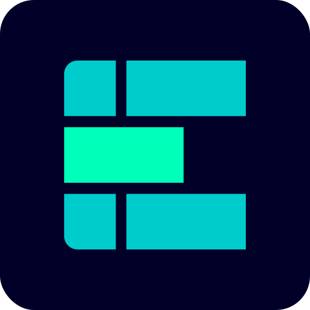

  

<h1 align="center">Siemens Element</h1>

  Siemens Element is a design system for products and digital experiences,
  grounded in the Siemens brand design language. It includes UI components
  (Angular), design tools and resources, human interface guidelines, and a
  vibrant community of contributors.

## Contributing

Improvements are always welcome! Feel free to log a bug,
write a suggestion, or contribute code by creating a pull request.
All details are listed in our contribution guide.

See [CONTRIBUTING.md](CONTRIBUTING.md).

## License

Code and documentation Copyright (c) Siemens 2016 - 2025.

MIT, see [LICENSE.md](LICENSE.md).

### Bootstrap

The source code in the folder [bootstrap](./projects/element-theme/src/styles/bootstrap/)
is based on [Bootstrap (v5.1.3)](https://github.com/twbs/bootstrap). We changed and adapted
the SASS component files to our needs. At that point in time, it was under _MIT License_
and _Copyright (c) 2011-2024 The Bootstrap Authors_.
