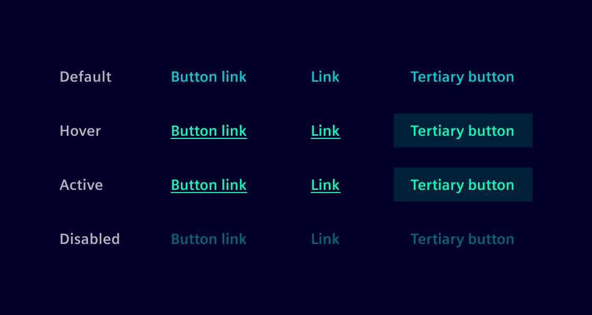
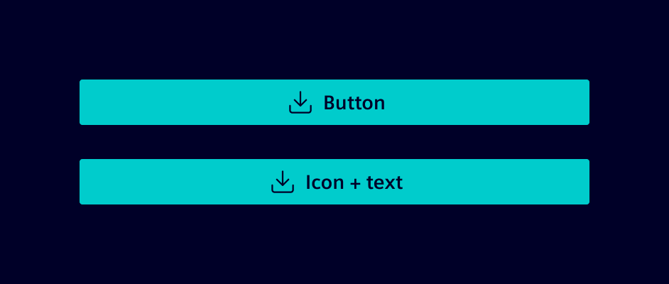

# Buttons

**Buttons** initiate actions and communicate their purpose through labels.

## Usage ---

Use buttons to trigger an action.
The labels describe what will happen when the user interacts with it, such as Add, Save, or Delete.

<si-docs-component example="buttons/buttontypes" editor="false" height="480"></si-docs-component>

Buttons are categorized by visual weight and semantic meaning to convey
the importance of the action and its potential consequences.

### Semantic meaning

Buttons are defined by the type of action they represent:

- **Default buttons** represent regular, non-destructive actions like submitting forms or saving changes.
- **Warning buttons** signify actions that require extra caution (e.g. confirming risky decisions).
- **Danger buttons** are used for destructive or irreversible actions (e.g. deleting data).

### Visual weigth

Buttons can be primary, secondary, or tertiary, regardless of their semantic meaning
(default, warning, or danger). Visual weight indicates the importance of the action:

- **Primary buttons** highlight the main action of the page or task, guiding users to the most important action
  (e.g. Save or Delete).
- **Secondary buttons** are less visually striking but still important (e.g. Cancel or Edit).
- **Tertiary buttons** are for lower-priority actions that need to be noticeable but not distracting.

### Categories

Buttons can have text or a combination of text and labels, or they can be purely icon-based.
When the button contains only an icon, it adopts a circular shape.

<si-docs-component example="buttons/buttoncategories" editor="false" height="150"></si-docs-component>

The circular variant also includes a ghost button style.
Ghost buttons are subtle and blend into the interface, used for low-priority or optional actions.
They signal availability without drawing attention, ideal for less critical or contextual options.

### Button link

A **button link** is a button styled as a [link](../buttons-menus/links.md).

Despite its link-like appearance, its primary distinction lies in its function:
[Links](../buttons-menus/links.md), built with the `<a>` HTML element, are designed for navigation,
whereas button links, created using the `<button>` HTML element, are intended to trigger actions.
This distinction ensures correct semantics, accessibility, and behavior.

While visually similar to a tertiary button, button links work well in tight layouts or inline with text,
where a regular button would be too bulky.



### Best practices

- Use only one primary button per page.
- Ensure call-to-action labels are straightforward and concise.
- Use single-line text for button labels; avoid multi-line text.
- Use circular shapes for icon-only buttons.
- When truncating text, ensure at least three characters of the content remain visible.
- Use the loading button to indicate ongoing processes.

## Design ---

### Button content



### Button shapes

#### Rectangular buttons

| Property           | Value        | Comment                                                 |
| -------------------|--------------|---------------------------------------------------------|
| Padding left/right | `$spacing-l` |                                                         |
| Padding top/bottom | `$spacing-s` |                                                         |
| Spacing(margin)    | `$spacing-l` | Spacing between buttons and other components/containers |
| Min-width          | 100px        | Minimum width of button irrespective of text length     |

#### Circle buttons

- **Large**

| Property     | Value | Comment |
| -------------|-------|---------|
| height/width | 40px  |         |

- **Small**

| Property     | Value | Comment |
| -------------|-------|---------|
| height/width | 32px  |         |

### Button placement

#### Arrangement

The position and alignment of buttons is defined in relationship to their container.
Buttons can be aligned right or center in relation to the parent container.

#### Related buttons

This is the case of two or more buttons that display related actions (e.g: save/cancel).

- Related buttons should all be the same width
- Spacing (margin) between related buttons is `spacing-s`

#### Scaling and adaptation

When scaling the viewport, buttons can adapt their visual presentation and
arrangement to fit different contexts and user needs.

#### Responsive grid

Typically, buttons are placed side by side. However, if the viewport becomes
too narrow to display all the text label, buttons should be stacked
following the responsive grid.

#### Text truncation

If the text label is too long, use and ellipsis `...` at the end of the line.

Be mindful about text truncation, since hides content that can be relevant to users.
For example, `Delete, to destroy all buildings!` should not become `Del...`

Instead, work with responsive design and prefer line wrapping for very important text.

## Code ---

### References

- **Bootstrap:** [Buttons](https://getbootstrap.com/docs/5.1/components/buttons/)

### Example

<si-docs-component example="buttons/buttons" height="330"></si-docs-component>

### Navigation buttons

There are cases in which a navigation links shall look like buttons. For example,
the link in the unauthorized page looks like a primary button to raise attention
and let the user navigate to a next page.

For these cases, use a `<a>` element styled as a button.

```html
<a class="btn btn-primary" href="https://siemens.com">Go back</a>
```

### Placement

In the following demo we showcase different button placements and dealing
with long text, using the bootstrap utilities classes.

First row shows the default buttons. All text is always visible. Decreasing container
width will increases the text lines.

Second row uses text truncation to keep button text in one line. Make sure the user
can read important text. Optionally, work with min-width.

Third row uses uses the responsive grid to for a vertical button placement if width
is smaller than 576px (see [Bootstrap Grid](https://getbootstrap.com/docs/5.1/layout/grid/)).

Row four and five show the same layout for task based dialogs like a modal dialog.
The first uses the `modal-footer` class, followed by the same CSS styling using
the [Bootstrap Utilities](https://getbootstrap.com/docs/5.1/utilities/api/).

<si-docs-component example="buttons/buttons-placement" height="450"></si-docs-component>
