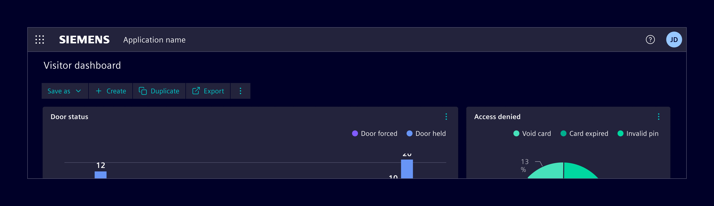
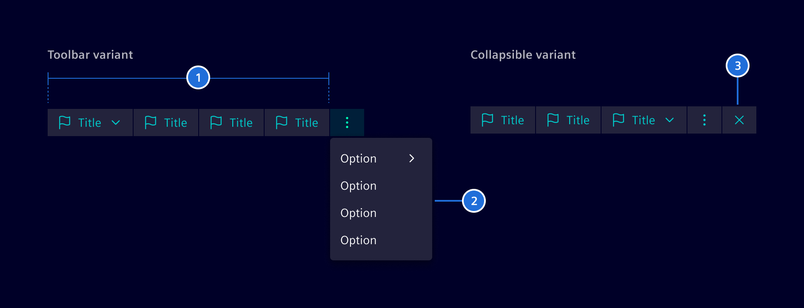
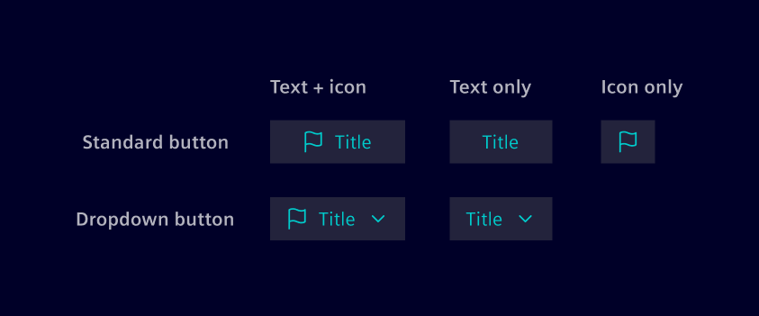
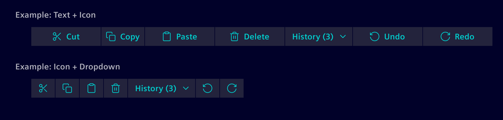
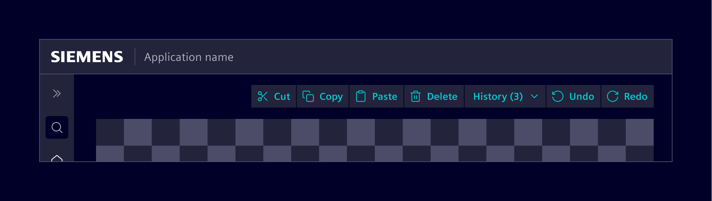
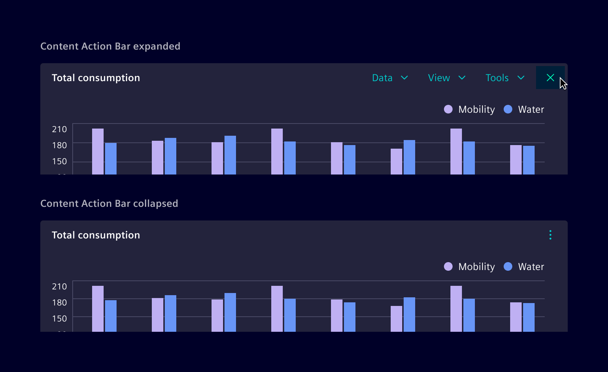
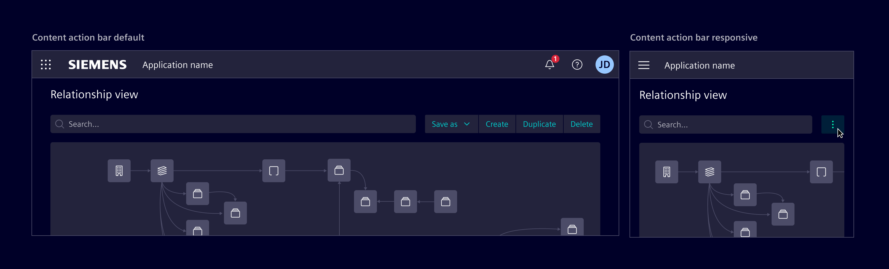

# Content Action Bar

<!-- markdownlint-disable MD033 -->

The **Content Action Bar** is a container for actions related to specific content.
Actions are available as buttons or dropdown menus, each triggering specific functionalities.

## Usage ---

The Content Action Bar groups contextually related actions that serve a common purpose within a specific content area.
For example, actions such as 'Edit', 'Delete', and 'Share' are used to manage specific pieces of content, like documents or images.

The Content Action Bar groups primary and secondary actions and adjusts to the available space.



### When to use

- When multiple actions that are closely related and need to be presented together.
- When an action stands alone or does not relate to other actions, use a regular [*Button*](../buttons-menus/buttons.md).
- If the primary requirement is simply to have a menu that remains consistently collapsed,
  use a tertiary [*Circle Button*](../buttons-menus/buttons.md) with a [*Menu*](../buttons-menus/menu.md).

## Design ---

### Elements

The Content Action Bar includes primary actions, which are always visible and prioritized, and optional secondary actions, which can be accessed through a menu.



> 1. Primary actions, 2. Secondary actions (optional), (4) Close button

### Button types

The Content Action Bar includes standard and dropdown buttons.
Standard buttons can display text, icons, or both, while dropdowns support text or text with icons.



Icons should be used as needed; however, avoid mixing text-with-icon buttons with icon-only buttons whenever possible.



### Variants

The Content Action Bar can be set to behave in two main ways, depending on the layout needs:

#### Expanded/Toolbar

In the expanded/toolbar variant, all actions are always displayed, providing consistent visibility and quick access.
This configuration is useful when actions need to be readily available, such as in editors or builder interfaces
(e.g., a floor plan editor or dashboard builder).



#### Collapsible

In the collapsible variant, users can expand the Content Action Bar as needed to reveal the available options.
Pressing the close button will collapse all actions under a menu.
This setup allows for a more compact layout when space is limited or when actions are needed less frequently.



### Responsive behavior

When the screen size is reduced, actions can automatically collapse into a menu in both the Toolbar and Collapsible variants.
If the primary requirement is simply to have a menu that remains consistently collapsed,
use a tertiary [*Circle Button*](../buttons-menus/buttons.md) with a [*Menu*](../buttons-menus/menu.md).



## Code ---

It can be used in one of three variations pointed out in Design section by
providing related `viewType` input as `collapsible`, `expanded` or `mobile`.
View type `expanded` is default.

### Usage

```ts
import { SiContentActionBarComponent } from '@siemens/element-ng/content-action-bar';

@Component({
  imports: [SiContentActionBarComponent, ...]
})
```

### Action bar configuration

Configure the the content action bar with `MenuItem`s as primary and secondary actions. You can
configure an Angular router or a href target as well as a custom action. Sub-menus are supported
by the `items` property.

<si-docs-component example="si-content-action-bar/si-content-action-bar" height="400"></si-docs-component>

### Action item states

Use the `MenuItem` states `disabled`, `isActive`, `badge` and `badgeColor` for configuration of item states.
Use semantic bootstrap colors like `warning` or `success` as `badgeColor`.

<si-docs-component example="si-content-action-bar/si-content-action-bar-states" height="400"></si-docs-component>

### Action toolbar

Use the `MenuItem` property `icon` to provide icons for all primary actions.

<si-docs-component example="si-content-action-bar/si-content-action-bar-toolbar" height="400"></si-docs-component>

<si-docs-api component="SiContentActionBarComponent"></si-docs-api>

<si-docs-types></si-docs-types>
