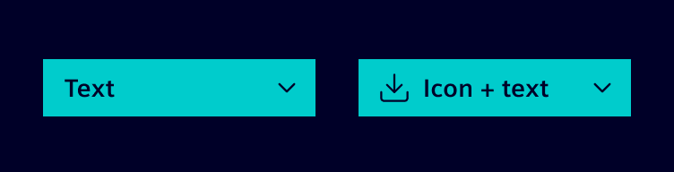
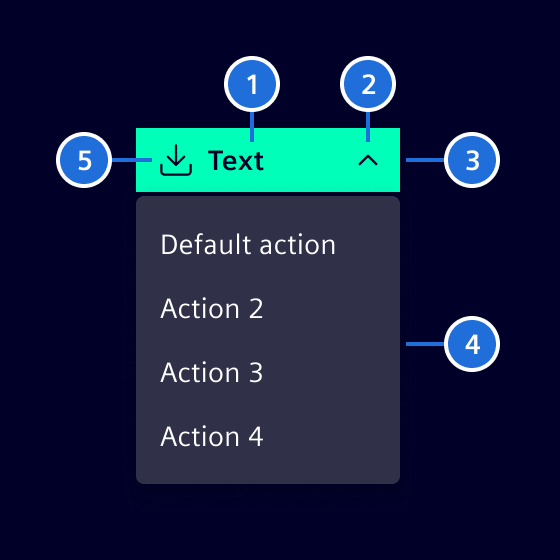
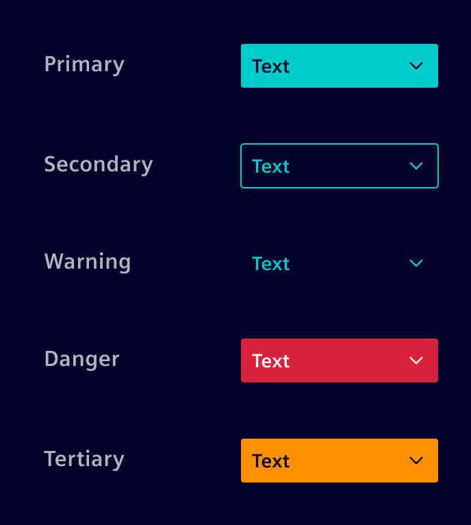

# Dropdowns

<!-- markdownlint-disable MD029 -->

Dropdowns are toggleable, contextual overlays for displaying actions related to the content.
They consist of a dropdown toggle and an overlay containing the actions.
The overlay is shown after clicking the dropdown toggle.
Dropdown toggles are available with text only or with text and icon.

## Usage ---

### When to use

- When there is a need for actions, which are related to each other
  (e.g. Export: PDF, Excel, Word, ...)
- When users need to make a choice among a list of mutually exclusive options

### When a Dropdown might not help

- When there are no other buttons with different actions
- When there are more than 10 actions to choose from
- When there are less than 2 actions to choose from (use [Button](buttons.md) instead)

### Best Practices for Dropdown

- Understand the context first in order to determine if a dropdown is indeed the
  best possible solution
- Place the default action on top of the menu (avoid extra searching)

### Dos and don'ts

- Do make a visual distinction between items that are disabled and the ones available
- Do keep disabled items visible
- Do support keyboard input to navigate within a dropdown
- Don't use a dropdown in a button without text

## Design ---

### Interaction States

Most Interaction states are identical to the [normal buttons](buttons.md).
The exceptions are documented here.

#### Active State

Active state is used, while the user is selecting the underlying action.

> (1) Placeholder text, (2) Arrow, (3) Container, (4) [Menu container](menu.md), (5) Icon (optional)

!!! info "Arrow Direction"
    Arrow changes direction when in active state.

### Dropdown with different Button Types

Dropdown is available for in each [rectangular Buttons style](buttons.md).

### Button Size

- Minimal button width is `100px`
- Menu container should be at least the same width as the button

## Code ---

!!! warning "Dropdown menu"
    If the overlay should show a contextual menu, please use the [menu component](menu.md).
    It already implements specific keyboard interactions and aria roles that are needed for a _dropdown menu_.

This chapter describes how to create an interactive contextual overlay using the [CDK Overlay module](https://material.angular.io/cdk/overlay/overview) and the [CDK Focus trap](https://material.angular.io/cdk/a11y/overview#focustrap)
without special keyboard handling and aria-roles.

The example uses the markup of [Bootstrap dropdown](https://getbootstrap.com/docs/5.1/components/dropdowns/).
It is also possible to use the CDK directives without using markup related to the `dropdown-menu`.

<si-docs-component example="si-dropdown/si-dropdown-with-overlay" height="200"></si-docs-component>

The overlay is toggled by the `open` property which needs to be updated properly.
We added a transparent backdrop to the overlay so that we can listen for `(backdropClick)` which should close the overlay.
The listener for `(detach)` is necessary for updating the `open` property after escape was pressed.
In a real world scenario, one has to be careful here, because `(detach)` is always called when the overlay is closed.

For having a proper keyboard interaction, we are using the [CDK Focus trap](https://material.angular.io/cdk/a11y/overview#focustrap).
It ensures that the focus will remain within the overlay while it is open.
Enabling `[cdkTrapFocusAutoCapture]="true"` ensures, that the focus will be moved into the overlay on creation and returned to the trigger when the overlay is closed.

<si-docs-api directive="CdkConnectedOverlay"></si-docs-api>

<si-docs-api directive="CdkOverlayOrigin"></si-docs-api>

<si-docs-api directive="CdkTrapFocus"></si-docs-api>

<si-docs-types></si-docs-types>
