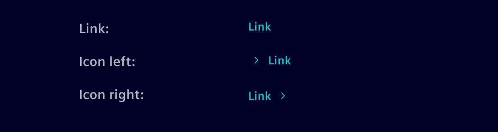
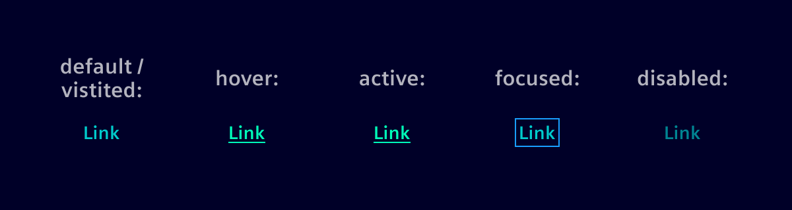

# Links

Links are used primarily as a navigational element. Links may also change what or how data is displayed (i.e., view more, show all).
If the action taken by the user will change or manipulate data, use a [button](buttons.md).

## Usage ---

### Best practices

- Use text for links rather than graphics or icons.
- Links should be three words or less.
- Text should be consistent with the title of the intended destination.
- Use caution with links that are several words long. It is recommended that links are long enough to be understood by the user, but short enough to prevent text wrapping.
- Avoid the term “click here,” other links to “here,” or the web address itself. Instead, use a meaningful descriptive label for the link, and match the destination site name.
- Links in paragraphs should always be underlined to ensure they’re easily recognized.
  As standalone elements (e.g., in cards or lists), underlines aren’t needed and an arrow icon (>) can be used to clarify function.
- If a link needs to trigger an action instead of navigating (e.g., opening a modal or expanding content),
  use a button link instead.

## Design ---

### States

Links support the different styles: default/visited, hover, pressed, focused and disabled.

### Styles

The visual representation of **Bold** or "Normal" depends on the surrounding context.

### Recommendation

Links can be grouped horizontally or vertically (e.g. in footers).
In this case it's recommended to have a proper distance between grouped links.

### Links vs. button links

Links, built with the `<a>` HTML element, are strictly for navigation. If an action does not involve
navigating to another page, use a [button link](../buttons-menus/buttons.md#button-link) instead.
This ensures correct semantics, accessibility, and behavior.

## Code ---

The link styling is applied to the standard HTML `a` element. For links inside a paragraph,
add the class `.link-text` to add the underline.

<si-docs-component example="links/links" height="75"></si-docs-component>
