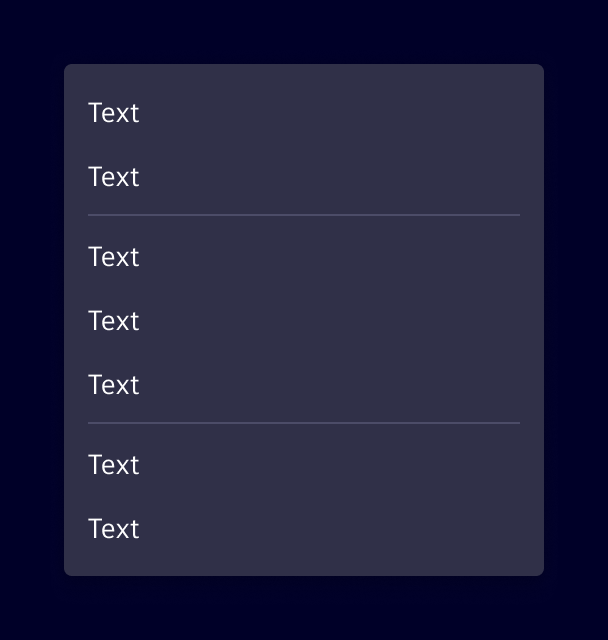
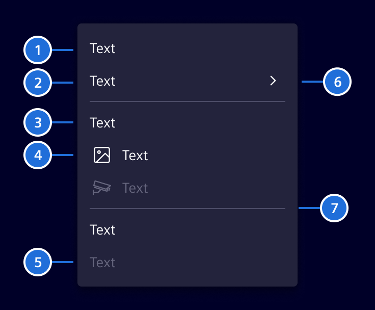
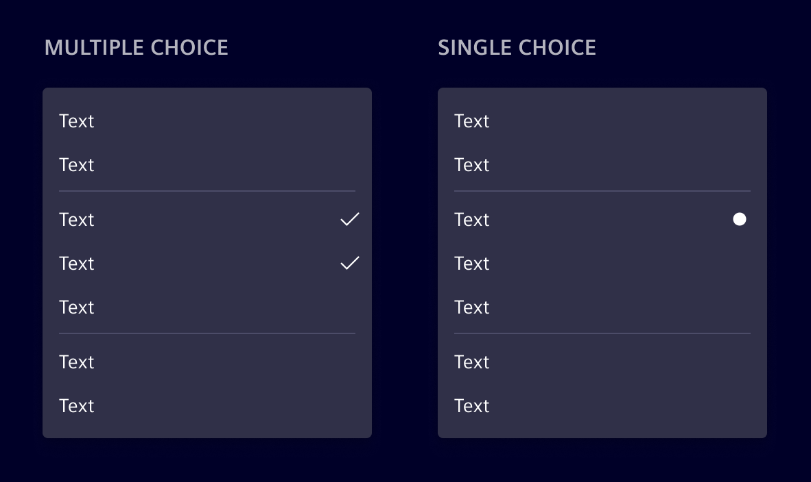

# Menu

Contextual menus are lists of commands that are based on the context of a selection, mouse hover or keyboard focus.
They are one of the most effective and highly used command surfaces, and can be used in a variety of places.

## Usage ---

### When to use

- If users need to perform several actions on a content
- If the actions are not used on a daily basis

### When a menu might not help

- If there is one action only use [Button](buttons.md) or [Link](links.md) instead
- If there is no interaction element to open the menu

### Best practices for menu

- Understand the context first in order to determine if a menu is
  indeed the best possible solution
- Analyze what actions are most important. Order the actions accordingly.
- Do group similar actions
- Do move less important actions to a submenu
- Do support keyboard input to navigate within a menu

### Dos and don'ts

- Do make a visual distinction between actions that are disabled and the ones available
- Do keep disabled actions visible
- Do not use more than 2 submenus in a nested way
- Do not have a long and flat list of actions, which might not have space on a small screen

## Design ---

### Elements

> (1) Hover state, (2) Entry with submenu, (3) Header, (4) Entry menu with icon, (5) Disabled state, (6) Indication for submenu, (7) Divider

### Alternatives

- Single choice should be used if the user has to select one of the options only. Make sure, that the options are grouped correctly.
- Multi choice can be used, if the user can enable or disable some functionality over the menu.

## Code ---

!!! warning "Important API changes"
    With Element v45, the `si-menu` has been completely re-implemented to feature a declarative API style based on the [CDK Menu](https://material.angular.io/cdk/menu/overview).
    If you are migrating from the old `si-menu-legacy`, you might want to consider using the `si-menu-factory`, which provides a more compatible model-driven API.

The `si-menu` has a declarative API and an additional `si-menu-factory` which accepts `MenuItem[]`.
It is built around the [CDK Menu](https://material.angular.io/cdk/menu/overview) using Angular's `hostDirective` feature.
Due to this:

- `CdkMenuTrigger` is required to open the menu
- `CdkMenuItem` can be used directly if proper styling is applied (helpful for special use cases)

### Usage of the declarative API

<si-docs-component example="si-menu/si-menu" height="500"></si-docs-component>

### Usage of the factory API

<si-docs-component example="si-menu/si-menu-factory" height="500"></si-docs-component>

### `si-menu-bar`

The `si-menu-bar` is a horizontal menu that is based on the `CdkMenuBar`.

While being visually similar to the `si-content-action-bar` it has two differences:

- `si-menu-bar` has a declarative API
- `si-menu-bar` has no responsive behavior

In general, we recommend using the `si-content-action-bar` over the `si-menu-bar`.

<si-docs-component example="si-menu/si-menu-bar" height="500"></si-docs-component>

<si-docs-api component="SiMenuItemComponent"></si-docs-api>

<si-docs-api component="SiMenuItemCheckboxComponent"></si-docs-api>

<si-docs-api component="SiMenuItemRadioComponent"></si-docs-api>

<si-docs-api component="SiMenuFactoryComponent"></si-docs-api>

<si-docs-api directive="CdkMenuTrigger"></si-docs-api>

<si-docs-api directive="CdkContextMenuTrigger"></si-docs-api>

<si-docs-types></si-docs-types>
