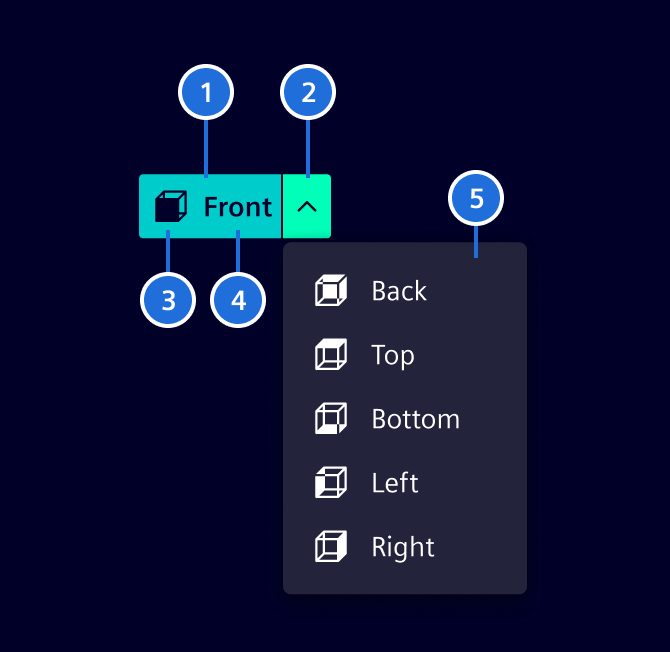

# Split button

A **split button** combines a primary action with a secondary dropdown menu, allowing users to either trigger a default action or choose from a list of related options.

## Usage ---

Split buttons can be styled as primary, secondary, or tertiary buttons, and may include an icon with a label, a label only, or an icon only—depending on the context and visual hierarchy.

### When to use

- There is a primary action that users will take most of the time.
- There are closely related secondary actions that should be accessible but not dominant.
- To reduce visual clutter by grouping similar actions under one control.

### Best practices

- Make the primary action clear and meaningful.
- Keep secondary options closely related to the main action.
- Use concise, scannable labels and icons in the dropdown.
- Don’t use a split button if there’s no clear primary action.
- Avoid hiding critical actions that users need to access frequently.
- Split buttons should not be used for destructive actions like `Delete` or `Reset`.

## Design ---

### Elements

> 1. Primary action, 2. Secondary dropdown, 3. Icon (optional) 4. Label (optional), 5. Secondary dropdown menu

### Interaction states

The interaction states like `hover`, `selected`, etc. are identical to the [normal buttons](buttons.md).

## Code ---

Will be implemented soon.
