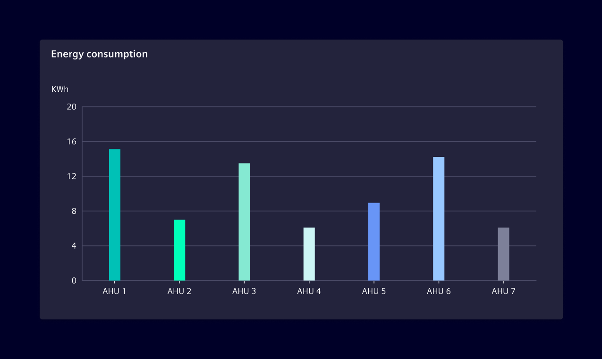
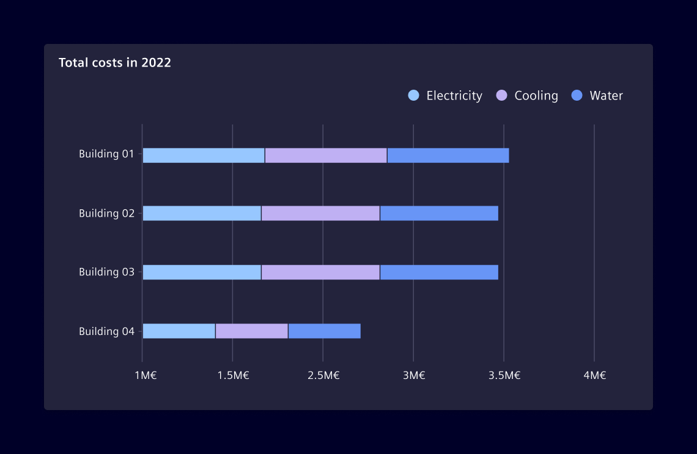
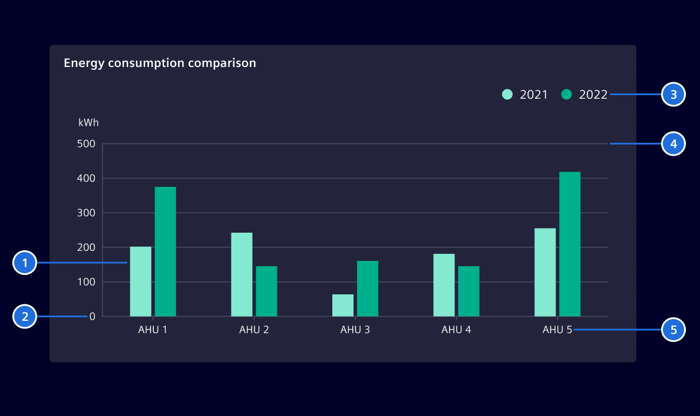

# Bar Chart

Shows the differences or similarities between values. Bar chart data answers the
question of "*how many?*" in each category.

## Usage ---

Use it to perform a comparison of values across different subgroups of data.
From a bar chart, it can be seen which groups are highest or most common, and
how groups compare against each other.

### Basic Variant

The basic bar chart shows numerical comparisons across categories. One axis of
the chart shows the specific categories being compared and the other axis is
numeric in nature.



### Multi-Set Variant

This variation is used when two or more data series are plotted side-by-side and
grouped together under categories, all on the same axis.


### Stacked Variant

The stacked bar chart is used to show how a category is divided. It helps to
understand what relationship each part has with the total amount.



### Best Practices for Bar Charts

- Plot the bars against a zero-value baseline to accurately reflect the
  difference in the data.
- Use colors with purpose. Select accent colors to highlight meaningful changes.
- Bar charts can be vertical or horizontal. Horizontal bar charts work best when
  there are lots of different categories with long labels.
- Use common sense and adjust the width of the bars according to the amount of
  elements. The minimum bar width is `16px`.

## Design ---



> 1. Bars, 2. Y axis, 3.Legend, 4.Grid lines, 5. X axis

## Code ---

### Usage

??? info "Required Packages"
    - [echarts](https://www.npmjs.com/package/echarts)

```ts
import { SiChartCartesianComponent } from '@siemens/charts-ng';

@Component({
  imports: [SiChartCartesianComponent, ...]
})
```

### Simple Bar Chart

<si-docs-component example="si-charts/si-chart-bar" height="400"></si-docs-component>

### Stacked Bar Chart

The same component can also be used in a stacked configuration.

<si-docs-component example="si-charts/si-chart-bar-stacked" height="400"></si-docs-component>

<si-docs-api component="SiChartCartesianComponent" package="@siemens/charts-ng" hideImplicitlyPublic="true"></si-docs-api>

<si-docs-types></si-docs-types>
