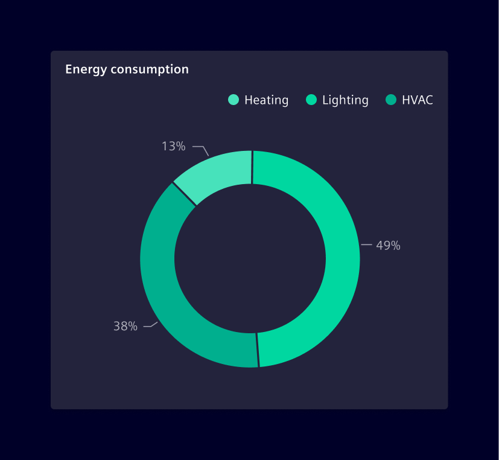
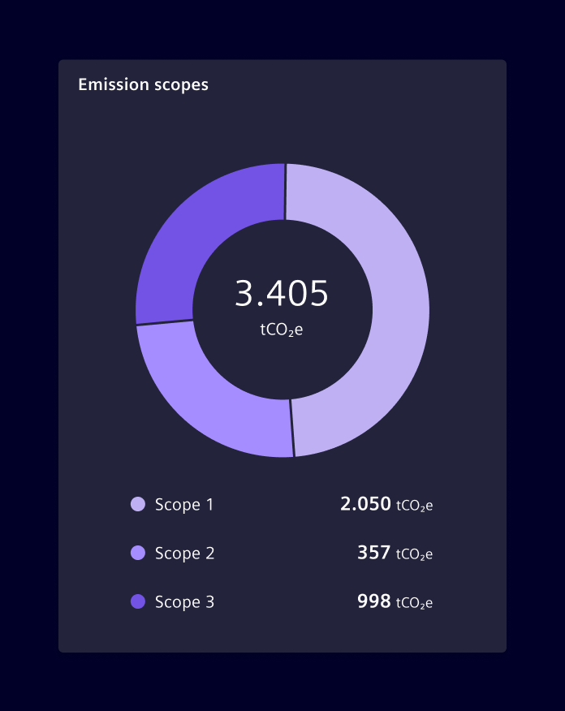
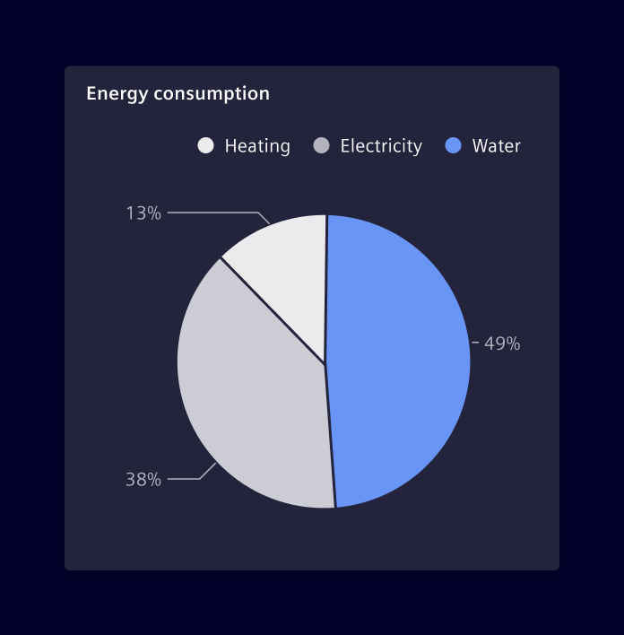
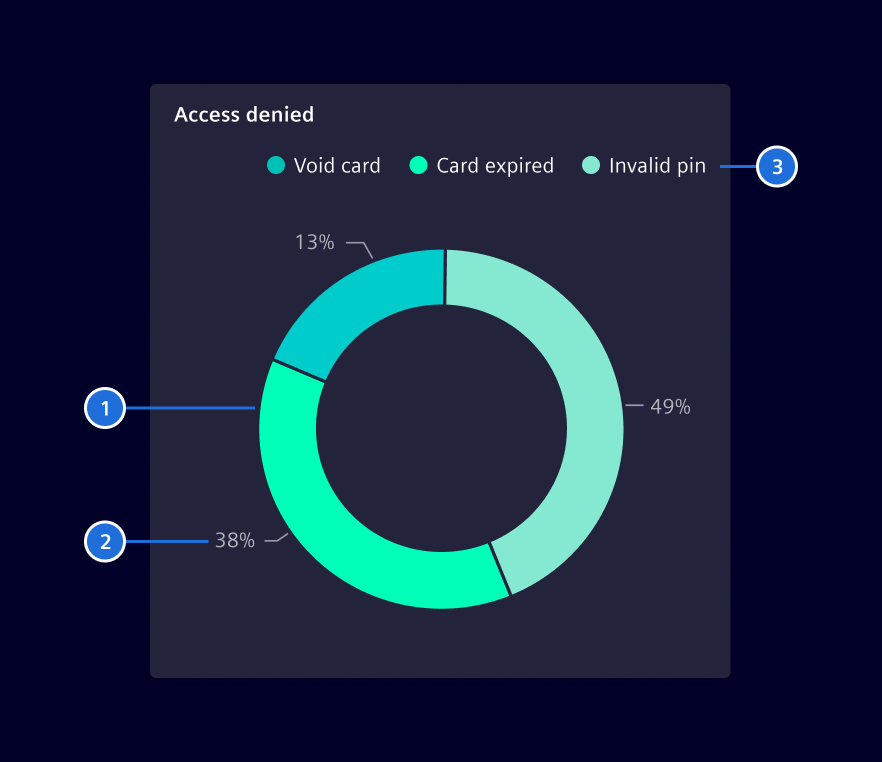

# Circle Chart

The circle chart, displayed as a pie or donut chart, shows how much each part of
something makes up the whole. Each arc length represents a proportion of each
category, while the full circle represents the total sum of all the data, equal
to 100%.

## Usage ---

In order to use a donut or pie chart, there must be a whole amount that is
divided into a number of distinct parts. The primary goal is to compare each
part contribution to the whole, as opposed to comparing parts to each other.

### Basic donut chart

A donut chart uses arc segments to display individual dimensions. When compared
to pie charts, they are visually lighter and easier to read.



### Donut chart with center label

If needed, the space in the middle can be used to display data.



### Pie chart

Pie charts are visually heavy, be mindful about the size and colors selected to
display the data.



### Best practices for circle charts

- Use pie charts sparingly.
- Don't plot more than five categories on the same circle chart. If needed,
  consider merging small slices into a single *other* slice.
- Don't use multiple circle charts to make comparisons between them.
- Consider the order of the categories, audiences will likely read the chart
  clockwise.
- Consider placing the chart values as part of the legend, especially when
  dealing with long numbers.
- The legend can be placed below or right to the circle chart. Use good
  judgement to select the best layout according to current need.

## Design ---



> 1. Circle chart, 2. Values, 3. Legend

## Code ---

### Usage

??? info "Required Packages"
    - [echarts](https://www.npmjs.com/package/echarts)

```ts
import { SiChartCircleComponent } from '@siemens/charts-ng';

@Component({
  imports: [SiChartCircleComponent, ...]
})
```

### Pie Chart

<si-docs-component example="si-charts/si-chart-circle-pie" height="400"></si-docs-component>

### Donut Chart

<si-docs-component example="si-charts/si-chart-circle-donut" height="400"></si-docs-component>

<si-docs-api component="SiChartCircleComponent" package="@siemens/charts-ng" hideImplicitlyPublic="true"></si-docs-api>

<si-docs-types></si-docs-types>
