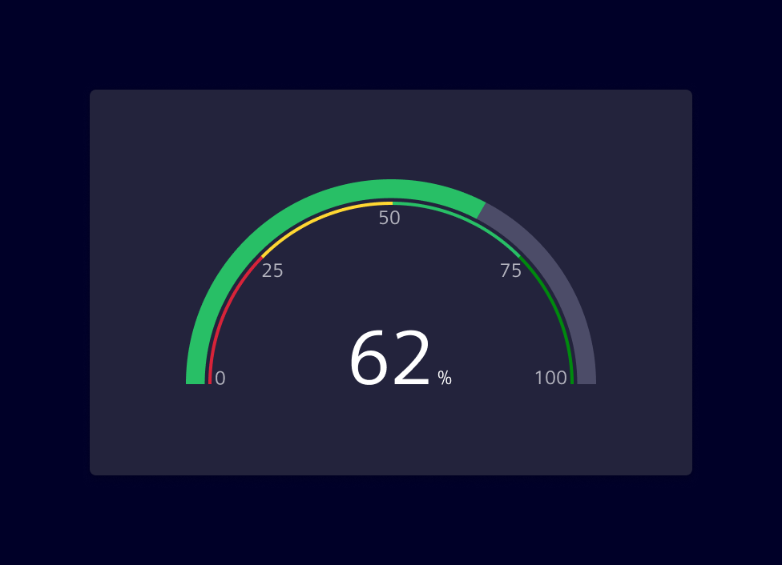
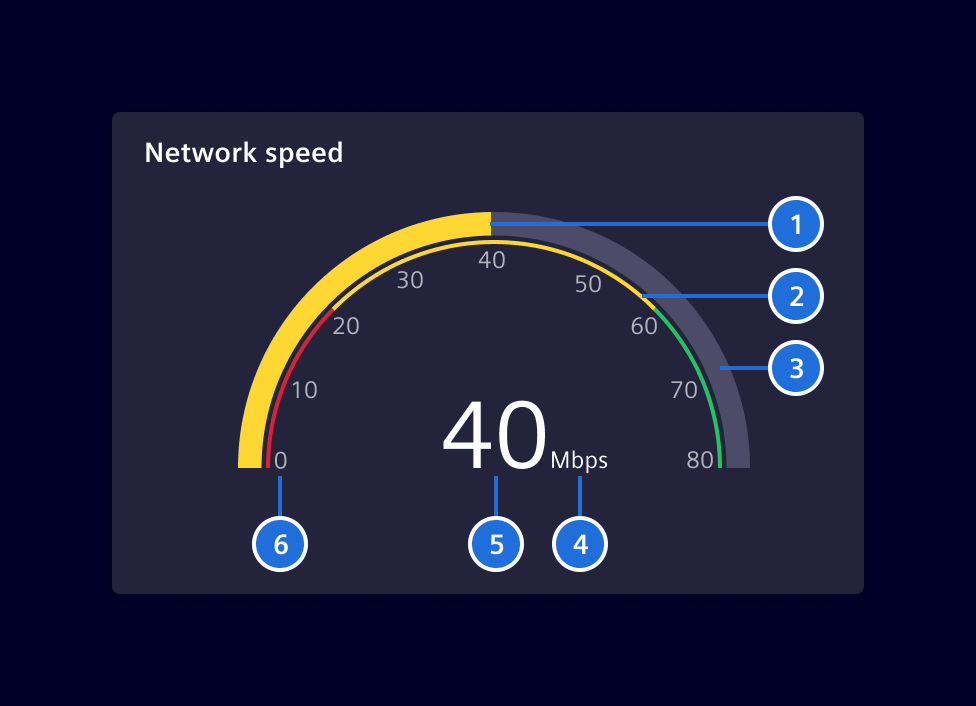

# Gauge chart

**Gauge charts** are data visualization elements that represent a value as a
position on a radial scale. It displays a simple and concise single value in
comparison to a maximum and minimum limit.

## Usage ---

Gauge charts are commonly used to display performance metrics, such as
percentage completion, quality scores or to indicate real-time values like
temperature or speed.

The chart can be accompanied by color coding to indicate different ranges or
thresholds. The gauge shows the value and its position between the minimum and
maximum, highlighted with a color that corresponds to the range the value
currently falls into.



### Best practices

- Ensure that the numeric scale used is clear and easy to understand. It's
  helpful to include the maximum and minimum values, as well as any threshold or
  target values.
- Color-coding is a useful way to indicate different ranges or thresholds.
  Choose colors that are meaningful in relation to the data being represented.
- Keep it simple. Gauge charts are best suited for displaying simple,
  straightforward data.
- If there is a need to represent a crucial system status (e.g: `danger`,
  `warning` or `caution`) provide additional visual cues, such as text labels
  or icons, to support accessibility.

## Design ---

A gauge chart displays data similar to a circle chart, but with a needle or dial
to indicate where the data point(s) falls over a particular range.



> 1. Progress, 2. Qualitative Range (Optional), 3. Base, 4. Unit, 5. Value, 6. Scale (Optional)

## Code ---

### Usage

??? info "Required Packages"
    - [echarts](https://www.npmjs.com/package/echarts)

```ts
import { SiChartGaugeComponent } from '@siemens/charts-ng';

@Component({
  imports: [SiChartGaugeComponent, ...]
})
```

<si-docs-component example="si-charts/si-chart-gauge" height="400"></si-docs-component>

<si-docs-api component="SiChartGaugeComponent" package="@siemens/charts-ng" hideImplicitlyPublic="true"></si-docs-api>

<si-docs-types></si-docs-types>
