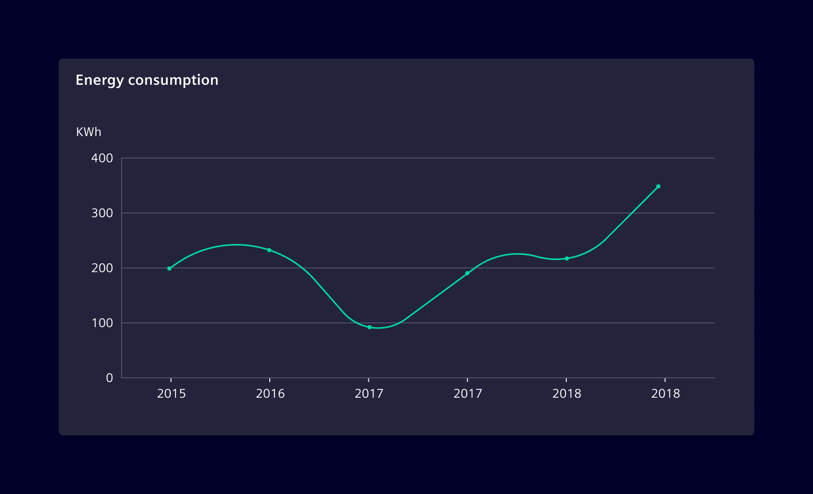
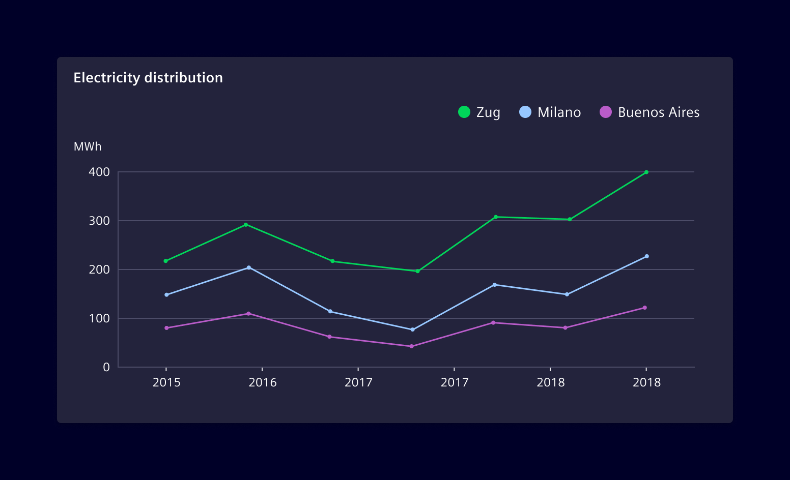
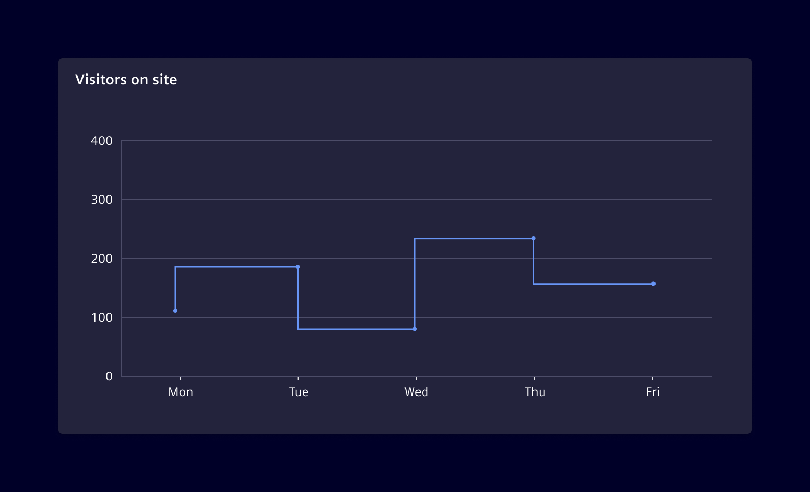
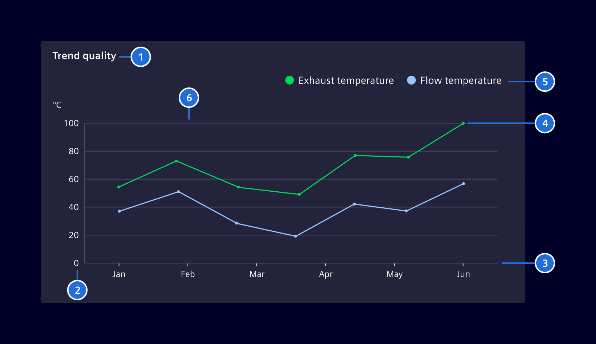

# Line Chart

**Line Charts** help to understand shifts or changes in data. They are usually
used to track changes over a period of time. When grouped with other lines
(other data series), individual lines can be compared to one another.

## Usage ---

Line charts can help users to track changes in data over time, compare
performance of different groups and analyze trends and patterns to make timely
decisions.

### Basic line chart

Line charts connect a series of data points using a line. It displays
quantitative data series over continuous intervals.



### Multiple line chart

Use it to visualize trends and relationships in multiple data sets. It compares
different data groups on the same scale to find out how each of them is
performing compared to the others.



### Step-line chart

Use it to visualize trends for a particular event that is not continuous in
nature. This chart compares the magnitude of change in value and helps to
discern the intermittent pattern of the trend.



### Best practices for Line charts

- Use appropriate time periods to ensure accurate insights.
- Choose a baseline that suits the data; choosing a zero baseline may not always
  represent the data change effectively.
- When comparing data sets, line charts are only useful if the axes follow the
  same scales.
- Don't plot too many lines. Limit the number to five.

## Design ---



> 1. Chart title, 2. Y axis, 3. X axis, 4. Line graph, 5. Legend, 6. Grid-lines

## Code ---

### Usage

??? info "Required Packages"
    - [echarts](https://www.npmjs.com/package/echarts)

```ts
import { SiChartCartesianComponent } from '@siemens/charts-ng';

@Component({
  imports: [SiChartCartesianComponent, ...]
})
```

<si-docs-component example="si-charts/si-chart-line" height="400"></si-docs-component>

<si-docs-api component="SiChartCartesianComponent" package="@siemens/charts-ng" hideImplicitlyPublic="true"></si-docs-api>

<si-docs-types></si-docs-types>
