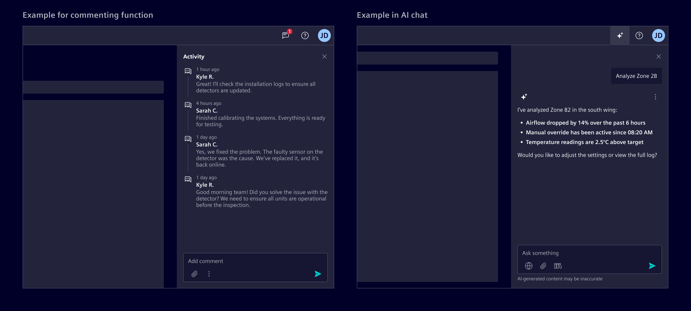
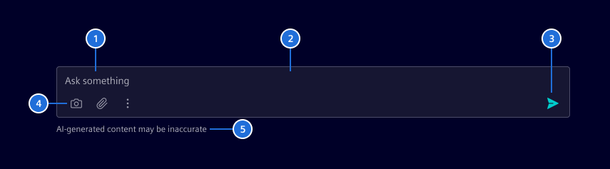
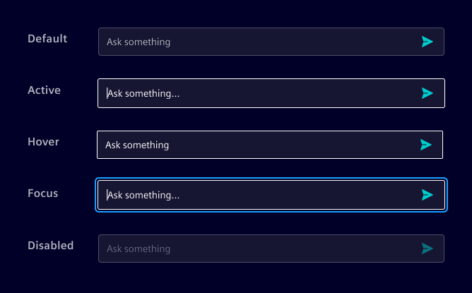
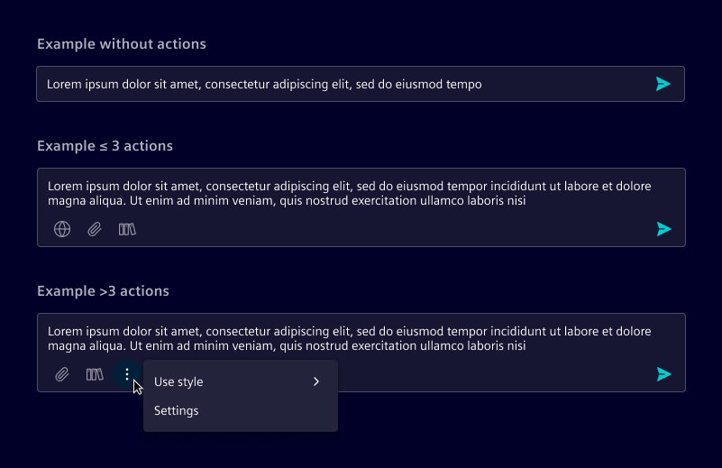
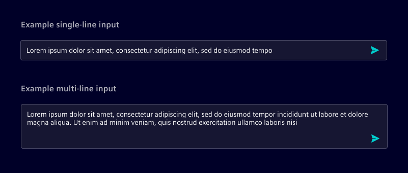
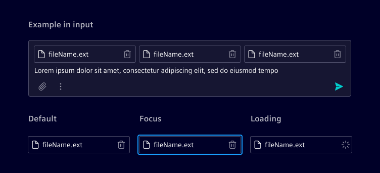

# Chat input

The **chat input** is a text field for composing and submitting messages in conversational interfaces.
It supports both AI-assisted interactions and human-to-human chat.

## Usage ---

The chat input enables users to send messages or comments depending on context:

- User chat: Sends real-time messages in a conversation
- AI chat: Submits queries to a system for response
- Commenting: Adds contextual feedback or notes tied to a specific element

### When to use

- In any interface where users need to communicate or leave feedback.
- When freeform text input is required in chat, messaging, or commenting scenarios.

### Best practices

- Always autofocus the input prompt when the page or chat view is opened.
- Limit input width to 720px for legibility.
- Match placeholder text to context (e.g., “Ask anything”, “Type a message”, “Leave a comment”).
- Disable the send button when input is empty or invalid.
- Add the legal disclaimer when used for AI functions.

## Design ---

### Elements

> 1. Placeholder text, 2. Container, 3. Send button, 4. Actions (optional), 5. Legal disclaimer (only for AI)

### Interaction states

### Actions

When actions are available, they appear directly below the text area. Up to three actions can be displayed inline; any additional actions are grouped into a menu.

### Overflow behavior

The input field begins as a single line and automatically expands into a multi-line field as the user types.
When the content exceeds the visible area, the field grows vertically—up to a set maximum height.
Beyond that point, scrolling is enabled within the input.

### Attachments

When supported, attachments appear within the input area as part of the composed message, allowing users to review and remove them before sending.

If multiple attachments are added, they wrap and stack within the input field to manage overflow gracefully.

## Code ---

Angular component is coming soon.
