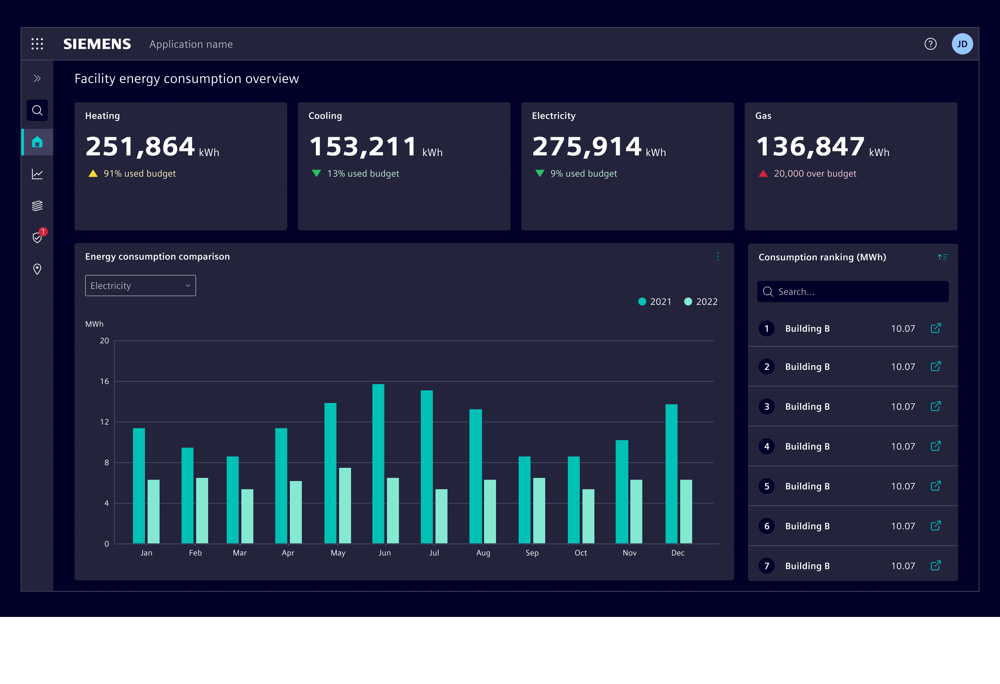
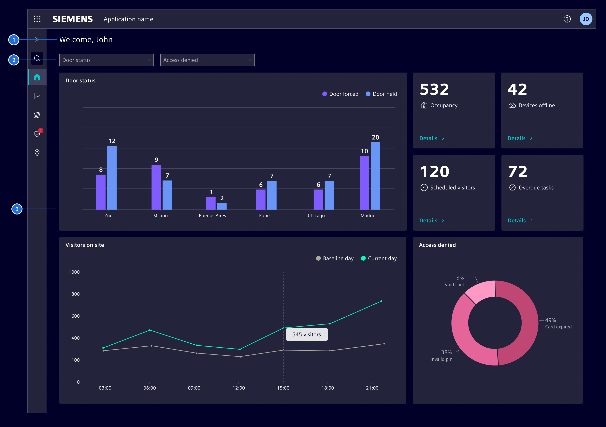
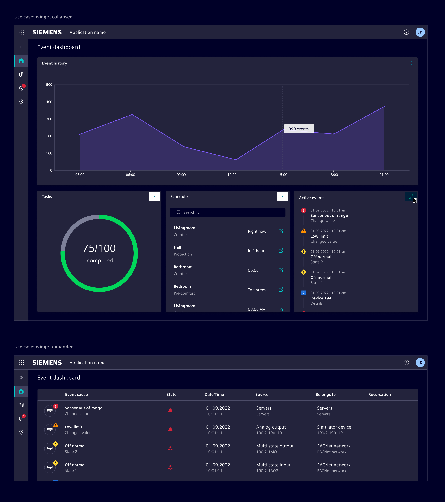

# Dashboard

A **dashboard** is a visual representation of different data and information
sources, that provides a summarized overview of multiple key performance
indicators such as metrics, trends and other insights.

## Usage ---

The purpose of a dashboard is helping users to monitor, measure and analyze
relevant data from different sources in a *at-a-glance* fashion.

They provide a quick and easy way to track performance metrics and identify
areas for improvement, enabling users to make informed decisions based on
real-time data.



**Dashboards vary significantly depending on the context in which they are used.**
Before starting to design a dashboard, it is important to understand the purpose
and the goals it aims to achieve. This will help to identify the key metrics and
information that need to be displayed.

### Best practices

- Keep it simple. Avoid clutter caused by too much information or showing
  irrelevant metrics.
- Choose the right visualizations to represent the data. See the [charts](../charts/index.md)
  chapter.
- Use color to draw attention to important information. Avoid using too many
  different colors or using them in a way that is visually distracting.
- Use real-time data to ensure that the dashboard is up-to-date and provides the
  most recent information.
- Use consistent units throughout the dashboard to ensure that the data is
  easily comparable among itself.
- Use either *global* (affecting all widgets) or *local* (affecting only one
  widget) filters, not both simultaneously.

## Design ---

### Elements



1. **Title (optional):** A brief and descriptive name of the whole dashboard.
1. **Dashboard options (optional):** Is the area located just bellow the title
   that contains filters, menus and other interactive elements that allow users
   to perform actions affecting the whole dashboard.
1. **Content area:** Is the main area of the dashboard where the actual data,
   charts, graphs and other visualizations are displayed.

### Progressive disclosure

Avoid overwhelming users with all the information being display at once by
revealing it gradually and as needed. When dealing with large amount of content,
it is better to display a summary or overview of the data with the option to
expand or drill down to see further details.



### Layout

- Place the most important items in areas where the viewer's eye will naturally
  look first. In left-to-right/LTR languages, this is typically the top-left
  corner of the screen, followed by the center of the screen.
- Place related items close to each other. This helps to create visual
  groupings and organizes information for the viewer.
- Charts should be sized and proportioned based on their importance and
  relevance.

See the [flexible dashboards](flexible-dashboards.md) chapter for
dashboards with user customizable content.

## Code ---

The `SiDashboardModule` consists of a `SiDashboardComponent` and the `SiDashboardCardComponent`.
The `SiDashboardCardComponent` extends the `SiCardComponent` and adds expand and restore functionality.
The dashboard works with content-projection slots to configure the layout, e.g. a Bootstrap grid.

The module has its own entry point to reduce the overall bundle size.

### Usage

```ts
import {
  SiDashboardCardComponent,
  SiDashboardComponent
} from '@spike-rabbit/element-ng/dashboard';

@Component({
  :
  imports: [
    :
    SiDashboardCardComponent,
    SiDashboardComponent,
    :
  ],
  standalone: true
})
```

<si-docs-component example="si-dashboard/si-dashboard-layout" height="700"></si-docs-component>

<si-docs-api component="SiDashboardComponent"></si-docs-api>

<si-docs-api component="SiDashboardCardComponent"></si-docs-api>

<si-docs-types></si-docs-types>
