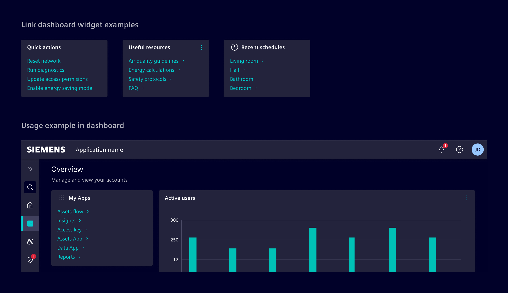
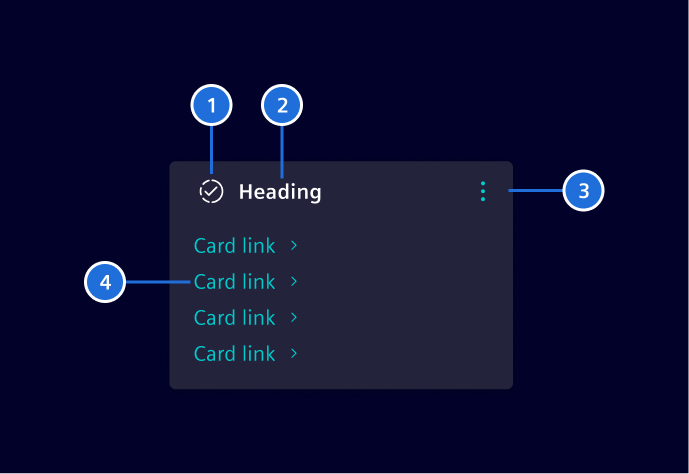

# Link Dashboard Widget

**Link dashboard widget** is a list of [links](../buttons-menus/links.md) that provides quick access
to frequently used functions, pages, or external resources.

## Usage ---



### When to use

- In dashboards and [tile layouts](../../fundamentals/layouts/content.md#tile-layout).
- To provide a list of navigation or action links.

### Best practices for link dashboard widget

- Prevent overcrowding by keeping the number of links between 2 and 6.
- Keep labels short and clear, directly indicating the link's purpose and destination.
- Arrange links by their relevance or frequency of use to facilitate quick access.
- Use [skeleton](../progress-indication/skeleton.md) to represent its loading state.

## Design ---

### Elements



> 1. Icon (optional), 2. Heading, 3. Actions (optional), 4. Links

## Code ---

The link widget is implemented by CSS classes and the usage of other Element components.

### Component usage

To simplify the usage and reduce the code, Element offers a Angular component as wrapper
with streamlined inputs. The component should be used together with the [card](../layout-navigation/cards.md).

```ts
import { SiLinkWidgetComponent } from '@siemens/element-ng/dashboard';

@Component({
  :
  imports: [SiLinkWidgetComponent],
  standalone: true
})
```

<si-docs-component example="si-dashboard/si-link-widget" height="400"></si-docs-component>

<si-docs-api component="SiLinkWidgetComponent"></si-docs-api>

### CSS class usage

For more flexibility and control, use the CSS classes directly in the `<si-card>`
component.

<si-docs-component example="si-dashboard/si-link-widget-css" height="400"></si-docs-component>

<si-docs-types></si-docs-types>
