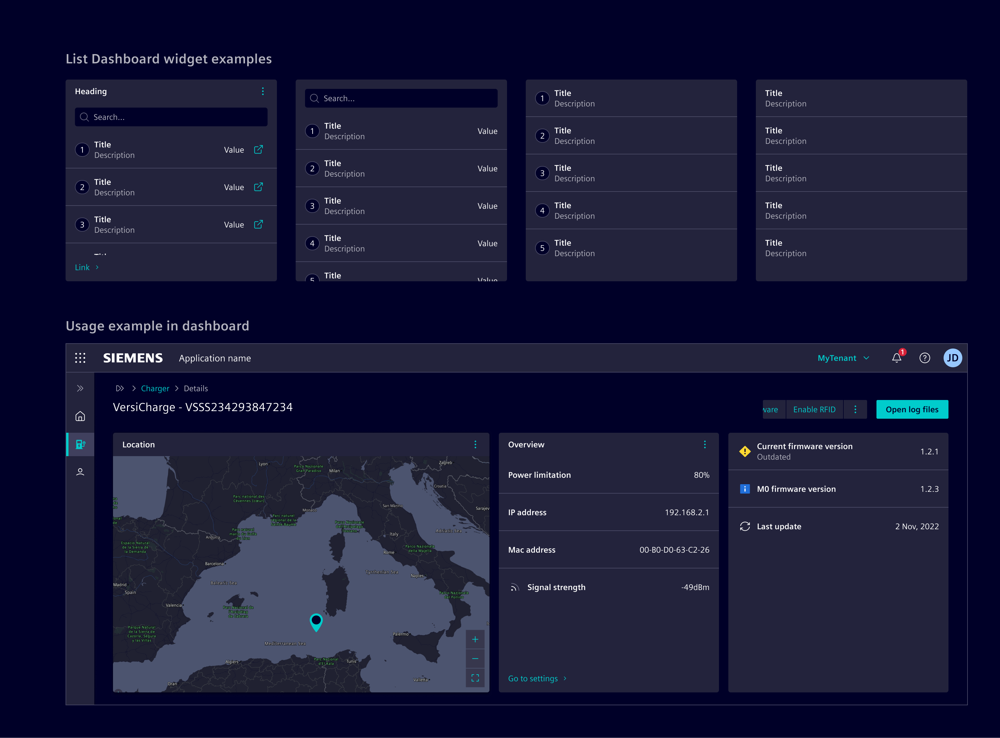
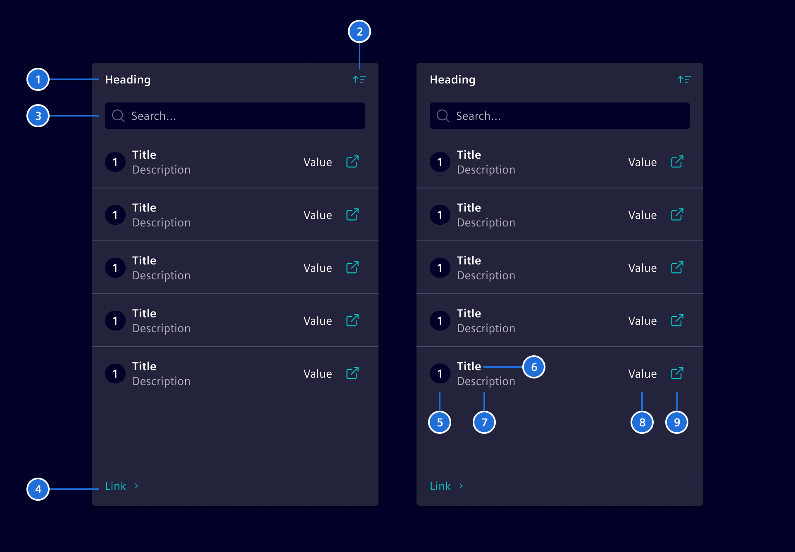
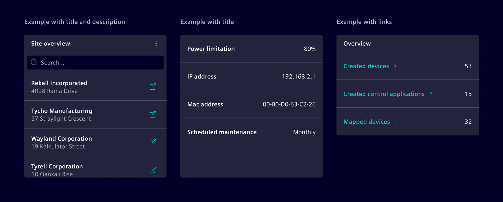
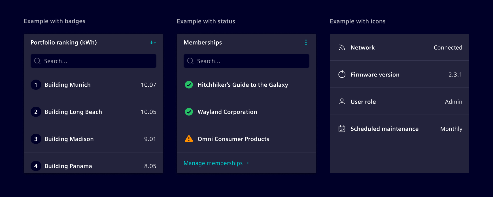

# List dashboard widget

**List dashboard widget** provides a quick-glance overview of list items,
offering users a shortcut to view and access key information directly.

## Usage ---

The List Dashboard Widget is used for presenting lists in a compact format, allowing users to scan
and interact with items quickly. It optionally allows search and sorting. It can include:

- Brief descriptions to provide context.
- Links for direct navigation.
- Actionable items for quick task initiation.



### When to use

- In dashboards and [tile layouts](../../fundamentals/layouts/content.md#tile-layout).
- To provide a ranked or organized list of items.
- When users need quick access to key information without navigating away.
- To summarize essential metrics, statuses, or items at a glance.
- When displaying frequently updated data in a compact format.

### Best practices

- Prioritize relevant information.
- Limit additional elements (e.g., badges or actions) to avoid visual clutter and improve readability.
- Enable sorting and search for lists with more than a few items to simplify navigation.
- Use [empty state](../status-notifications/empty-state.md) to represent empty values.

## Design ---

### Elements



> 1. Heading, 2. Action, 3. Search, 4. Footer link, 5. Indicator, 6. Row title, 7. Description, 8. Value, 9. Row action

With the exception of the Row title (6), all items are optional.

### Variants

Each item can display a title or a [link](../buttons-menus/links.md), with an optional description.



The indicator can be customized to show an icon, status
or a [badge](../status-notifications/badges.md).



The header action supports sorting items and other actions as needed.
Content overflow is managed with an internal scrollbar, and the widget height can be configured to either
full or fixed height according to layout needs.

This component is flexible enough to accommodate additional options, allowing for tailored solutions.

## Code ---

We support the the list widget in two ways:

- Angular components that are configured by data objects to support minimum
  effort on the application development.
- HTML and CSS-based to support maximum flexibility.

### List widget component

To simplify the usage and reduce the code, Element offers a Angular component as wrapper
with streamlined inputs. The component is a wrapper around the [card](../layout-navigation/cards.md)
and the `<si-list-widget-body>`.

```ts
import { SiListWidgetComponent } from '@siemens/element-ng/dashboard';

@Component({
  :
  imports: [SiListWidgetComponent],
  standalone: true
})
```

Add the empty state component by content projection with the `empty-state` slot.

```html
<si-list-widget search [heading]="'Heading'" [value]="items">
    <si-empty-state empty-state [icon]="'element-info'" [heading]="'No buildings found.'" />
</si-list-widget>
```

<si-docs-component example="si-dashboard/si-list-widget" height="550"></si-docs-component>

<si-docs-api component="SiListWidgetComponent"></si-docs-api>

### List widget body component

The body of the `<si-list-widget>` is implemented in the component `<si-list-widget-body>`. You can
use it for compositions.

<si-docs-component example="si-dashboard/si-list-widget-body" height="450"></si-docs-component>

<si-docs-api component="SiListWidgetBodyComponent"></si-docs-api>

### CSS class usage

For more flexibility and control, use the CSS classes directly in the `<si-card>`
component.

<si-docs-component example="si-dashboard/si-list-widget-css" height="400"></si-docs-component>

<si-docs-types></si-docs-types>
