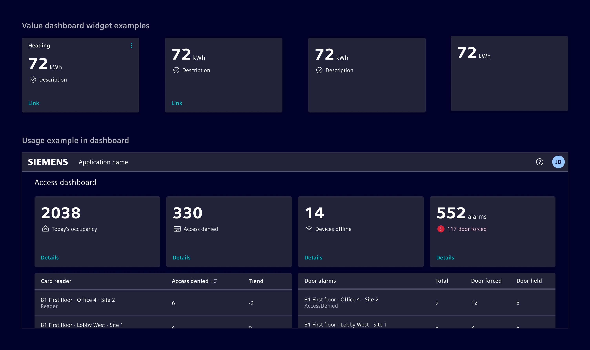
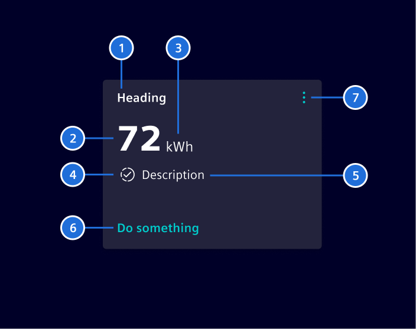
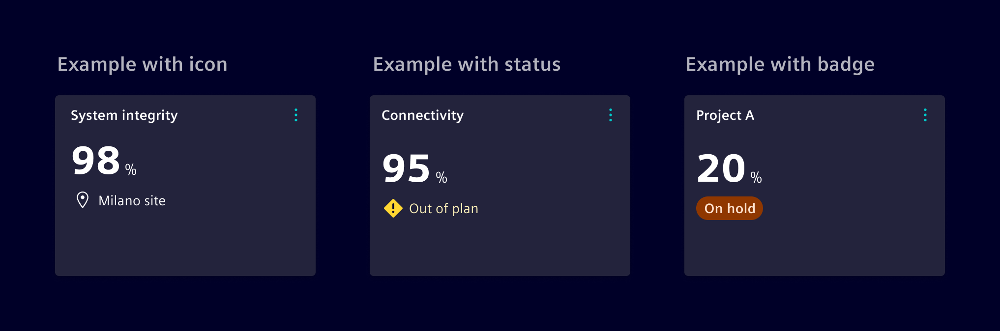
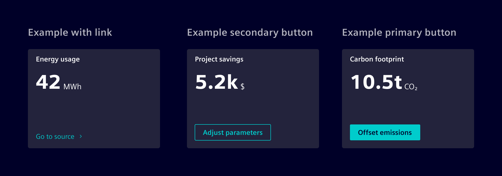
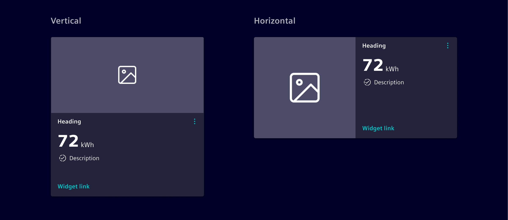
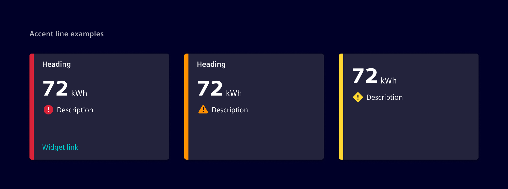
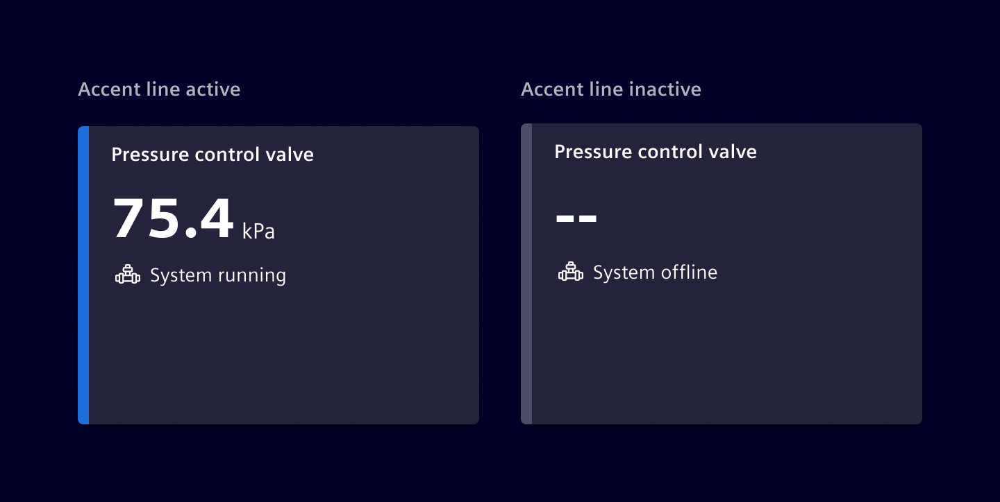
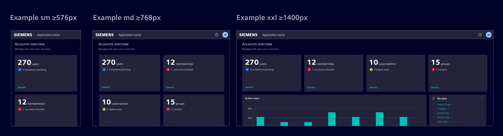

# Value dashboard widget

**Value dashboard widget** displays key information and offers interactive features
for direct user interaction.

## Usage ---

The Value Dashboard Widget displays key information, such as numerical values, and optionally include icons
or indicators that highlight its nature or status.

It can include:

- A description to offer a clearer context.
- Links for navigation.
- Actionable items, like buttons or menus, to directly initiate tasks.



### When to use

- In dashboards and [tile layouts](../../fundamentals/layouts/content.md#tile-layout).
- To provide an at-a-glance overview of key metrics or information.
- To present actionable cards that lead to more detailed content or follow-up actions.

### Best practices

- Display only the most relevant data.
- Prevent overcrowding by limiting the number of actions or visual elements.
- Include actions that are clearly related to the data shown.
- Maintain a design that is consistent with the overall dashboard.
- Optimize for performance to ensure responsiveness and a smooth user experience.
- Use [skeleton](../progress-indication/skeleton.md) to represent its loading state.

## Design ---

### Elements



> 1. Heading, 2. Value, 3. Unit, 4.Icon/indicator, 5. Description, 6. Call-to-action (CTA), 7. Content Action Bar

With the exception of the Value (2), all items are optional.

### Variants

The icon/indicator can be adapted to show an icon, status
or a [badge](../status-notifications/badges.md).



Value Dashboard Widget supports calls-to-action (CTAs), such as a [buttons](../../components/buttons-menus/buttons.md)
or [links](../../components/buttons-menus/links.md).



It is also possible to add an image, which can be configured to be either vertical or horizontal.
The image size can be adapted according to the need.



The widget can include an **accent line**, which acts as a status indicator to highlight critical information.

When there’s only one status, the accent line alone is enough to convey the message.
For multiple statuses, the accent line should be combined with a status icon to give extra context.

If there’s a single status, the accent line alone is sufficient.
For multiple statuses, pair the line with an appropriate icon to provide additional context.



The accent line can also switch to a neutral color.
This is useful for special cases where it represents a dynamic state, like showing whether something is on/off or active/inactive.



Ensure the status is not communicated solely through color;
pair the line with appropriate text, icons, or other visual cues when needed.

### Responsive behavior

To achieve harmonious layouts, adjust the width of the Value Widget as required, ensuring a consistent height throughout.
it's designed to span a minimum of 3 columns and adjusts responsively to screen size changes, with stacking for adaptability.



## Code ---

The value widget is implemented by CSS classes and the usage of other Element components.

### Component usage

To simplify the usage and reduce the code, Element offers a Angular component as wrapper
with streamlined inputs.

```ts
import { SiValueWidgetComponent } from '@siemens/element-ng/dashboard';

@Component({
  :
  imports: [SiValueWidgetComponent],
  standalone: true
})
```

<si-docs-component example="si-dashboard/si-value-widget" height="600"></si-docs-component>

<si-docs-api component="SiValueWidgetComponent"></si-docs-api>

### CSS class usage

For more flexibility and control, use the CSS classes directly in the `<si-card>`
component.

```html
<si-card
    [heading]="'Heading'"
    [primaryActions]="primaryActions"
    [secondaryActions]="secondaryActions"
  >
  <div class="card-body" body>
    <span class="si-value-widget-value">Value</span>
    <span class="si-value-widget-unit">Unit</span>
    <div class="si-value-widget-description text-warning">
      <si-icon icon="element-checked" />
      <span>Description</span>
    </div>
  </div>
  <div class="card-footer" footer>
    <a [siLink]="simplActionLink">Do something</a>
  </div>
</si-card>
```

<si-docs-component example="si-dashboard/si-value-widget-css" height="400"></si-docs-component>

### Value widget body component

The body of the `<si-value-widget>` is implemented in the component `<si-value-widget-body>`. You can
use it for compositions.

<si-docs-component example="si-dashboard/si-value-widget-body" height="250"></si-docs-component>

<si-docs-api component="SiValueWidgetBodyComponent"></si-docs-api>

<si-docs-types></si-docs-types>
