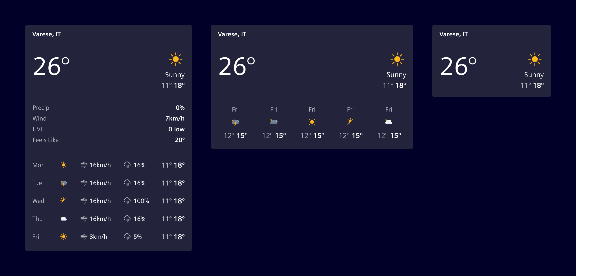
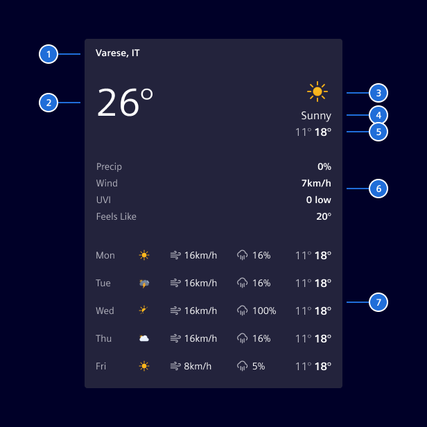
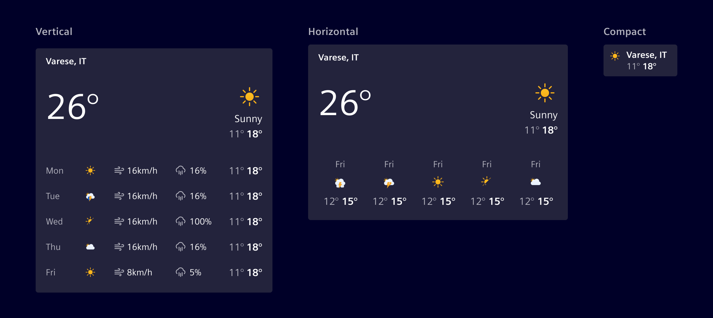
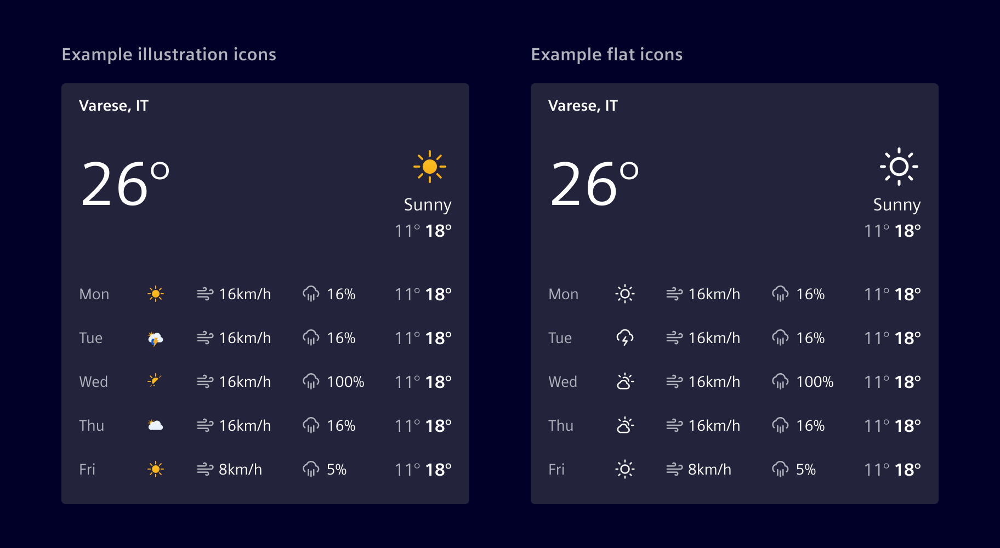

# Weather dashboard widget

**Weather dashboard widget** displays current weather conditions
and, optionally, a short-term forecast for a single location.

## Usage ---

The weather dashboard widget displays current temperature and sky conditions, with an optional short-term forecast and additional meteorological parameters like humidity or wind speed.

The widget supports different layouts, and both the
forecast days and the number of additional meteological parameters can be configured according to the use case.



### When to use

- In dashboards and [tile layouts](../../fundamentals/layouts/content.md#tile-layout).
- To display current outdoor or environmental conditions.
- To offer users a quick overview of the day's or week's weather.

### Best practices

- Show only the metrics most relevant to the context.
- Keep units consistent (e.g. °C or °F, km/h or mph).
- Pick the layout that matches the available tile size.
- Use a [skeleton](../progress-indication/skeleton.md) to represent the
  loading state.

## Design ---

### Elements



> 1\. Heading (location), 2. Current temperature, 3. Illustration, 4. Condition label, 5. Min/Max range, 6. Additional metrics (optional), 7. Forecast (optional)

### Layout variants

The widget supports three layouts:

- **Vertical:** Forecast with up to five columns of additional data
  (e.g., wind, precipitation, humidity, UV, pressure).
- **Horizontal:** Forecast with condition and temperature only.
- **Compact:** No forecast.

The forecast shows **up to seven days**. The number of days is configurable.
Columns are hidden automatically as the widget narrows.



### Icon style

Weather conditions can be represented with flat Element icons or illustrated icons.
For illustrated icons, the style may vary depending on the weather provider.



## Code ---

The weather widget is built around two Angular components: the widget itself,
which wraps an [`<si-card>`](../layout-navigation/cards.md), and a body
component that can be reused for compositions.

### Component usage

To simplify the usage and reduce the code, Element offers an Angular
component as a wrapper with streamlined inputs.

```ts
import { SiWeatherWidgetComponent } from '@spike-rabbit/element-ng/dashboard';

@Component({
  :
  imports: [SiWeatherWidgetComponent]
})
```

<si-docs-component example="si-dashboard/si-weather-widget" height="600"></si-docs-component>

<si-docs-api component="SiWeatherWidgetComponent"></si-docs-api>

#### Weather widget body component

The body of `<si-weather-widget>` is implemented in the component
`<si-weather-widget-body>`. You can use it for compositions where the
[`<si-card>`](../layout-navigation/cards.md) wrapper is not appropriate.

<si-docs-api component="SiWeatherWidgetBodyComponent"></si-docs-api>

### Configurable playground

The configurable example exposes every input of the widget and is useful for
exploring layouts, metrics and forecast extras interactively.

<si-docs-component example="si-dashboard/si-weather-widget-configurable" height="700"></si-docs-component>

### Icon resolver

Weather illustrations are produced by an injectable `SiWeatherIconResolver`.
The library ships a default resolver that maps the built-in
`SiWeatherCondition` vocabulary (`clear`, `clouds`, `rain`, `storm`, `wind`,
`unknown`) to Element icons:

| Condition | Icon             |
| --------- | ---------------- |
| `clear`   | `element-sun`    |
| `clouds`  | `element-cloudy` |
| `rain`    | `element-rain`   |
| `storm`   | `element-storm`  |
| `wind`    | `element-wind`   |
| `unknown` | _(no icon)_      |

Applications can override the default by providing their own resolver. A
resolver returns either an Element icon name (rendered via `<si-icon>`) or a
direct image URL (rendered as ``); callers can also pass an `src`
directly via `illustration.src` to bypass the resolver.

#### Implementing a custom resolver

A custom resolver extends `SiWeatherIconResolver` and returns one of:

- `{ icon: '<name>' }` — rendered as `<si-icon icon="…">`.
- `{ src: '<url>' }` — rendered as ``.
- `null` — no illustration is shown.

The example below uses the MIT-licensed [meteocons](https://github.com/basmilius/meteocons)
static SVG set (`@meteocons/svg-static`). The icons are exposed via
`angular.json` under `/assets/meteocons/`:

```jsonc
// angular.json (assets array)
{
  "glob": "*.svg",
  "input": "node_modules/@meteocons/svg-static/fill",
  "output": "/assets/meteocons/"
}
```

The resolver is a small class that maps the six built-in condition tokens to
file names. For more complex scenarios, you can introduce or reuse a richer
condition vocabulary. It is registered as a component-level provider, so the
override is scoped to this example:

```ts
providers: [{ provide: SiWeatherIconResolver, useClass: SiWeatherWidgetMeteoconsIconResolver }];
```

For an application-wide override, register the resolver in the root injector
instead (`providedIn: 'root'` on the class itself, or via `providers` in
`bootstrapApplication`).

<si-docs-component example="si-dashboard/si-weather-widget-custom-resolver" height="600"></si-docs-component>

<si-docs-api component="SiWeatherIconResolver"></si-docs-api>

<si-docs-types></si-docs-types>
