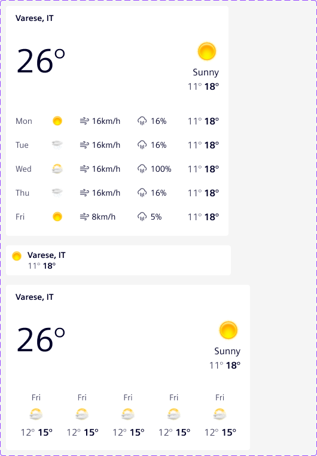
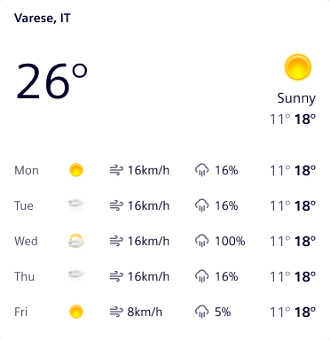
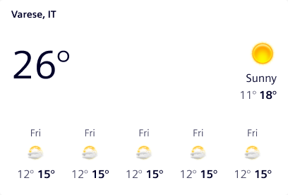
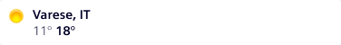

# Weather dashboard widget

**Weather dashboard widget** displays current weather conditions, optional
environmental metrics and a short-term forecast for a single location.

## Usage ---

The weather dashboard widget summarizes the outdoor or environmental conditions
relevant to a dashboard at a glance. It is a pure presentation component:
applications pre-format every value (temperatures, wind speed, humidity, …) and
pass the data in as strings or numbers. The widget itself never performs unit
conversion.

It can include:

- Current temperature with an illustration of the condition.
- A location label as the card heading (vertical and horizontal layouts) or
  next to the illustration (compact layout).
- A list of environmental metrics, such as wind, humidity or UV index.
- A short-term forecast of up to five days, optionally with additional
  per-day columns (e.g. precipitation, wind, humidity).



### When to use

- In dashboards and [tile layouts](../../fundamentals/layouts/content.md#tile-layout).
- To surface current outdoor or environmental conditions next to operational
  data that depends on weather context.
- To give users a quick orientation about the day or week ahead at the
  monitored location.

### Best practices

- Display only the conditions and metrics that are relevant for the
  dashboard's purpose; avoid recreating a full weather application.
- Pre-format every value with units before passing it in. The widget does
  not localize numbers or convert units.
- Pick the layout that matches the available tile size:
  vertical for narrow tiles, horizontal for wide tiles, compact for headers
  or tiles that only need the current condition.
- Out of the box, the widget renders illustrations for the built-in condition
  tokens (`clear`, `clouds`, `rain`, `storm`, `wind`) using Element icons.
  Register a custom `SiWeatherIconResolver` if you need a provider-specific
  vocabulary or your own imagery.
- Use a [skeleton](../progress-indication/skeleton.md) to represent the
  loading state.

<!-- TODO: confirm with design -->

## Design ---

### Elements



> 1. Heading (location), 2. Current temperature, 3. Illustration,
> 2. Condition label, 5. Min/Max range, 6. Metrics list, 7. Forecast list

With the exception of the current temperature (2), all items are optional.

### Variants

The widget supports three layouts selected through the `layout` input.


**Vertical** — the default layout. Renders the today block at the top of the
card and a vertical forecast list below. The forecast supports up to two
additional columns (e.g. wind, humidity) next to the min/max temperature
range.



**Horizontal** — wider layout that places the today block on the left and the
forecast as a strip on the right. Forecast columns (extras) are not shown in
this layout.



**Compact** — single-row condensed layout without a card heading. The
location and min/max temperature are rendered next to the illustration. The
compact layout does not show metrics or a forecast.

### Responsive behavior

The forecast accepts at most **five days** and at most **five extra columns**.
As the widget narrows, trailing extra columns (vertical layout) or trailing
forecast days (horizontal layout) are hidden via CSS container queries; no
JavaScript measurement is involved. The first day and the min/max temperature
range are always visible.

<!-- TODO: confirm with design -->

## Code ---

The weather widget is built around two Angular components: the widget itself,
which wraps an [`<si-card>`](../layout-navigation/cards.md), and a body
component that can be reused for compositions.

### Component usage

To simplify the usage and reduce the code, Element offers an Angular
component as a wrapper with streamlined inputs.

```ts
import { SiWeatherWidgetComponent } from '@siemens/element-ng/dashboard';

@Component({
  :
  imports: [SiWeatherWidgetComponent]
})
```

<si-docs-component example="si-dashboard/si-weather-widget" height="600"></si-docs-component>

<si-docs-api component="SiWeatherWidgetComponent"></si-docs-api>

#### Weather widget body component

The body of `<si-weather-widget>` is implemented in the component
`<si-weather-widget-body>`. You can use it for compositions where the
[`<si-card>`](../layout-navigation/cards.md) wrapper is not appropriate.

<si-docs-api component="SiWeatherWidgetBodyComponent"></si-docs-api>

### Configurable playground

The configurable example exposes every input of the widget and is useful for
exploring layouts, metrics and forecast extras interactively.

<si-docs-component example="si-dashboard/si-weather-widget-configurable" height="700"></si-docs-component>

### Icon resolver

Weather illustrations are produced by an injectable `SiWeatherIconResolver`.
The library ships a default resolver that maps the built-in
`SiWeatherCondition` vocabulary (`clear`, `clouds`, `rain`, `storm`, `wind`,
`unknown`) to Element icons:

| Condition | Icon             |
| --------- | ---------------- |
| `clear`   | `element-sun`    |
| `clouds`  | `element-cloudy` |
| `rain`    | `element-rain`   |
| `storm`   | `element-storm`  |
| `wind`    | `element-wind`   |
| `unknown` | _(no icon)_      |

Applications can override the default by providing their own resolver. A
resolver returns either an Element icon name (rendered via `<si-icon>`) or a
direct image URL (rendered as ``); callers can also pass an `src`
directly via `illustration.src` to bypass the resolver.

#### Implementing a custom resolver

A custom resolver extends `SiWeatherIconResolver` and returns one of:

- `{ icon: '<name>' }` — rendered as `<si-icon icon="…">`.
- `{ src: '<url>' }` — rendered as ``.
- `null` — no illustration is shown.

The example below uses the MIT-licensed [meteocons](https://github.com/basmilius/meteocons)
static SVG set (`@meteocons/svg-static`). The icons are exposed via
`angular.json` under `/assets/meteocons/`:

```jsonc
// angular.json (assets array)
{
  "glob": "*.svg",
  "input": "node_modules/@meteocons/svg-static/fill",
  "output": "/assets/meteocons/"
}
```

The resolver itself is a small class that maps the six built-in condition
tokens to file names; it is registered as a component-level provider so the
override is scoped to the example:

```ts
providers: [{ provide: SiWeatherIconResolver, useClass: SiWeatherWidgetMeteoconsIconResolver }];
```

For an application-wide override, register the resolver in the root injector
instead (`providedIn: 'root'` on the class itself, or via `providers` in
`bootstrapApplication`).

<si-docs-component example="si-dashboard/si-weather-widget-custom-resolver" height="600"></si-docs-component>

<si-docs-api component="SiWeatherIconResolver"></si-docs-api>

<si-docs-types></si-docs-types>
