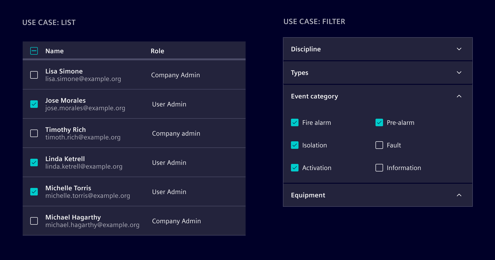
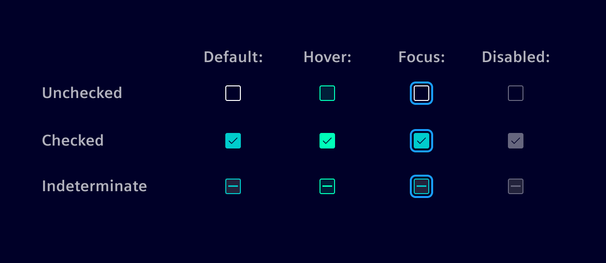
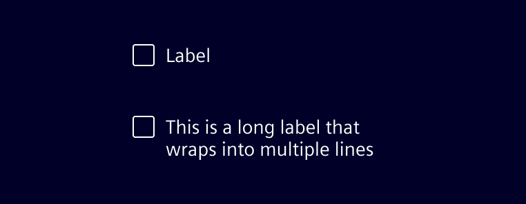

# Checkbox

Checkboxes are used for multiple choices in a list, for filters etc. Users can
select zero, one, or multiple number of items.

## Usage ---



### When and where to use

- In lists or data tables for batch editing purposes.
- In forms.
- For selection or filtering options.
- For setting preferences or settings.

### When checkbox might not help

- Checkboxes should not be used to toggle a single option or setting. Use
  [*Toggle Switch*](switch.md) instead.
- If options are mutually exclusive, use [*Radio Buttons*](radio.md) instead.
- Checkboxes should not be used to make important decisions, like confirming
  deletion, as they are easily overlooked by users.

## Design ---

### Interaction states



!!! info "Clickable area"
    Users can trigger the interaction by clicking the checkbox input or the
    accompanying label.

### Labels

Always use clear and concise labels for checkboxes. Labels should always be
placed to the right of checkbox inputs.

If labels are too extensive, try to reworded them to be shorter. If it's not
possible, wrap the text to a second line so the checkbox and label are top
aligned.



## Code ---

In Element, checkboxes are created using the native `<input type="checkbox">` element.
They should be used together with the `si-form-item` component (see [here](forms.md)).

```html
<si-form-item label="Checkbox">
  <input type="checkbox" class="form-check-input" [formControl]="control" />
</si-form-item>
```

The class `form-check-input` and `type="checkbox"` must be applied to ensure correct visual appearance.
Instead of `formControl`, you can also use `ngModel`.

### Group checkboxes

Use the `si-form-fieldset` component to group multiple checkboxes together.
It will ensure a correct layout and apply the necessary accessibility attributes.

```html
<si-form-fieldset label="Group">
  <si-form-item label="Option 1">
    <input type="checkbox" class="form-check-input" [formControl]="control1" />
  </si-form-item>
  <si-form-item label="Option 2">
    <input type="checkbox" class="form-check-input" [formControl]="control2" />
  </si-form-item>
</si-form-fieldset>
```

By default, the checkboxes are stacked vertically.
To display them inline, apply the `form-check-inline` class to the `si-form-item`:

```html
<si-form-fieldset label="Group Inline">
  <si-form-item label="Option 1" class="form-check-inline">
    <input type="checkbox" class="form-check-input" [formControl]="control1" />
  </si-form-item>
  <si-form-item label="Option 2" class="form-check-inline">
    <input type="checkbox" class="form-check-input" [formControl]="control2" />
  </si-form-item>
</si-form-fieldset>
```

### Native HTML markup

If a `si-form-item` component cannot be used, it is also possible to use
the checkbox with native HTML elements only:

```html
<div class="form-check">
  <input type="checkbox" id="check-id" class="form-check-input" />
  <label for="check-id" class="form-check-label">Checkbox</label>
</div>
```

In this case, all the attributes shown above must be set by an application.
Otherwise, the checkbox may appear broken.

Alternatively, you can also wrap the `input` element into the `label` and skip adding the `id`.

```html
<label>
  <input type="checkbox" class="form-check-input" />
  <span class="form-check-label">Check this custom checkbox</span>
</label>
```

To create an inline checkbox, additionally apply the `form-check-inline` class to the `form-check` div.

### Example

<si-docs-component example="custom-form-elements/checkbox" height="550"></si-docs-component>
