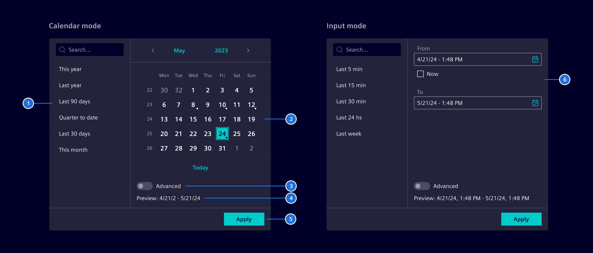
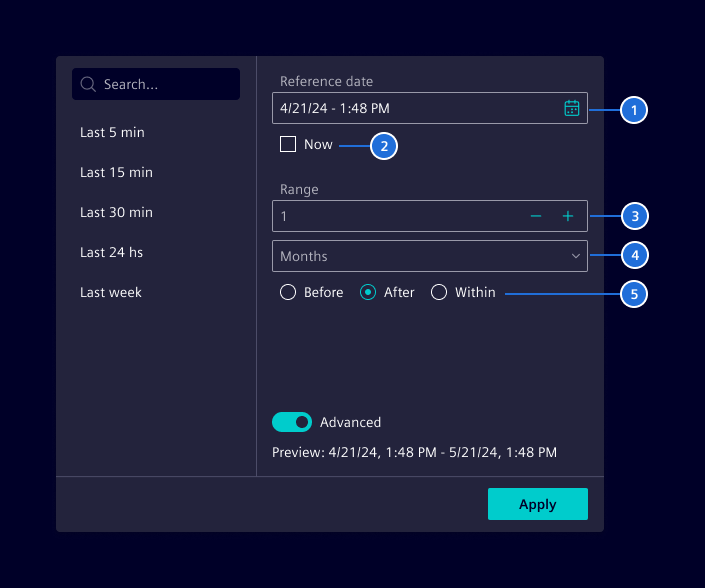

# Date range filter

**Date range filter** allows users to select specific date intervals,
either by choosing two absolute dates or by defining a relative range based on a reference point.

## Usage ---

The **date range filter** provides options for both absolute and relative dates.

Users can select specific dates using either the calendar mode or the input mode.

It is possible to switch to an advanced mode to access relative date functions,
which use offsets to specify dates in relation to a reference point (e.g., 7 days before or 1 month after now).

Additionally, it includes optional presets for quick access to common periods like "Last 7 days" or "Next month.


### When to use

- For complex date filtering scenarios or in dashboards.
- When the use case requires flexibility in selecting periods relative to a reference date/time (e.g., "5 days before").
- When the use case involves advanced filtering capabilities, such as combining today or now with relative ranges.
- To offer users quick access to common preset ranges.
- Use a [date picker](../forms-inputs/datepicker.md) if simpler date selections are required.

### Best practices

- Use it in combination with [input button](../buttons-menus/buttons.md).
- Use “Enter date” or the date format (i.e., MM/DD/YYYY) as placeholder.
- Configure presets according to the use case.
- If there are more than 10 presets, consider adding a search function.

## Design ---

### Date selection

For straightforward date selection, users can select absolute dates. This can be done in one of two modes:

- **Calendar mode:** Users select dates from a calendar interface, ideal for a visual approach.
- **Input mode:** Users manually enter dates and optionally use a calendar.
  Use this mode when both date and time need to be specified.



> 1. Presets (optional), 2. Calendar, 3. Advanced control , 4. Preview, 5. Apply button (optional), 6. Date picker controls

### Advanced functions

Advanced function provides flexibility with relative dates. Users can select dates relative to a reference point
(e.g., "5 days before today").



> 1. Reference date, 2. Anchor to today/now, 3. Range value, 4. Time scale, 5. Offset period

## Code ---

The `SiDateRangeFilter` component supports selecting date/time ranges for filtering
use cases that occur for example in dashboard applications. The component provides
the date/time interval object `DateRangeFilter` by:

- Selecting two absolute dates.
- Selecting a date as a reference point and a range definition like `5 days before` or `2 weeks after`.
- Using `today` or `now` in combination with a range definition.

In addition, the component offers a configurable list of named preset range definitions.

### Usage

```ts
import { SiDateRangeFilterComponent } from '@siemens/element-ng/date-range-filter';

@Component({
  imports: [SiDateRangeFilterComponent, ...]
})
```

<si-docs-component example="si-date-range-filter/si-date-range-filter" height="450"></si-docs-component>

### Usage within popup

When using as a filter in a popup for a dashboard, use the button styled as an input, by using the `btn-input`
CSS style.

<si-docs-component example="si-date-range-filter/si-date-range-filter-popup" height="400"></si-docs-component>

<si-docs-api component="SiDateRangeFilterComponent"></si-docs-api>

<si-docs-api injectable="SiDateRangeCalculationService"></si-docs-api>

<si-docs-types></si-docs-types>
