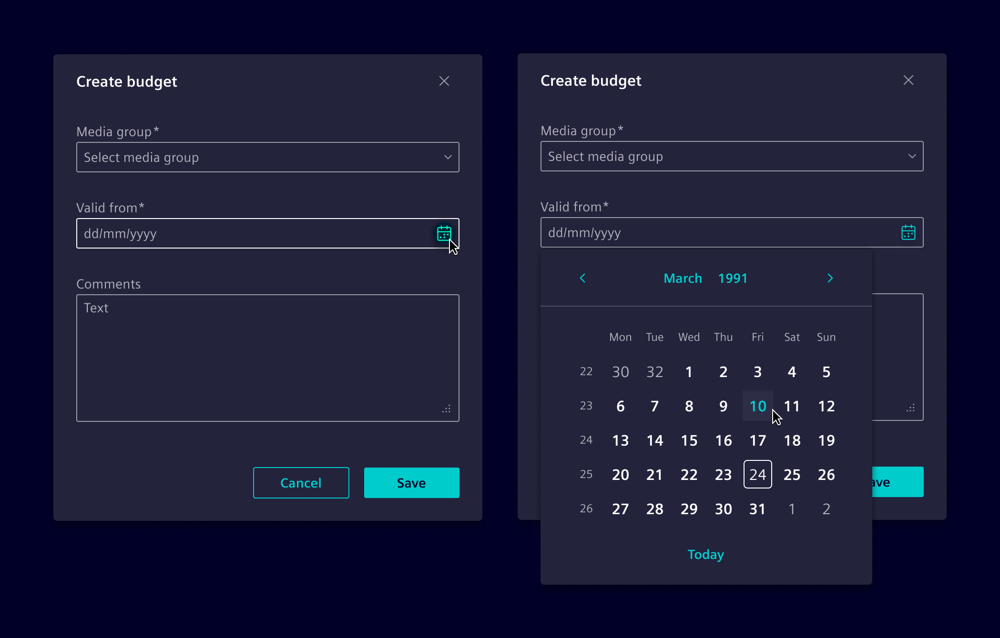
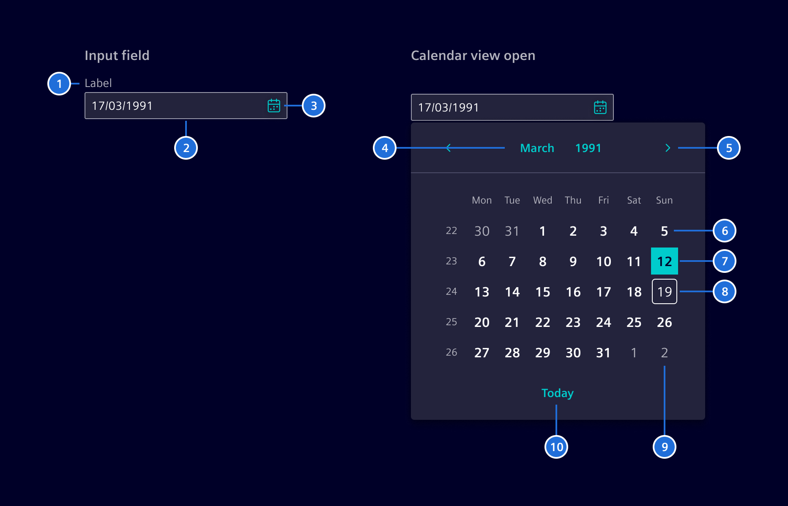
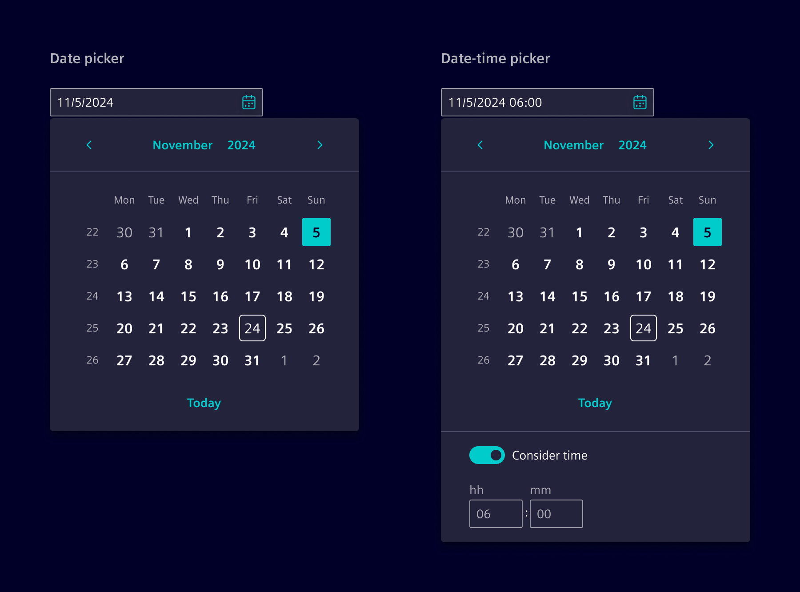
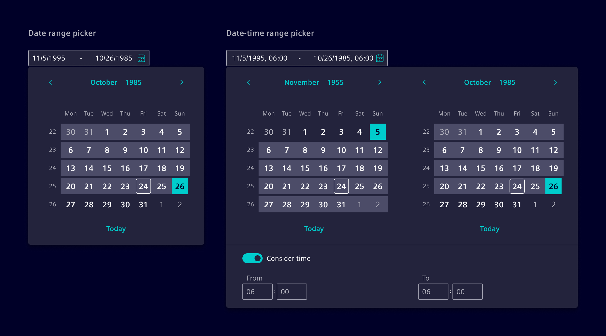
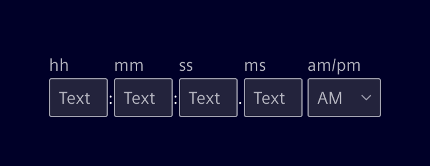

# Date & time

**Date pickers** and **time pickers** allow users to select and navigate through
past, present, and future dates and times.

## Usage ---

These components are used in scenarios where users need to input specific dates, times, or date ranges.

Date pickers typically include an expandable calendar menu and a text input field,
while time pickers focus solely on time selection, usually a text input
field or dropdown menu for selecting specific times.



### When to use

- To collect absolute date and time inputs.
- For scheduling tasks.
- In [forms](../forms-inputs/forms.md).
- To select date ranges for generating reports or viewing historical data.
- For relative date selection, use [date range filter](../forms-inputs/date-range-filter.md).

### Best practices

- Ensure the format of dates and times adheres to the user's locale settings.
  See [localization](../../fundamentals/localization.md) for more details.
- Ensure placeholders are also localized to match the user's regional settings (e.g., "MM/DD/YYYY").
- When required, validation can be set for all time inputs.
- Provide clear and concise labels for input fields.

## Design ---

### Basic anatomy

Date pickers and date-time pickers consist of an optional input field and a calendar view.
The input field allows users to manually type dates and times.
When needed, the calendar view opens for visual selection, making this structure **common across all variants.**



> 1. Label (optional), 2. Input, 3. Calendar button, 4. Month & Year control, 5. Previous and Next month control, 6. Default day, 7. Selected day, 8. Current day,  9. Off month day, 10. Today control

### Single date and date-time picker

The single date picker allows users to select a specific date, either by typing in the input field or using the calendar view.
When the time option is enabled, users can also select a specific time.



### Date and date-time range picker

The date range picker enables users to choose a start and end date.
When the time option is enabled, a two-month view layout is used.



### Time picker

The time picker is a component with separate input fields for individually setting units of time measurement (e.g., hh, mm, …).
Minutes, seconds, and milliseconds are optional and can be configured to show or hide as needed.



## Code ---

The datepicker and timepicker components are highly configurable. The datepicker optionally
includes the timepicker.

The `SiDatepickerComponent`, `SiTimepickerComponent`, as well as the `SiDatepickerDirective`, to
attach the datepicker component to a HTML input element, are provided by the `SiDatepickerModule`
Angular module.

### Usage

`Datepicker` can be imported using the module

```ts
import { SiDatepickerModule } from '@spike-rabbit/element-ng/datepicker';

@NgModule({
  imports: [SiDatepickerModule, ...]
})
```

or as a standalone component:

```ts
import {  
  SiDateInputDirective,
  SiDatepickerComponent,
  SiDatepickerDirective,
  SiDateRangeComponent 
} from '@spike-rabbit/element-ng/datepicker';

@Component({
  imports: [
    SiDateInputDirective,
    SiDatepickerComponent,
    SiDatepickerDirective,
    SiDateRangeComponent,
    ...
  ]
})
```

### Datepicker without time

The Datepicker component can be added to any view. Bidirectional binding of the date
object is provided by the `date` property. The configuration is handled by the `config`
object as documented in the API.

<si-docs-component example="si-datepicker/si-datepicker-no-time" height="350"></si-docs-component>

### Datepicker with time control

- Setting `showTime` in the config will display the timepicker within the date picker.
- A switch enables the user to include (`Consider time`) the time or not (`Ignore time`).
- Initial switch enablement is controlled by the `disabledTime` flag and changes are emitted
  by the `disabledTimeChange` output property.
- Use the `mandatoryTime` flag to hide the switch.

<si-docs-component example="si-datepicker/si-datepicker" height="450"></si-docs-component>

### Datepicker with date range

The `si-datepicker` allows to pick date ranges. Use the two-way binded property `dateRange`
and set `enableDateRange: true` in configuration.

<si-docs-component example="si-datepicker/si-datepicker-range" height="450"></si-docs-component>

### Input element with datepicker

The `SiDatepickerDirective` attaches the datepicker to an HTML input element. Without any additional
configuration, the Angular locale date formatter is used to write the selected date into the
input field. Changes of the input field are also parsed and used to set the date in the datepicker.
Optionally, you can provide a custom date and time format using the `config` object.

The directive implements the Angular `ControlValueAccessor` and can be used in Angular Forms.

<si-docs-component base="si-datepicker" height="650">
  <si-docs-tab example="si-datepicker-input" heading="Datepicker Input"></si-docs-tab>
  <si-docs-tab example="si-datepicker-input-playground" heading="Datepicker Input Playground"></si-docs-tab>
</si-docs-component>

### Input element with date range picker

The `SiDateRangeComponent` component is a custom component which can be used to use datepicker as range selector.

The component implements the Angular `ControlValueAccessor` and can be used in Angular Forms.

<si-docs-component base="si-datepicker" height="450">
  <si-docs-tab example="si-date-range" heading="Date Range"></si-docs-tab>
  <si-docs-tab example="si-date-range-playground" heading="Date Range Playground"></si-docs-tab>
</si-docs-component>

### Timepicker

The timepicker component is a custom component with individual input fields for setting the
parts of the time individually, like hours, and minutes. It implements the `ControlValueAccessor`
and can be used in Angular Forms.

<si-docs-component base="si-datepicker">
  <si-docs-tab example="si-timepicker" heading="Timepicker"  height="350"></si-docs-tab>
  <si-docs-tab example="si-timepicker-limits" heading="Timepicker With Min And Max" height="100"></si-docs-tab>
</si-docs-component>

<si-docs-api component="SiDatepickerComponent"></si-docs-api>

<si-docs-api component="SiDateRangeComponent"></si-docs-api>

<si-docs-api component="SiTimepickerComponent"></si-docs-api>

<si-docs-api directive="SiDatepickerDirective"></si-docs-api>

<si-docs-types></si-docs-types>
