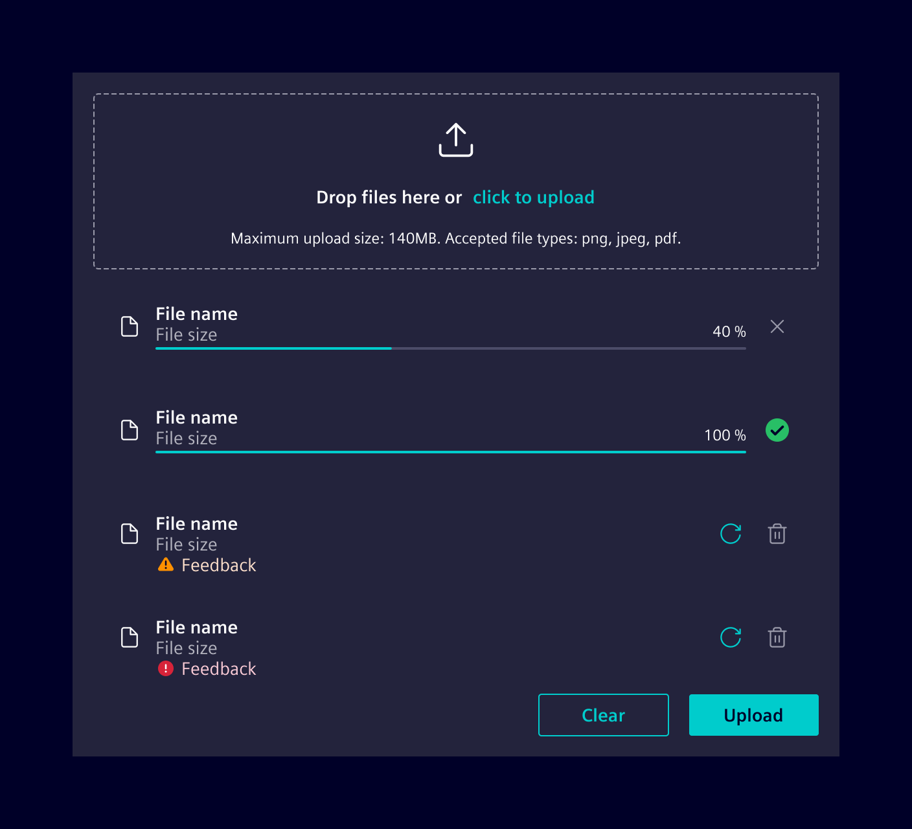
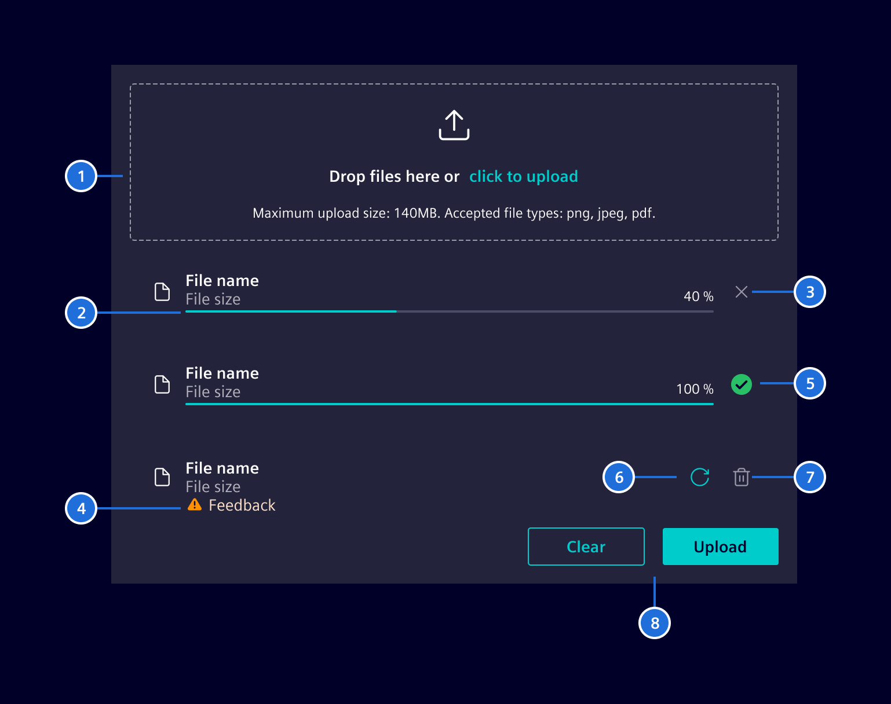
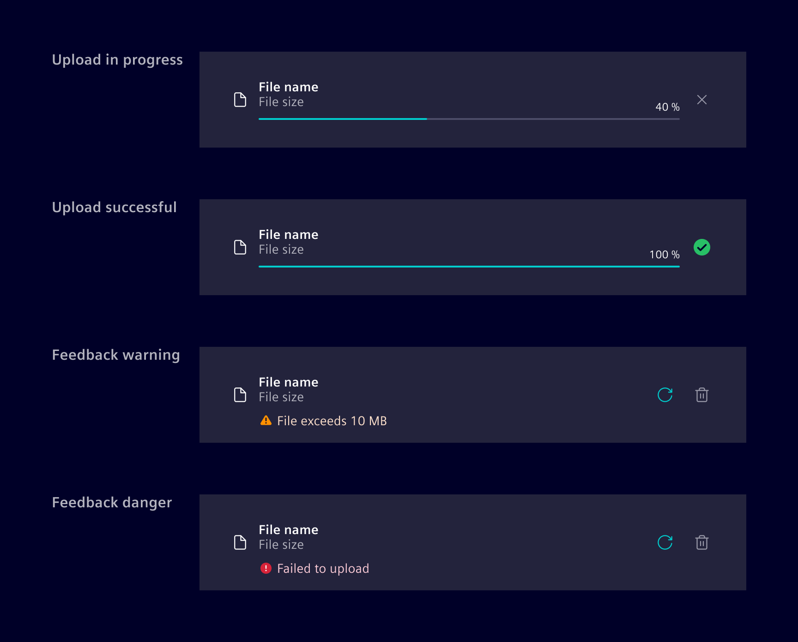
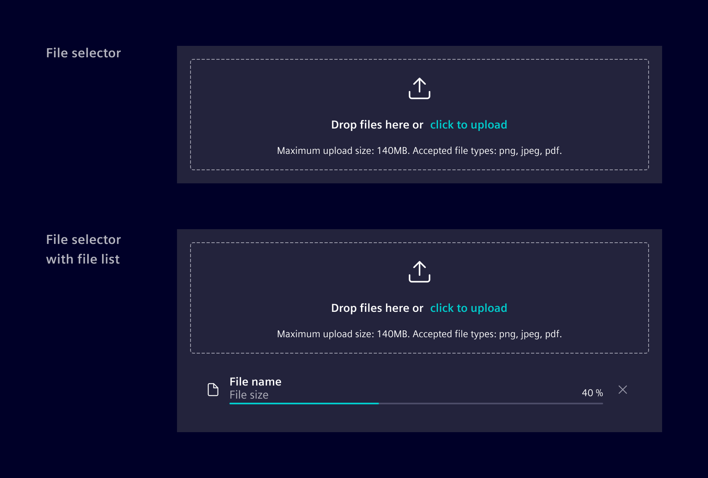

# File uploader

The **file uploader** component allows users to upload one or more files, such
as images, documents or firmware. It shows the upload progress as well as a
success/error status after an upload finishes.

## Usage ---

The file uploader allows to upload file-based content. They are typically
integrated in forms but can also be used in a standalone fashion.

Users can upload files by dragging and dropping them into the designated drop
area. Alternatively, users can also use a browser's/OS' native file selection
dialog by clicking the upload link within the drop zone.



## Design ---

### Elements



> 1. File selector/drop zone, 2. File upload progress, 3. Cancel file upload
> button, 4. Upload issue feedback, 5. Upload successful icon , 6. Retry
> button, 7. Delete file button, 8. Actions (optional)

### Upload states



### Variants

The file uploader is available in two variants, either as just the file selector
alone without any status or interaction controls or as the complete variant with
file list and all other state management handling.



The component can be set to either a fixed height or it supports a dynamically
growing one to accommodate a longer list of uploaded files. When set to a fix
height, the additional files might be hidden and users have to scroll to see
them.

## Code ---

This component can be used to upload a file. Either via file browser or using
drag and drop. It also shows you if the upload was successful or has failed.
In the case that it was successful, you will be provided with the output emitter
`uploadFinished`.

### Usage

```ts
import { SiFileUploaderComponent } from '@spike-rabbit/element-ng/file-uploader';
import { HttpClientModule } from '@angular/common/http';

@Component({
  imports: [SiFileUploaderComponent, HttpClientModule, ...]
})
```

<si-docs-component example="si-file-uploader/si-file-uploader" height="250"></si-docs-component>

It's also possible to have only the file selector / drop zone part without the file list.

<si-docs-component example="si-file-uploader/si-file-dropzone" height="250"></si-docs-component>

<si-docs-api component="SiFileUploaderComponent"></si-docs-api>

<si-docs-api component="SiFileDropzoneComponent"></si-docs-api>

<si-docs-types></si-docs-types>
