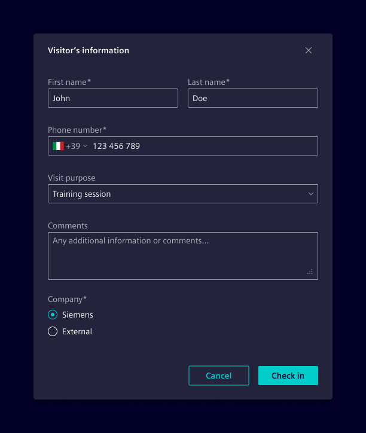
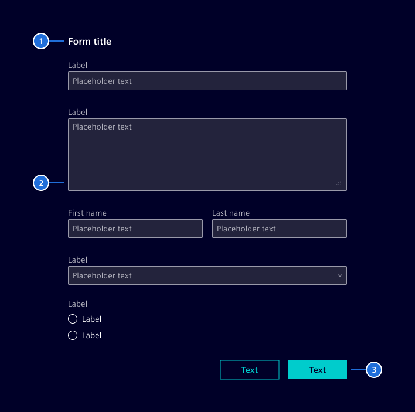
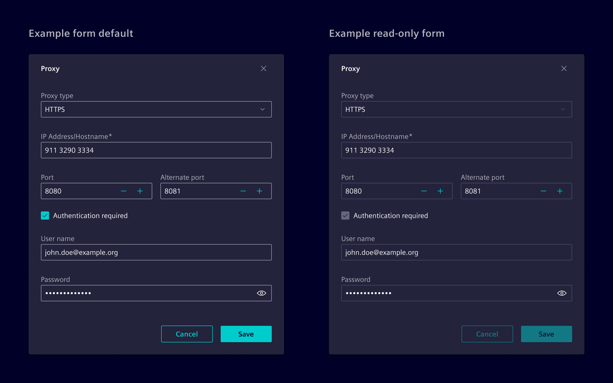
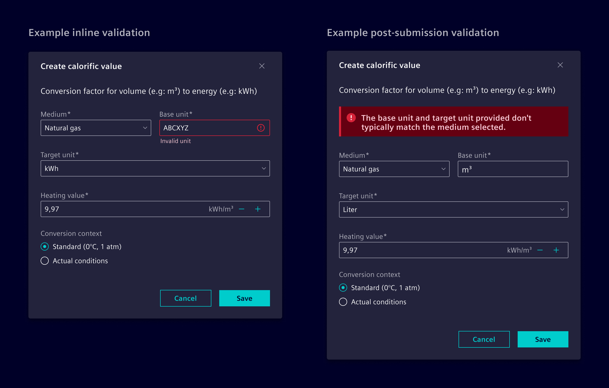

# Forms

Forms are components designed to create and structure input masks, consisting of
multiple input controls. They are configurable to fit various use cases and
layouts.

## Usage ---

A form is a set of related input controls that allow users to provide
information.



### Best Practices for Forms

- Keep it short. Remove fields that collect redundant, untimely, or unnecessary
  information.
- Ask for information in a logical sequence.
- Visually group related fields.
- Match fields to the type and size of the expected input.
- When possible, use smart defaults and typeahead behavior.
- Don’t rely on placeholders; include a short and meaningful label.
- Distinguish optional and required fields. Required fields can be indicated
  using an asterisk.
- Make action buttons task-specific

## Design ---

### Elements



Forms can be comprised of some or all of the following elements:

1. **Title:** A brief headline that indicates the form's purpose or the
   information it collects.
2. **Form body:** Enable users to insert free or specific form text (e.g:
   [text inputs](../forms-inputs/input.md), [select](../forms-inputs/select.md),
   [checkboxes](../forms-inputs/checkbox.md), [radio buttons](../forms-inputs/radio.md),
   and more).
3. **Actions:** Allow users to submit or quit a form.

### States

The status of the form directly corresponds to the status of each of its
individual fields.



### Labels

Labels can be placed on top of fields or to the left (in RTL languages). All
labels in a single form should use the same placement style.
**Prefer top placement of labels**, since it provides a consistent left edge
alignment, improving scannability.

### Validation

Always display error states within the form and prioritize the use of inline
validation.

- Inline validation: This validates user data while they fill out the form,
  being triggered immediately after a field loses focus.
- Post-submission validation: This assesses the entire form's data only after
  the user has submitted it, providing feedback through inline notifications.



## Code ---

User input is one of the essential pillars of many applications.
Read [Forms in Angular](https://angular.dev/guide/forms) as basis
for working with forms.

The following are important yet repetitive tasks for every form control
(e.g. input, textarea, checkbox) of a form:

- For accessibility, linking a `<label>` to its input using `id`/`for` attributes or aria attributes.
- the label must be correctly aligned for different types, e.g. text, checkbox, ...
- Display meaningfull validation error messages on input to guide and support the user.
- Group related form fields to a fieldset. For example, multiple radio checkbox inputs belong to one input and have one label.

Element provides components to shift repetitive and common tasks from
the application developers to the framework. The `si-form-item` component
is a wrapper around a form control element that renders the associated label.

```html
<si-form-item label="My form item">
  <input [formControl]="angularControl" class="form-control">
</si-form-item>
```

The `si-form-item` component adds and links a label to the control in compliance to [WCAG v2.2](https://www.w3.org/TR/WCAG22/),
so that screen readers are able to guide users through the form.

Native controls like `<input>` are only recognized by the `si-form-item` if they are an angular control,
meaning that they either have a `formControl`, `formControlName` or `ngModel` attached.
Custom controls of Element (e.g. `si-select`) are automatically recognized by the `si-form-item`.

### Form feedback

Element form controls should provide user feedback on user input.
[Angular Forms](https://angular.dev/guide/forms/form-validation) handle
valid and invalid form states automatically. In addition, Element supports
setting form control states and feedback messages explicitly in the template:

```html
<si-form-item label="Warning item">
  <input class="form-control is-warning">
  <span class="warning-feedback">Attention, this is a Warning!</span>
</si-form-item>
```

These states are available:

- valid --> `is-valid`
- warning --> `ìs-waring`
- error --> `is-error`

For warning and error states, a respective icon is automatically added.
Starting with Element v46, the feedback icon **must not** be added manually.

### Error messages

`si-form-item` is capable of showing errors from Angular's validation mechanism automatically.
Element has a built-in resolution of standard errors like `required`.
On top of that, Element supports configuring the resolution mechanism.
This enables applications to adjust existing messages and add new ones for custom validators.

#### Global error resolution

For a standalone app:

```ts
import {ApplicationConfig} from "@angular/core";
import {provideFormValidationErrorMapper} from "@siemens/element-ng/form";

export const appConfig: ApplicationConfig = {
  providers: [
    provideFormValidationErrorMapper(
      {
        maxlength: 'MY.CUSTOM.ERROR.MESSAGE.KEY', // when using ngx-translate one has access to the validation result as parameters (requiredLength and actualLength in this case)
        minlength: ({ requiredLength }) => `This field must be at least ${requriredLength} characters long`,
        myCustomError: ({ myCustomErrorResult }) => `My custom error message: ${myCustomErrorResult}`,
      }
    )
  ]
}
```

or for a module base app:

```ts
import {SiFormModule} from '@siemens/element-ng/form';

@NgModule({
  imports: [
    SiFormModule.withConfiguration({
      validationErrorMapper: {
        maxlength: 'MY.CUSTOM.ERROR.MESSAGE.KEY', // when using ngx-translate one has access to the validation result as parameters (requiredLength and actualLength in this case)
        minlength: ({ requiredLength }) => `This field must be at least ${requriredLength} characters long`,
        myCustomError: ({ myCustomErrorResult }) => `My custom error message: ${myCustomErrorResult}`,
      },
    })
  ],
})
```

#### Local error resolution

```html
<si-form-item label="Required input" [formErrorMapper]="{required: 'This field is required'}">
  ...
</si-form-item>
```

### Required detection

`si-form-item` automatically detects whether a form control is required.
It does this by checking if Angular's required validator is attached
or if the control's validation feedback contains `{required: true}`.

To have this check working, make sure that only the standard validators of
Angular are used.

### Form fieldset

Use a `si-form-fieldset` to group multiple related `si-form-item`.
This is often required for radio inputs, but works for every other type as well.

```html
<si-form-fieldset label="Radion options">
  <si-form-item label="Radio option A">
    <input type="radio" class="form-check-input">
  </si-form-item>
  <si-form-item label="Radio option B">
    <input type="radio" class="form-check-input">
  </si-form-item>
</si-form-fieldset>
```

### Custom Controls

`si-form-item` provides an API for being linked to custom controls implemented by an application.
Custom controls must implement the `SiFormItemControl` interface and provide themselves as `SI_FORM_ITEM_CONTROL`:

```ts
import { SI_FORM_ITEM_CONTROL, SiFormItemControl } from '@siemens/element-ng/form';
import { Component } from '@angular/core';

@Component({
  providers: [{ provide: SI_FORM_ITEM_CONTROL, useExisting: CustomControlComponent}]
})
export class CustomControlComponent implements SiFormItemControl {
  // Provide an automatically generated ID.
  // If your component is only a wrapper around either an input, textarea or select,
  // assign this ID to that element. Otherwise assign it to the host element.
  private static idCounter = 0;
  readonly id = `__app-custom-control-${CustomControlComponent.idCounter++}`;


  // Set this only if the custom-control is NOT an input, textarea or select.
  // It is required as the [for] attribute of an label only works for native inputs.
  readonly labelledby = `${this.id}-label`;

  // Set to true if, the control should be rendered like a checkbox. This only affects the positioning of the label.
  // If false, this should be omitted.
  readonly isFormCheck = false;
}
```

For HTML Elements that are marked as `form-control` (--> input like appearance), icons are automatically included.
If the form-control contains custom icons at the end, like the dropdown arrow for select, adjust the positioning of the
feedback icon.

1. `--si-feedback-icon-offset` contains the size of the currently shown feedback icon.
   Use this to shift the content within the `form-control` so that it does not overlap the icon.
2. Set `--si-action-icon-offset` to move the feedback so that there is space for icons after it.

The example below shows how to create a wrapped input with an action icon:

```html
<div class="form-control">
  <input class="my-inner-input">
  <i class="my-action-icon element-arrow-down icon"></i>
</div>
```

```scss
.form-control {
  --si-action-icon-offset: 24px // size of my-action-icon
}

.my-inner-input {
  margin-inline-end: var(--si-feedback-icon-offset);
}

// other styling
```

### Si-Form-Container

The `si-form-container` is an optional wrapper around a form.
It provides additional responsive behavior for switching labels dependent
on the available size from `block` (label is on top the input) to `inline` (label is on the same line).

### Example

<si-docs-component example="si-form/si-form" height="470"></si-docs-component>

### Angular Formly

Formly is a library for generating dynamic forms based on JSON input instead of pre-constructed HTML templates.
Consider using formly for forms whose fields are not known at compile time and instead are created dynamically
based on data.
Element provides a built-in theming for [formly](https://formly.dev/) which is part of the `si-formly` component.
See also [Dynamic Forms](../../architecture/dynamic-forms.md).

### Native HTML markup

> Element does not recommend using native markup.

The Element theme includes a few CSS classes that are also internally used by the `si-form-item`.
Internally, a form item is basically structured like this:

```html
<div>
  <label class="form-label" for="input">Label</label>
  <input class="form-control" id="input">
</div>
```

For checkboxes and radios, it uses `form-check` instead of the `form-control` class:

```html
<div class="form-check">
  <input class="form-check-input" id="input" type="checkbox|radio">
  <label class="form-check-label" for="input">Label</label>
</div>
```

In both variants the feedback is included using a `*-feedback` class.
The feedback is either visible if an Angular state matches the feedback like `.ng-invalid`
or if the state is set manually by applying a class like `.is-invalid`.

```html
<div>
  <label class="form-label" for="input">Label</label>
  <input class="form-control is-invalid" id="input">
  <div class="invalid-feedback">Invalid feedback</div>
</div>
```

<si-docs-api component="SiFormContainerComponent"></si-docs-api>

<si-docs-api component="SiFormItemComponent"></si-docs-api>

<si-docs-types></si-docs-types>
