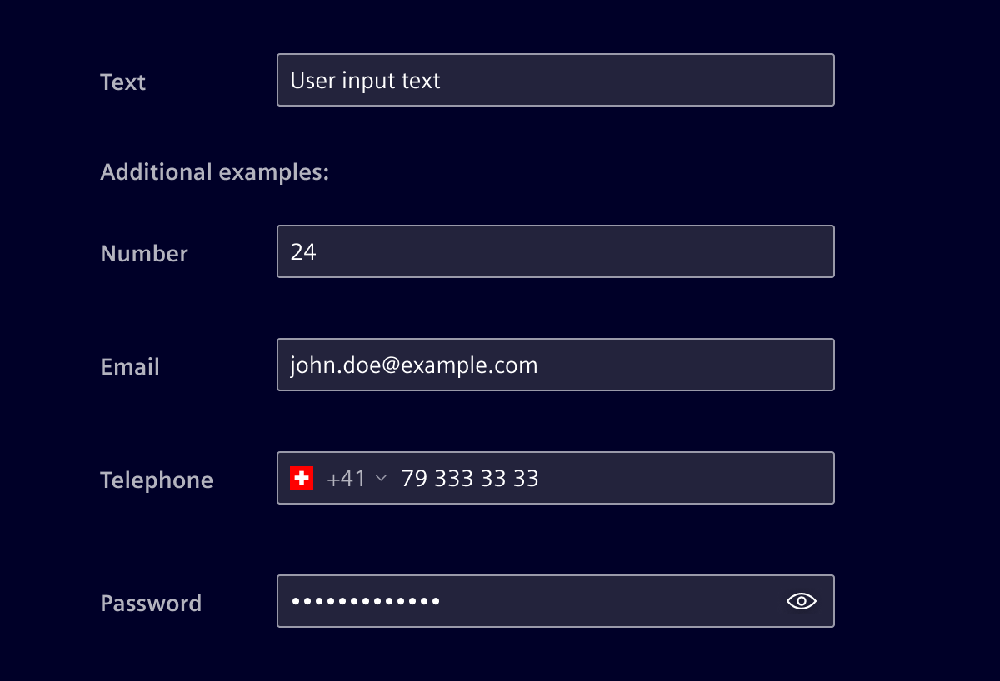
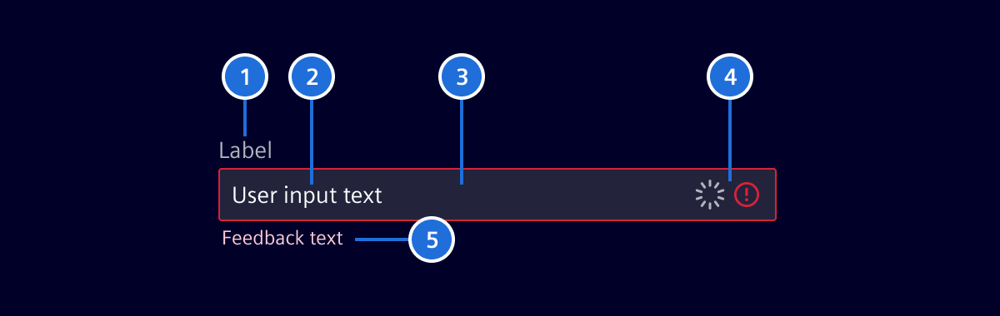
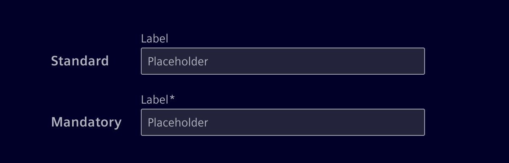
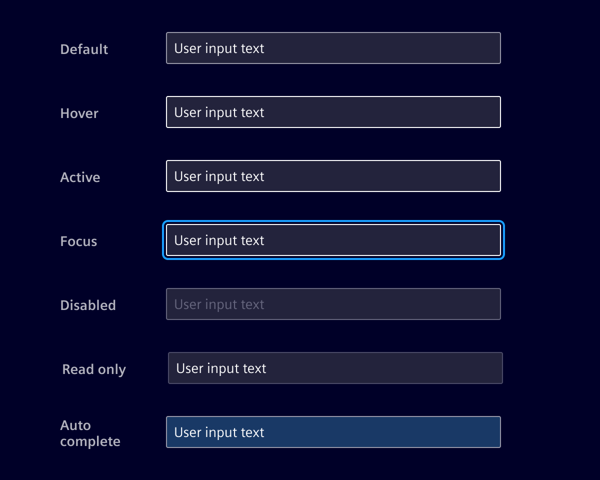
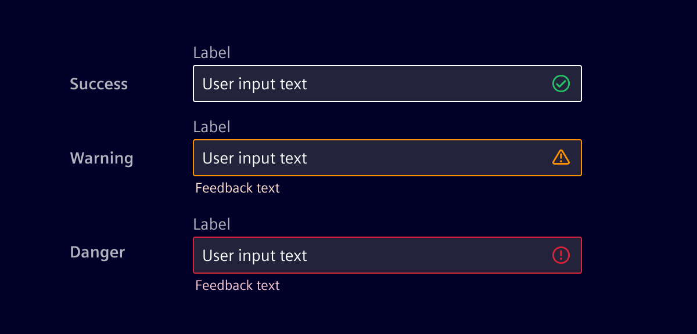
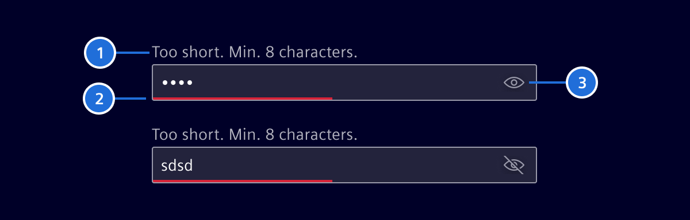
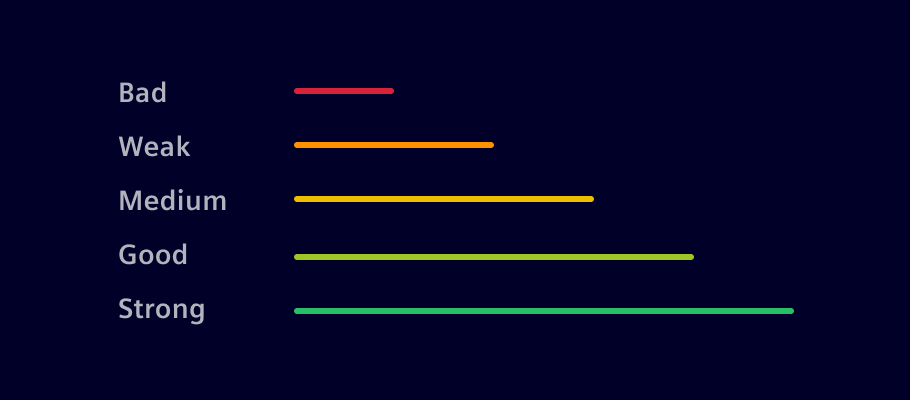
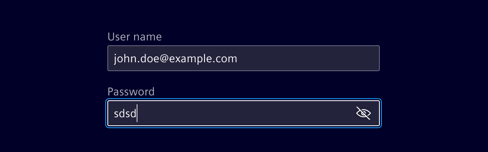

# Input

**Input** allows a user to provide text based input in different formats. They are usually found within a form but can also be part of a modal, search, or card.

## Usage ---

When the expected text input is a single line as opposed to a paragraph.

It supports different types of input formats like **text**, **number**, **password**, **email**, **tel**, **URL** and more.



**Element design system** offers specific components for:

- [Number input](number-input.md)
- [Phone number input](phone-number-input.md)
- [Pills input](pills-input.md)

### When to use

- When the expected user input is a single line of text or numerical values.
- When there is a need to enter text.
- Common text input types include user names, descriptions, URLs, emails, addresses, and plain text searches.

#### Best practices

- When the expected user input is more than one line [use the textarea component instead](text-area.md).
- Distinguish between editable vs. read-only fields.
- Differentiate between required and optional fields.
- Maintain a proper field size, according to each specific case.
- Define the width of the input field according the content and the grid system.
- Do not use single-line text fields for longer input texts.

## Design ---

### Elements



> 1. Label (Optional), 2. Content / Placeholder text, 3. Container, 4. Icons (Optional), 5. Message (Optional)

### Label (Optional)

Precise labeling helps users understand what information to enter.

- Keep labels short and clear (should not be wider than the input field).
- A required field will be marked with an ***-asterisk**.
- Labels can be placed above or left to the input.



### Content

Labels should always be present to describe the purpose of the field.
If possible, use smart default values to help users avoid unnecessary typing.
Use type-ahead to make suggestions, if the value cannot be determined.

#### Placeholders

Placeholder text can offer hints or examples of expected content.
Since placeholders disappear when users start typing, they shouldn’t contain essential information.

When an input field is disabled, the placeholder is hidden since the field cannot be edited or focused.

### Container

The container is used to indicate the different states an input field can have.



### Validation

Real time validation helps to streamline the process and keep input data clean while the user is filling out forms.



### Password

#### Defining a new or changing a password

The password strength indication helps to ensure that a password meets the password policy, such as minimum length, the use of certain characters and more.
It gives the user immediate feedback about the current password strength and instructions to strength the password.



> 1. Instructions, 2. Strength indicator, 3. Show/Hide - control (Optional)

Give the user clear **instructions** about how to meet the password requirements
like:

- Minimum length
- Uppercase letter (`[A..Z]`)
- Lowercase letter (`[a..z]`)
- Use number (`[0..9]`)
- Special character (`[$,#,...]`)

The **strength indicator** validates and gives the user visual feedback about the password's strength.



#### Entering a password/login



The password visibility toggle allows users to show or hide their passwords, enhancing both convenience and security.

## Code ---

### References

- **Bootstrap:** [Form Control](https://getbootstrap.com/docs/5.1/forms/form-control/)

### Usage

<si-docs-component example="input-fields/single-line" height="220"></si-docs-component>

#### Password input with visibility toggle

The `si-password-toggle` component provides an `inputType` property that has to be applied
to the input's `type`:

```html
<si-password-toggle #toggle>
  <input
    ...
    [type]="toggle.inputType"
  ></input>
</si-password-toggle>
```

#### Password strength policy

The `si-password-strength` component provides the user feedback about the strength of a new password.

Wrap the component around an input with `type="password"`. Add the `[siPasswordStrength]` directive
to the input field and specify the requirements which have to be fulfilled for an eligible password.

Utilize the output callback event [`(passwordStrengthChanged)`](./input.md#SiPasswordStrengthDirective_o) to get the current password strength.

```html
 <si-password-strength>
  <input
    id="password"
    type="password"
    name="password"
    class="form-control"
    ngModel
    [siPasswordStrength]="{
      minLength: 8,
      uppercase: true,
      lowercase: true,
      digits: true,
      special: true
    }"
    (passwordStrengthChanged)="doSomething($event)"
  />
</si-password-strength>
```

<si-docs-component example="input-fields/password" height="220"></si-docs-component>

<si-docs-api component="SiPasswordToggleComponent"></si-docs-api>
<si-docs-api component="SiPasswordStrengthComponent"></si-docs-api>
<si-docs-api directive="SiPasswordStrengthDirective"></si-docs-api>

<si-docs-types></si-docs-types>
