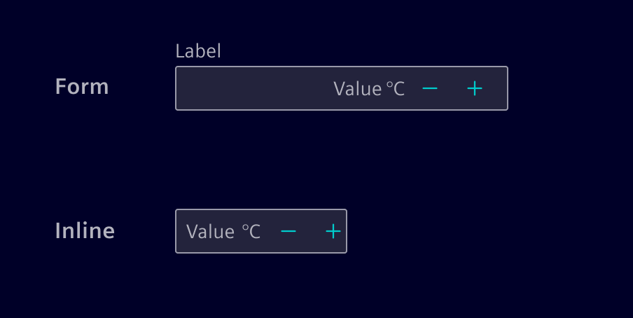
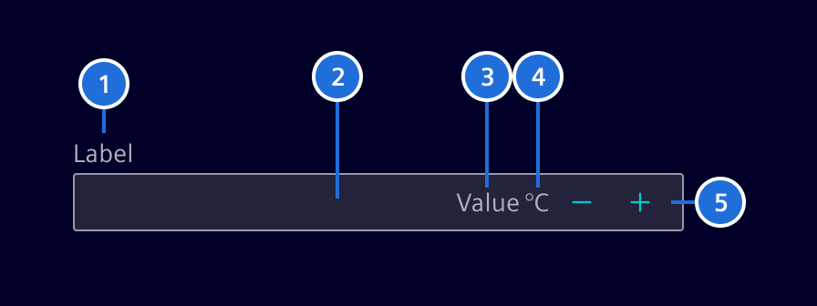
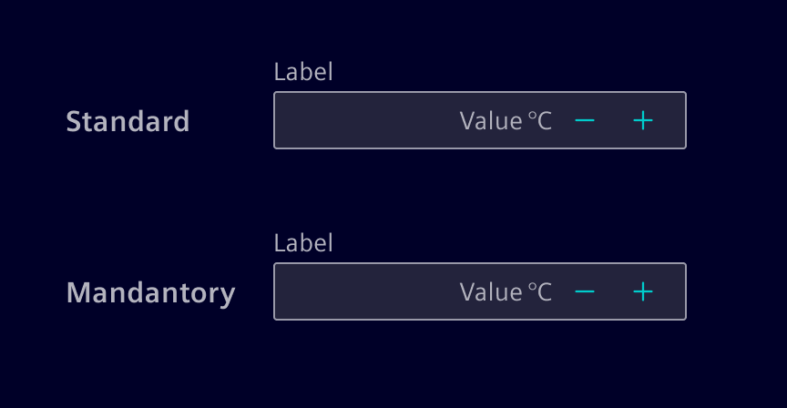
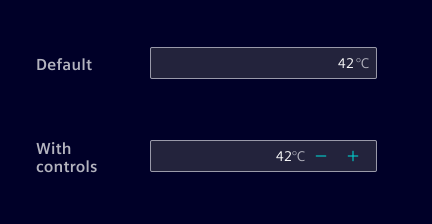
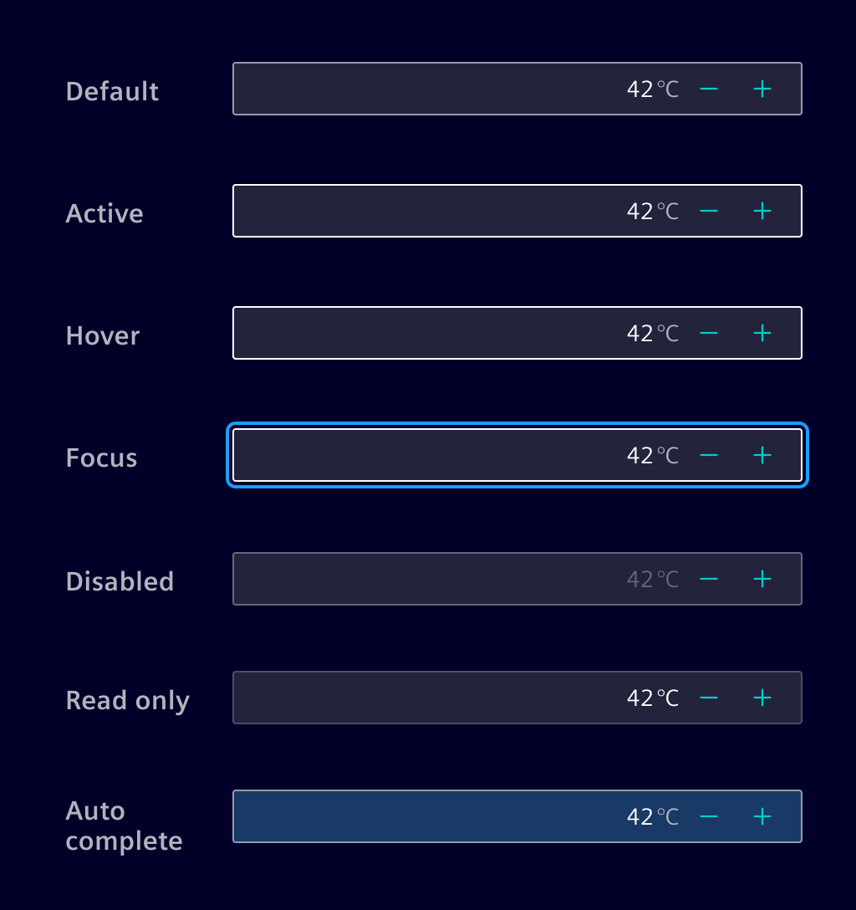
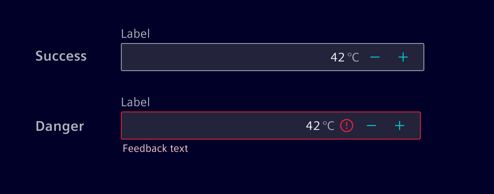

# Number input

The **number input** allows users to enter and modify a numeric value with an
optional unit.

## Usage ---

The component includes `+` / `-` controls to increment or decrement the value in predefined steps.
It acts as a high-level alternative to the native number input control.



### When to use

- To enter a numeric value in a form or inline in a component.
- When a user needs precise control over a numeric value.

### Best practices

- Define the width of the number input field according to the maximum value
  and the grid system.
- Offer a smart default value whenever possible.
- When precision is not important, use a [slider](../forms-inputs/slider.md) instead.

## Design ---

### Elements



> 1. Label (optional), 2. Container, 3. Content, 4. Unit (optional), 5. Controls
> (optional)

#### Label (optional)

Effective form labeling helps users understand what information to enter.



- Provide a short and concise label that is shorter than the input field itself.
- A mandatory field is marked with an **`*`-asterisk.**
- Labels can be placed above or left to the input.

#### Controls (optional)

The number input can contain controls to increment or decrement the value.

It is possible to set the step size. E.g. in a range of `0..10'000`, a step size
of `10` is more appropriate.



### Interaction states



### Validation

Real-time validation ensures that the data being entered is within a specific
range or follows certain rules, preventing errors and ensuring the integrity of
the data.



## Code ---

A drop-in replacement for the HTML `<input type="number">`. It has more
accessible increment decrement buttons and can show a unit.

### Usage

```ts
import { SiNumberInputComponent } from '@siemens/element-ng/number-input';

@Component({
  imports: [SiNumberInputComponent, ...]
})
```

<si-docs-component example="si-number-input/si-number-input"></si-docs-component>

<si-docs-api component="SiNumberInputComponent"></si-docs-api>

<si-docs-types></si-docs-types>
