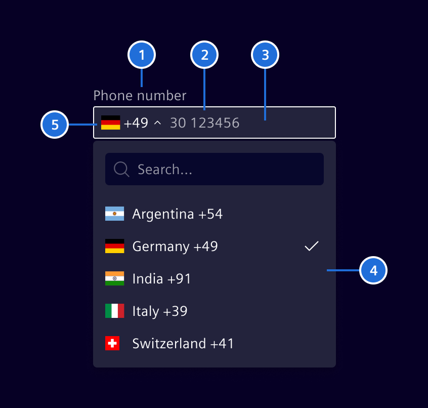
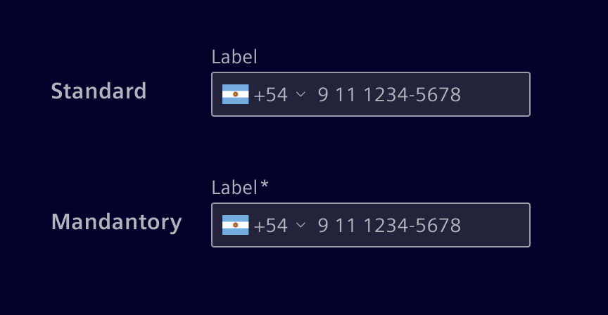
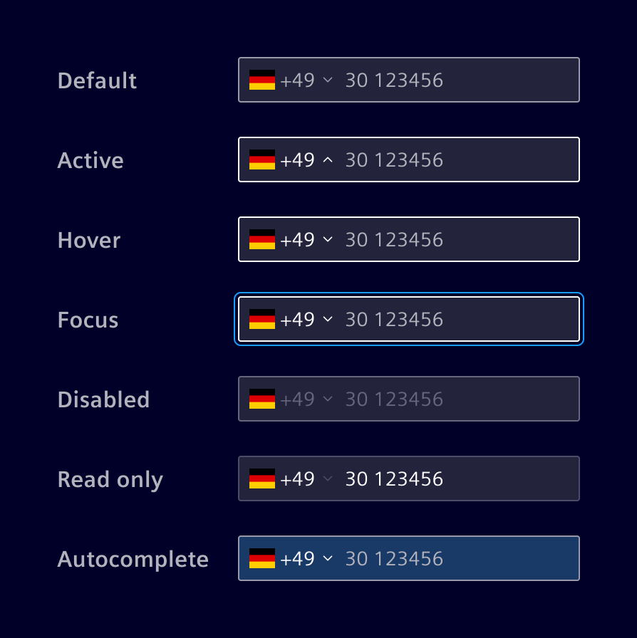

# Phone Number Input

The **Phone Number Input** allows a user to enter a phone number by selecting the country
(international area code) from a dropdown list and entering the rest of the number in
a text input field.

## Usage ---


### When to use

- For allowing users to enter or update a phone number.
- When validation and formatting of international phone numbers are required.

### When not to use

- When collecting non-phone number data, a standard [*Input*](../forms-inputs/input.md) component should be used.

### Best Practices for Phone Number Input

- Ensure the input field is wide enough to accommodate different international phone number formats.
- Use smart defaults, such as showing the country code and phone number format based on the user's location.

## Design ---

### Elements



> Label (optional) 2. Content/placeholder text, 3. Container, 4. Menu, 5. Country code with flag.

#### Label (optional)

Effective form labeling helps users understand what information to enter.



- Keep labels short and clear (should not be wider than the input field).
- A mandatory field is marked with an **`*`-asterisk.**

### Interaction States



### Validation

Real-time validation ensures that the data being entered is within a specific
range or follows certain rules, preventing errors and ensuring the integrity of
the data.


## Code ---

### Usage

```ts
import { SiPhoneNumberInputComponent } from '@siemens/element-ng/phone-number';

@Component({
  imports: [SiPhoneNumberInputComponent, ...]
})
```
<!-- markdownlint-disable MD046-->
??? info "Required Packages"
    - [google-libphonenumber](https://www.npmjs.com/package/google-libphonenumber)
    - [@types/google-libphonenumber](https://www.npmjs.com/package/@types/google-libphonenumber)
    - [flag-icons](https://www.npmjs.com/package/flag-icons)

    The versions of the required packages are defined in the peer-dependencies of [element-ng](https://github.com/siemens/element/blob/main/projects/element-ng/package.json). Together with the types package, they are also part of the [package.json of the demo app](https://github.com/siemens/element/blob/main/package.json).
<!-- markdownlint-enable MD046-->

- Ensure to import the `node_modules/flag-icons/css/flag-icons.css` to the `angular.json` styles configuration as follows:

```ts
          "styles": [
              "node_modules/flag-icons/css/flag-icons.css",
              ...
          ]
```

- Set the `supportedCountries` input array to define the available list of countries. The countries are defined in [ISO-3166-2](https://en.wikipedia.org/wiki/ISO_3166-2) format.
- To display all the available countries, don't add `supportedCountries` input.
- Use the `defaultCountry` [ISO-3166-2](https://en.wikipedia.org/wiki/ISO_3166-2) input to select a default.
- Set `validatePhoneNumber` input to enable a validation service and show status information in the form control.
- Use the `placeholderForSearch` input for a custom placeholder text of the country search.
- The `selectCountryAriaLabel` input sets the ARIA label for the country dropdown.
- The `phoneNumberAriaLabel` input sets the ARIA label for the phone number input.
- All changes are emitted through the `valueChange` output.

<si-docs-component example="si-phone-number-input/si-phone-number-input" height="300"></si-docs-component>

<si-docs-api component="SiPhoneNumberInputComponent"></si-docs-api>

<si-docs-types></si-docs-types>
