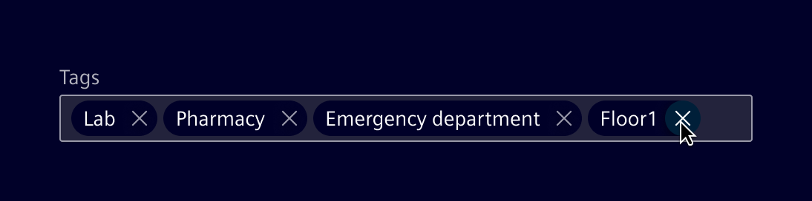
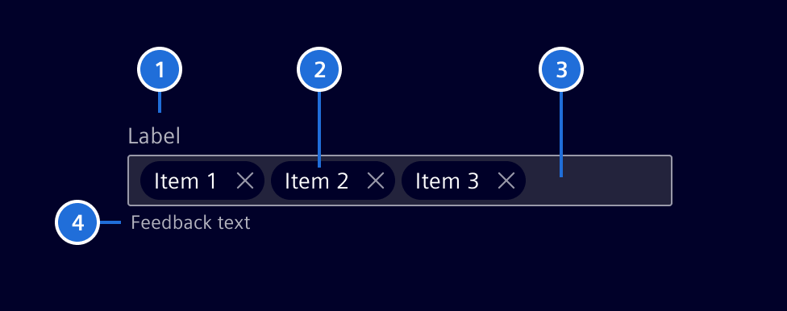
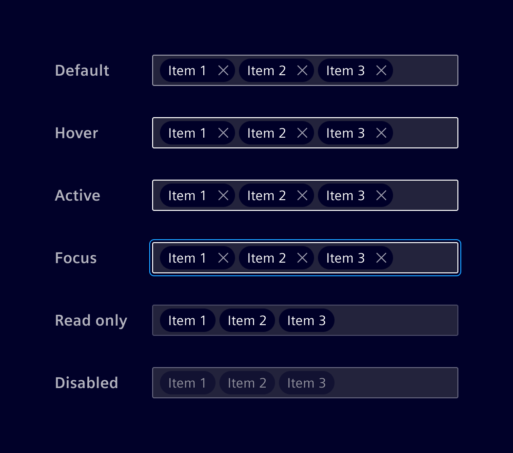
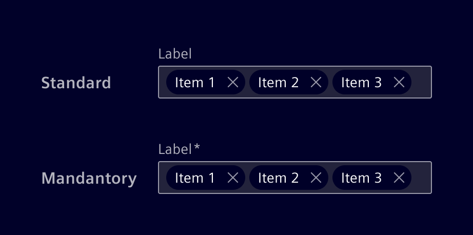
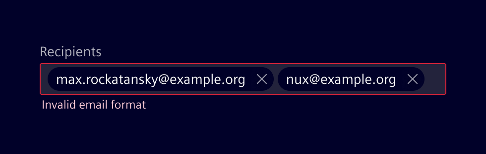
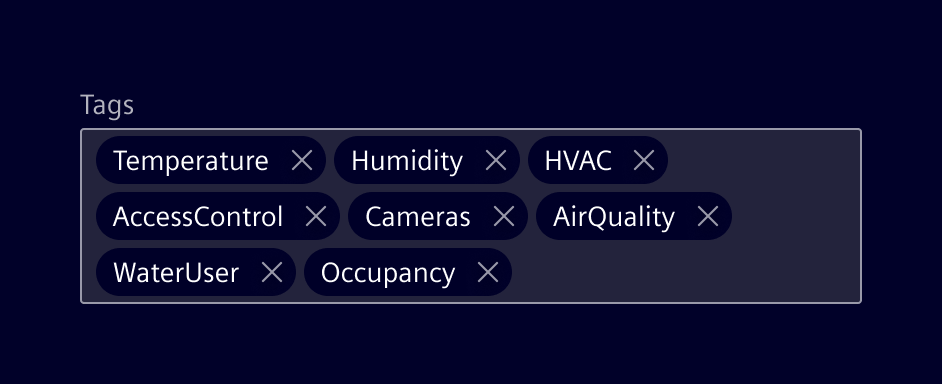

# Pills input

**Pills input** allows users to enter multiple items, such as tags or email addresses, into a single input field.

## Usage ---

Pill Input is a control that lets users enter text, transforming each entry into a distinct "pill".
A new entry is added when the Enter key is pressed or when separated by commas or semicolons.
Existing pills can be deleted as needed.



### When to use

- To add tags to categorize content, making it easier for users to classify and find items based on keywords.
- To enter email addresses or names, allowing users to easily add or remove recipients.
- For selecting multiple options from a wide range of choices.

### Best practices

- Guide users with examples in the placeholder, like "Enter tags, separated by commas."
- If needed, set a maximum number of pills to keep the interface clean.
- Offer autocomplete suggestions as required.
- Provide validation when necessary.

## Design ---

### Elements



> 1. Label (optional), 2. Pills, 3. Container, 4. Message (optional)

### Interaction states



### Label (optional)

Effective labeling helps users understand what information to enter.

- Keep labels short and clear (should not be wider than the input field).
- Mandatory fields are marked with an `*`-asterisk.
- Labels can be placed on top of fields or to the left (in RTL languages).
  Prefer top placement of labels, since it provides a consistent left edge alignment, improving scannability.



### Validation

Real-time validation can be implemented to ensure that entered text meets specific
criteria.



### Responsive behavior

When space is limited, pills are stacked to ensure adaptability across various screen sizes.



## Code ---

### Usage

```ts
import { SiPillsInputComponent } from '@spike-rabbit/element-ng/pills-input';

@Component({
  imports: [SiPillsInputComponent, ...]
})
```

<si-docs-component example="si-pills-input/si-pills-input" height="250"></si-docs-component>

<si-docs-api component="SiPillsInputComponent"></si-docs-api>

<si-docs-api directive="SiPillsInputCsvDirective"></si-docs-api>

<si-docs-types></si-docs-types>
