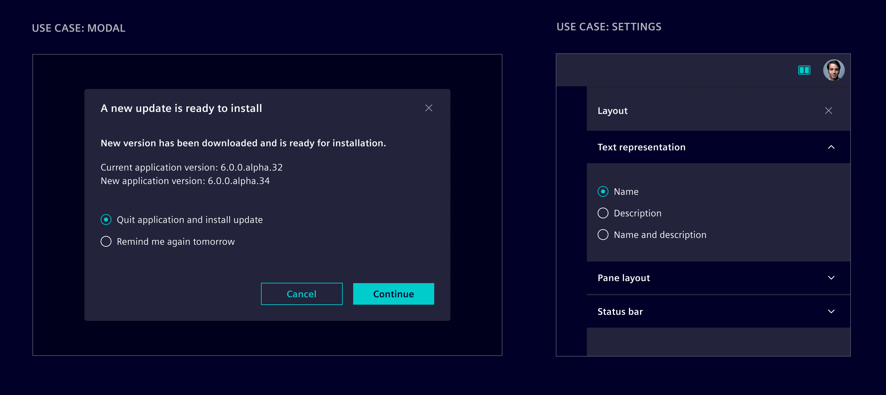
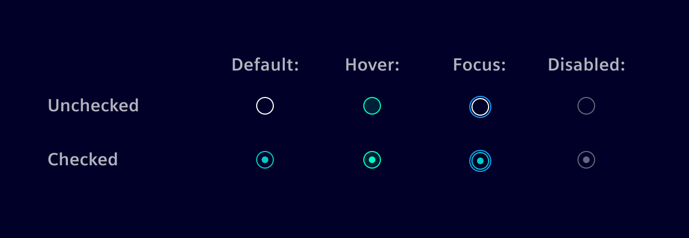
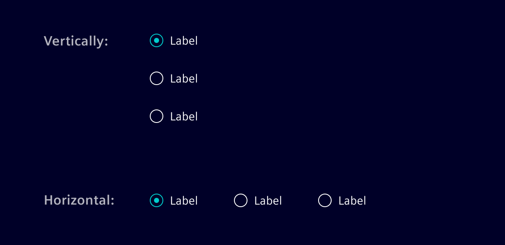
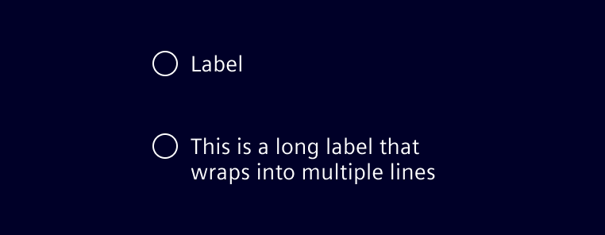

# Radio buttons

**Radio buttons** are used when there is a list of two or more options that are
mutually exclusive and the user must select exactly one choice. When a user
chooses a new item, the previous choice is automatically deselected.

## Usage ---

Radio buttons can be used where a user has to make a mutually exclusive
selection, e.g. in forms, modals, side panel, settings and more.



### Best practices for radio buttons

- The list of options should be structured in a logical order, e.g. from
  simplest operation to the most complex one or least to most risk.
- Options should be comprehensive and clearly distinct.
- Radio buttons should always have exactly one option pre-selected. Select the
  safest and most secure option (*e.g. to prevent data loss*).
- If users need to be able to skip any selection, provide a radio button for
  this choice labeled as "None".
- Avoid nesting radio buttons with other radio buttons or checkboxes. Keep all
  options at the same level to avoid confusion.
- For selecting multiple options, use the [checkbox](checkbox.md) component
  instead.

## Design ---

### Interaction states



When possible, arrange the radio button groups vertically for easier reading.



### Labels

Always use clear and concise labels for radio buttons. Labels should always be
placed to the right of radio button inputs.

If labels are too extensive, try to reworded them to be shorter. If it's not
possible, wrap the text to a second line so the radio button and label are top
aligned.



## Code ---

In Element, radio buttons are created using the native `<input type="radio">` element.
They should be used together with the `si-form-item` component (see [here](forms.md)).
Like checkboxes, they are styled using the `form-check-input` class.

```html
<si-form-item label="Radio button">
  <input type="radio" class="form-check-input" [formControl]="control">
</si-form-item>
```

The class `form-check-input` and `type="radio"` must be applied to ensure correct visual appearance.
Instead of `formControl`, you can also use `ngModel`.

### Group radio buttons

Use the `si-form-fieldset` component to group multiple radio buttons together.
It will ensure a correct layout and apply the necessary accessibility attributes.

```html
<si-form-fieldset label="Group">
  <si-form-item label="Option 1">
    <input type="radio" class="form-check-input" [formControl]="control1">
  </si-form-item>
  <si-form-item label="Option 2">
    <input type="radio" class="form-check-input" [formControl]="control2">
  </si-form-item>
</si-form-fieldset>
```

By default, the radio buttons are stacked vertically.
To display them inline, apply the `form-check-inline` class to the `si-form-item`:

```html
<si-form-fieldset label="Group Inline">
  <si-form-item label="Option 1" class="form-check-inline">
    <input type="radio" class="form-check-input" [formControl]="control1">
  </si-form-item>
  <si-form-item label="Option 2" class="form-check-inline">
    <input type="radio" class="form-check-input" [formControl]="control2">
  </si-form-item>
</si-form-fieldset>
```

### Native HTML markup

If a `si-form-item` component cannot be used, it is also possible to use
a radio button with native HTML elements only:

```html
<div class="form-check">
  <input type="radio" id="check-id" class="form-check-input">
  <label for="check-id" class="form-check-label">Radio button</label>
</div>
```

In this case, all the attributes shown above must be set by an application.
Otherwise, the radio button may appear broken.

To create an inline radio button, additionally apply the `form-check-inline` class to the `form-check` div.

### Example

<si-docs-component example="custom-form-elements/radio" height="550"></si-docs-component>
