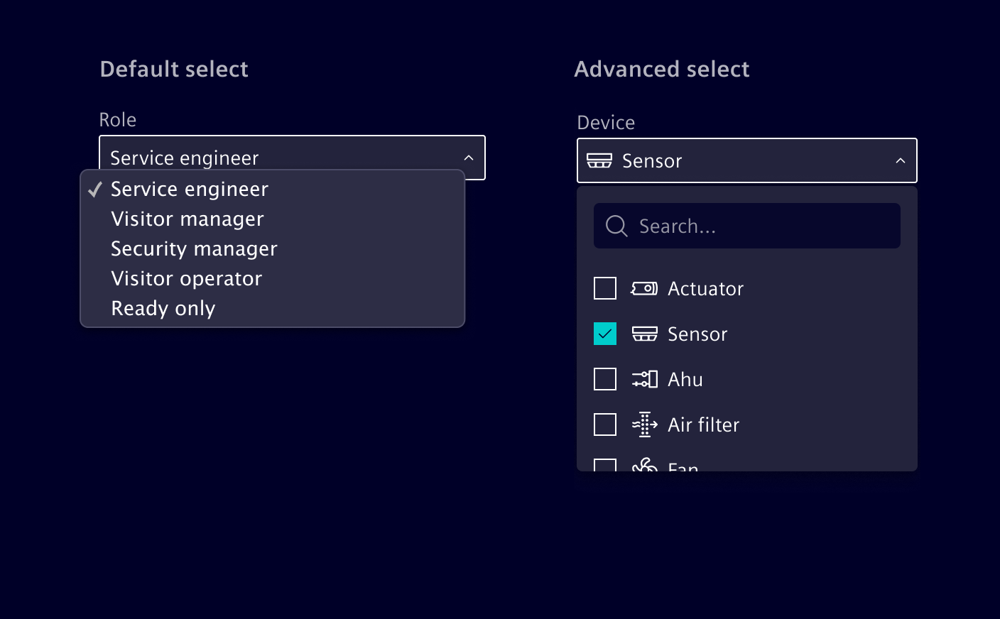
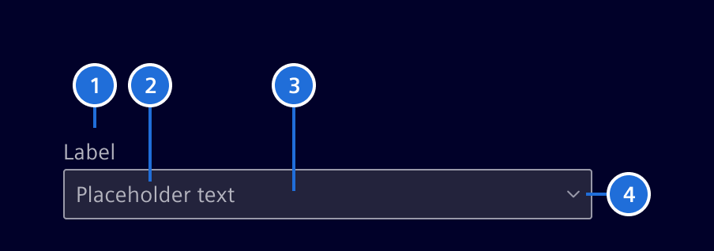
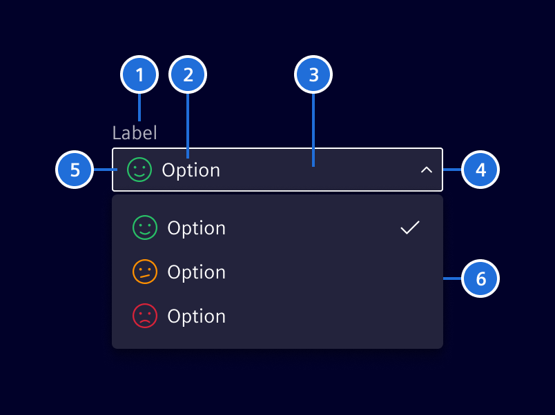
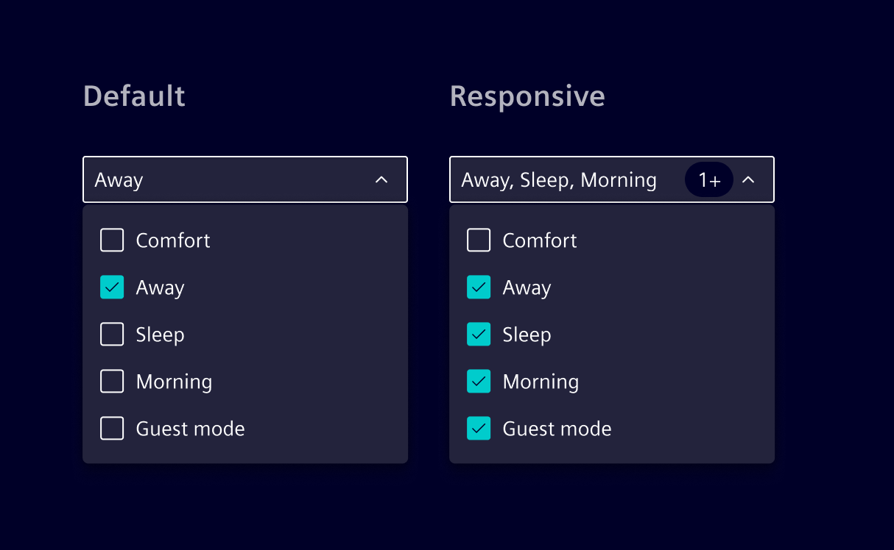
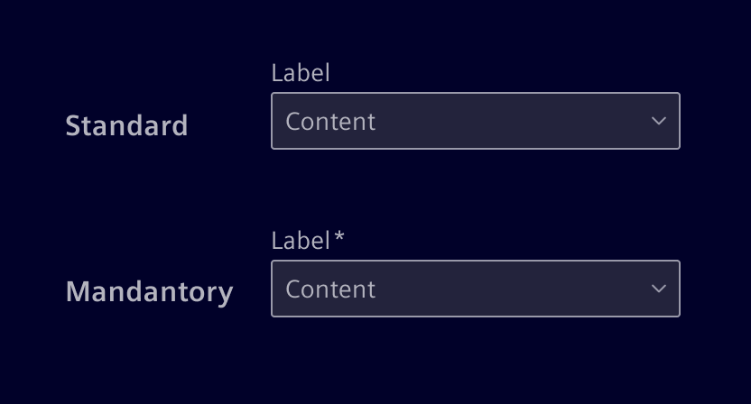

# Select

**Select inputs** are fields that allow users
to choose options from a menu.

## Usage ---

Element offers two distinct select input types: the Default Select and the Advanced Select.

The **default select** is based on the native HTML `select` element.
Use it for straightforward scenarios where users need to select a single option from a dropdown list.

The **advanced select** is designed to accommodate more complex requirements,
offering support for single-selection, multi-selection, icons, and a search
function. This variant should be employed only when one or more of the
mentioned capabilities are necessary.



### When to use select input fields

- When users need to make a choice among a list of options.
- When there are more than 5 options to choose from.
- When options can be logically grouped (e.g., countries, cities, etc.).
- Use it in forms and for atribute selection.

### Best practices for select input field

- Don't use it if there are less than three options available for selection.
- Analyze what actions will save more time for the user (e.g. selecting an item
  versus typing that item).
- If possible, mark the default option as the recommended one (avoid extra clicking).

## Design ---

### Default select



> 1.Label (optional), 2. Content/placeholder text, 3. Container, 4. Arrow

### Advanced select



> Label (optional) 2. Content/placeholder text, 3. Container, 4. Arrow, 5. Icon (optional), 6. Menu

Advanced select supports both single and multiple selections.
When dealing with many options, a filterable menu with a search bar can be used to streamline selection.


Selected options are displayed within the input field.
If they exceed the available space, they will be grouped into a single pill (e.g. using 3+).



### States

Advanced select provides two configurations: Inline for direct integration with content, and form-style for structured data entry.


### Label (optional)

Effective form labeling helps users understand what information to enter.

- Keep labels short and clear (should not be wider than the input field).
- A mandatory field is marked with an ***-asterisk**.



### Validation states

The select input field has the same validation states as a
[input component](input.md).

## Code ---

### References

- **Bootstrap:** [Select](https://getbootstrap.com/docs/5.1/forms/select/)

### Example

<si-docs-component example="custom-form-elements/select" height="550"></si-docs-component>

### si-select component

Element also offers a custom select component called `si-select`.
The `si-select` component provide the following abilities:

- specify the icon for each specified option.
- disable options
- single / multi-select behavior
- custom option input
- option groups
- customizable rendering of options
- option filtering
- customizable footer with actions

The component should only be used if you require one of the listed abilities.
Otherwise the [native select input with Bootstrap markup](select.md#code) is preferred.

#### Usage

`si-select` can be imported using the module

```ts
import { SiSelectModule } from '@siemens/element-ng/select';

@NgModule({
  imports: [SiSelectModule, ...]
})
```

or as a standalone component:

```ts
import {
  SiSelectComponent,
  SiSelectSimpleOptionsDirective, // At least one option directive is required. Unused option types can be omitted.
  SiSelectSingleValueDirective, // At least one value directive is required. Unused value types can be omitted.
  SiSelectMultiValueDirective
} from '@siemens/element-ng/select';

@Component({
  imports: [
    SiSelectComponent,
    SiSelectSimpleOptionsDirective,
    SiSelectSingleValueDirective,
    SiSelectMultiValueDirective,
  ]
})
```

### Options

Options are provided as an array of `SelectItem<T>` objects:

```html
<si-select
  [options]="[
    {
      type: 'option',
      value: { id: id, myProperty: myValue },
      label: 'Label',
      disabled: false,
      icon: 'element-face-happy',
      iconColor: 'status-success'
    }
  ]"
/>
```

Customize option rendering using a template:

```html
<si-select
  [options]="[
    { type: 'option', value: 'good', label: 'Good' },
    { type: 'option', value: 'fair', label: 'Fair' },
    { type: 'option', value: 'bad', label: 'Bad' }
  ]"
>
  <ng-template let-option siSelectOptionTemplate>{{ option.label | uppercase }}</ng-template>
</si-select>
```

Wrap options in groups:

```html
<si-select
  [options]="[
    {
      type: 'group',
      label: 'Group',
      options: [{ type: 'option', label: 'Option', value: 'value' }]
    }
  ]"
>
  <!-- Optional group template -->
  <ng-template let-group siSelectGroupTemplate>{{ group.label | uppercase }}</ng-template>
</si-select>
```

### Lazy options

Instead of providing eagerly loaded options, applications can provide an `[optionSource]`.
The option source allows lazy loading of options.
It can be used with or without filtering.

To use the `[optionSource]` applications must implement the `SelectOptionSource` interface:

```ts
// This provides options which value are of type MyValue.
// For async methods the si-select will show a loading spinner until the observable emits the first time.
// Always return options in a consistent order.
export class MyOptionSource implements SelectOptionSource<MyValue> {
  
  getOptionsForValues(values: MyValue[]): Observable<SelectOptionNext<MyValue>[]> {
    // si-select will call this function when it needs to get options for the provided values.
    // This function is typically called when the value is set via a formControl or ngModel.
    // Lookup the values on your server and return the corresponding options.
  }

  getAllOptions?(): Observable<SelectItem<MyValue>[]> {
    // This function is optional, if filtering is enabled.
    // The options returned by this function are shown in the dropdown when no search value is provided.
    // You can return all available options or just a subset of the most common options.
    // If this function is not implemented only the selected options are shown.
  }

  getOptionsForSearch?(search: MyValue): Observable<SelectItem<MyValue>[]> {
    // This function is required if filtering is enabled.
    // It is never called with an empty search value.
    // Return all options that matches the search value.
  }
  
  compareOptions?(a: SelectOptionNext<MyValue>, b: SelectOptionNext<MyValue>): number {
    // This function is optional.
    // If provided it is used to compare options for sorting.
    // This ensures a correct order if options are loaded from the cache.
  }

  optionsEqual?(optionA: MyValue, optionB: MyValue): boolean {
    // By default si-select checks values on equality by reference.
    // If you use objects as values override this method so that equal values are recognized as such.
    // For primitiv values like strings this method should be omitted.
  }
}
```

Then use this source in your component:

```ts
import { SiSelectComponent, SiSelectSingleValueDirective, SiSelectLazyOptionsDirective } from '@siemens/element-ng/select';

@Component({
  selector: 'app-sample',
  template: '<si-select [optionSource]="myOptionSource" [formControl]="control" />',
  standalone: true,
  imports: [SiSelectComponent, SiSelectSingleValueDirective, SiSelectLazyOptionsDirective]
})
export class SampleComponent {
  myOptionSource = new MyOptionSource();
  control = new FormControl<MyValue | null>(null);
}
```

<si-docs-component example="si-select/si-select-lazy-load" height="300"></si-docs-component>

#### Selection

Single selection:

```ts
@Component({
  standalone: true,
  selector: 'app-sample',
  imports: [SiSelectComponent, SiSelectSimpleOptionsDirective, SiSelectSingleValueDirective],
  template: '<si-select [options]="optionsList" [(value)]="selected" />'
})
export class SampleComponent {
  optionsList: SelectItem<string>[] = [
    {
      type: 'option',
      value: 'good',
      label: 'Good'
    },
    {
      type: 'option',
      value: 'fair',
      label: 'Fair'
    }
  ];
  selected = 'good';
}
```

Multi selection:

```ts
@Component({
  standalone: true,
  selector: 'app-sample',
  imports: [SiSelectComponent, SiSelectSimpleOptionsDirective, SiSelectMultiValueDirective],
  template: '<si-select multi [options]="optionsList" [(value)]="multiValue" />'
})
export class SampleComponent {
  optionsList: SelectItem<string>[] = [
    { type: 'option', value: 'good', label: 'Good' },
    { type: 'option', value: 'fair', label: 'Fair' }
  ];
  multiValue = ['good', 'fair'];
}
```

#### Filtering options

Add the attribute `hasFilter` to enable an input element for option filtering in the overlay of the `si-select` component.
If a custom template is used, a value provider is required.

```html
<si-select hasFilter [options]="[...]" />
```

#### Footer actions

By using the `siSelectActions` directive, you can add custom actions to the footer of the `si-select` component.

To align the styling to the design system specification it is necessary that actions:

- apply the `siSelectAction` directive to each item
- and footer buttons shall apply the following classes `btn btn-link`.

```html
<si-select [options]="[{ id: 'option1', title: 'Option 1' }, { id: 'option2', title: 'Option 2' }]" >
  <ng-template siSelectActions>
    <button siSelectAction type="button" class="btn btn-link" aria-label="Action 1">Action 1</button>
    <button siSelectAction type="button" class="btn btn-link" aria-label="Action 2">Action 2</button>
  </ng-template>
</si-select>
```

In some scenarios it is necessary to close the dropdown on click for example to display a modal dialog. The `siSelectActions` directive offers an input `selectActionAutoClose` for this purpose.

The following demonstrates how to add a "Create" button within the dropdown actions that, when clicked, will close the dropdown:

```html
<si-select [options]="[{ id: 'option1', title: 'Option 1' }, { id: 'option2', title: 'Option 2' }]" >
  <ng-template siSelectActions>
    <button 
      siSelectAction 
      selectActionAutoClose
      type="button"
      class="btn btn-link" 
      (click)="....">
      Create
    </button>
  </ng-template>
</si-select>
```

<si-docs-component example="si-select/si-select" height="500"></si-docs-component>

<si-docs-api component="SiSelectComponent"></si-docs-api>

<si-docs-api directive="SiSelectSimpleOptionsDirective" heading="Simple options (via SiSelectSimpleOptionsDirective)"></si-docs-api>

<si-docs-api directive="SiSelectComplexOptionsDirective" heading="Complex options (via SiSelectComplexOptionsDirective)"></si-docs-api>

<si-docs-types></si-docs-types>
