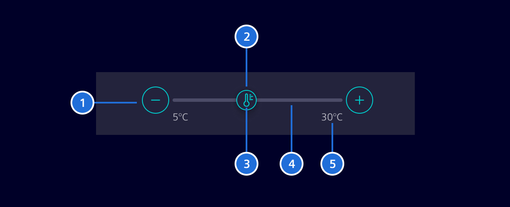
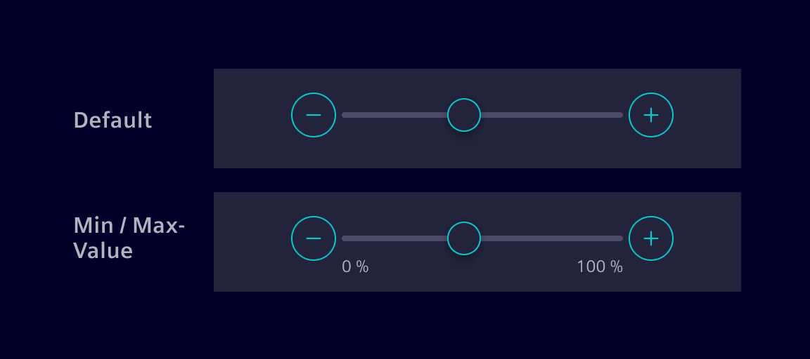
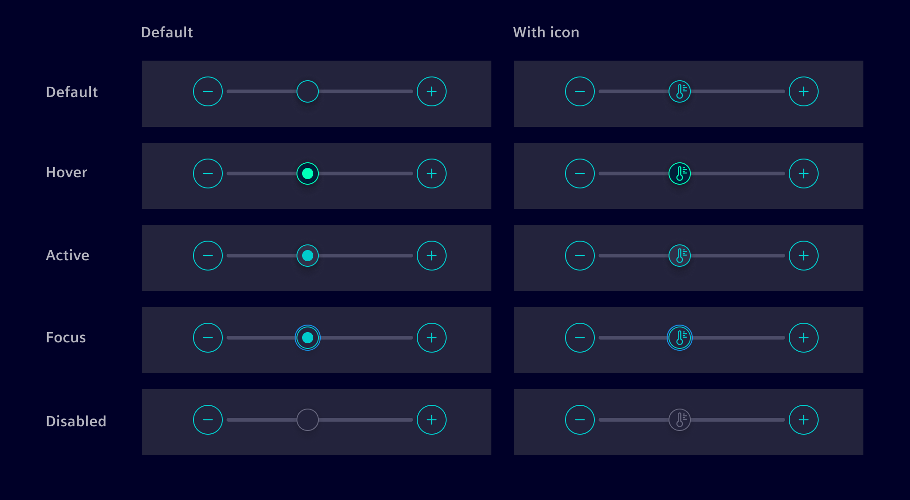

# Slider

A **Slider** provides a visual indication of adjustable content, where the user
can increase or decrease the value by moving the slider thumb along a horizontal
track.

## Usage ---


Sliders allow users to view and select a value from the range along a horizontal
track. They’re ideal for adjusting settings such as volume and brightness where
accuracy is not of highest importance.

The buttons can be used to make small adjustments in either direction, while
the slider thumb can be used for larger adjustments.

Changes made with sliders take effect immediately, allowing users to make slider
adjustments with direct feedback.

### When to use

- Use it for making selections from a range of values.
- Use it when the range is more important than precision.

### Best practices

- Use a regular value input, if a user needs to enter a precise number.
- Sliders shouldn’t be used to adjust settings with any delay in providing user
  feedback.

## Design ---

### Elements



> 1. +/- Button, 2. Thumb, 3. Thumb icon (Optional), 4. Track, 5. Range values (Optional)

### Slider variations



### Thumb interaction states

The thumb can optionally contain an icon.



## Code ---

### Usage

```ts
import { SiSliderComponent } from '@siemens/element-ng/slider';

@Component({
  imports: [SiSliderComponent, ...]
})
```

<si-docs-component base="si-slider">
  <si-docs-tab example="si-slider" heading="Default slider"></si-docs-tab>
  <si-docs-tab example="si-slider-icon" heading="with icon"></si-docs-tab>
</si-docs-component>

<si-docs-api component="SiSliderComponent"></si-docs-api>

<si-docs-types></si-docs-types>
