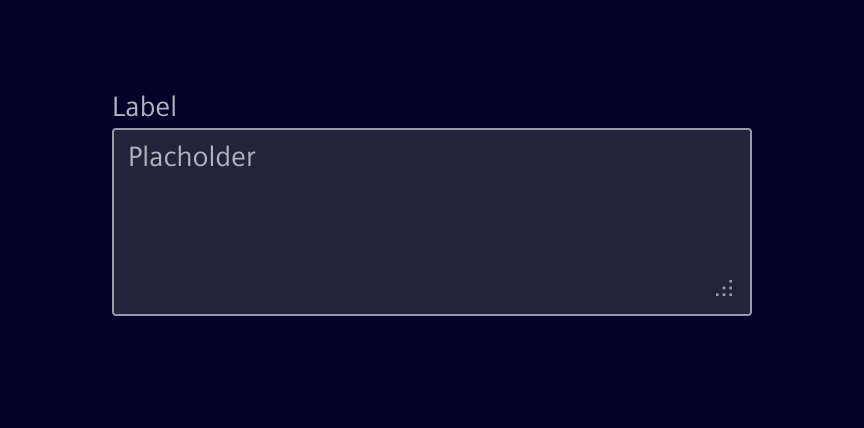
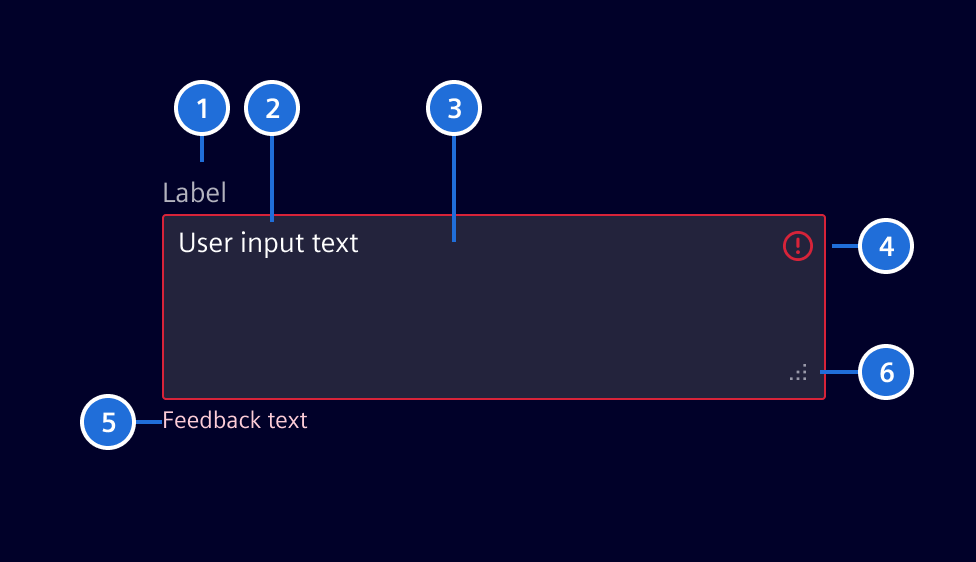
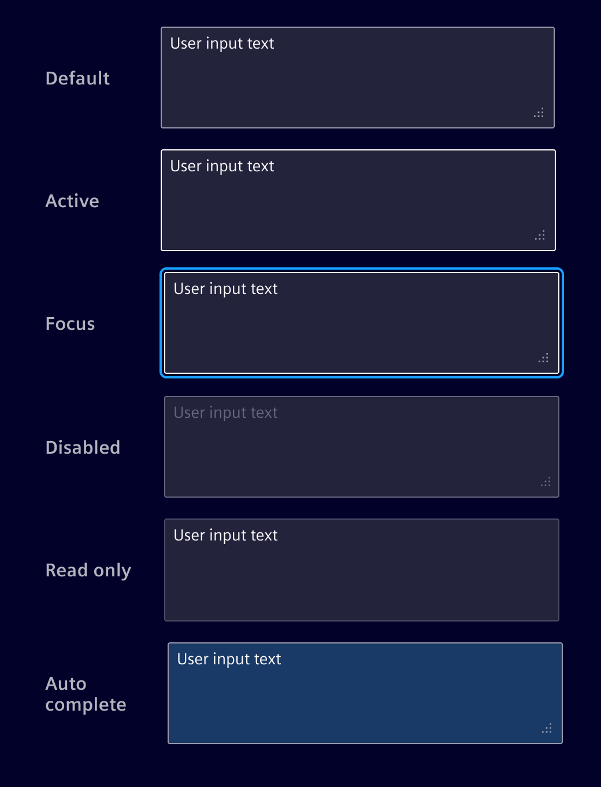
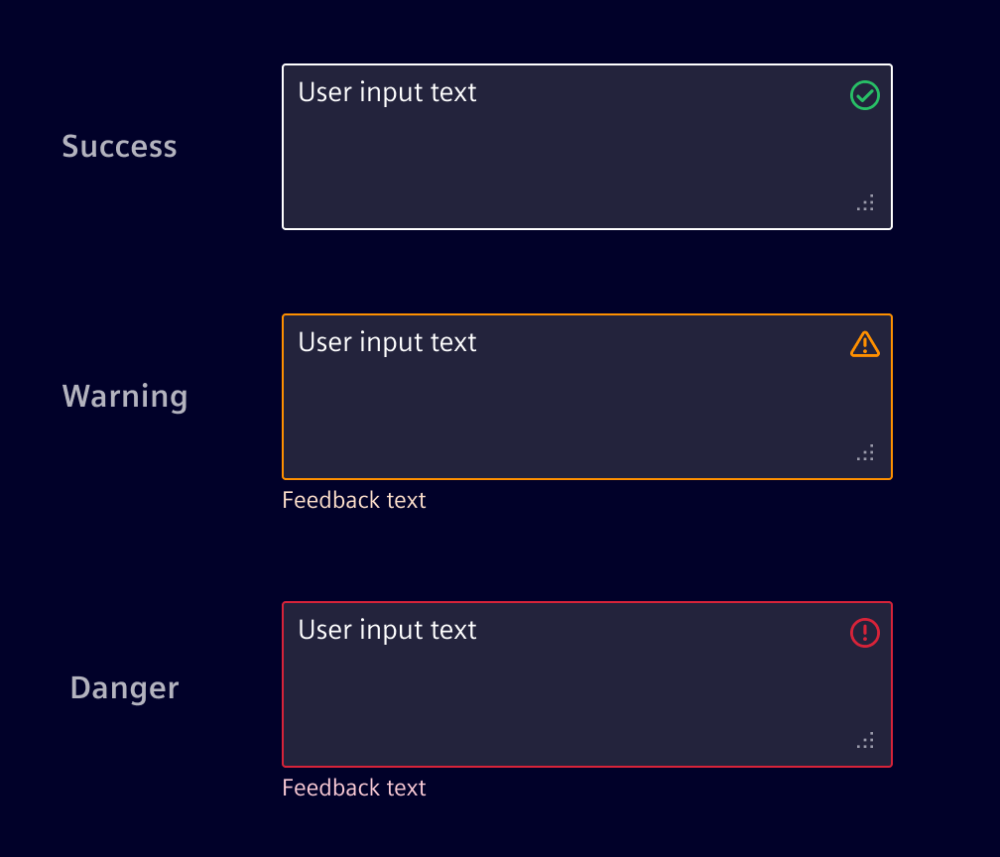

# Text area

**Text areas** allow users to enter multiple lines of text within a field.

## Usage ---

Use a text area when the expected user input spans multiple lines. For single-line input,
use a [single-line field](../forms-inputs/input.md) instead.

### Best practices

- Keep labels short and clear
- Use placeholders to reinforce the information needed in the
  input. They should not contain critical information, instead use labels for that.
- Assist while the user is entering the data ([warning, validation, etc.](#validation-states))

## Design ---

### Elements

> 1. Label (optional), 2. Content/Placeholder text, 3. Container, 4. Icon (optional), 5. Message (optional), 6. Resizer (optional)

### Interaction states

### Validation states

Real time validation helps to streamline the process and keep input data clean while the user is filling out the field.

### Content overflow

The input height can be fixed, with overflow managed by a scrollbar, or it can grow dynamically as the user types.
Users may also manually resize the field if resizing is enabled.

## Code ---

### References

- **Bootstrap:** [Form Control](https://getbootstrap.com/docs/5.1/forms/form-control/)

### Example

<si-docs-component example="input-fields/multi-line" height="700"></si-docs-component>
