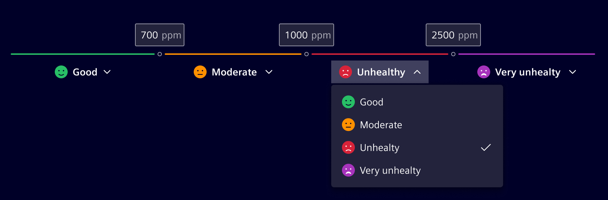
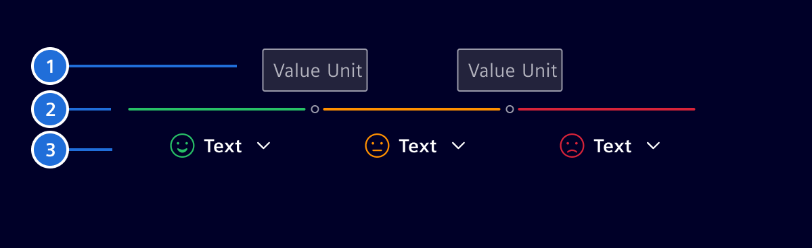
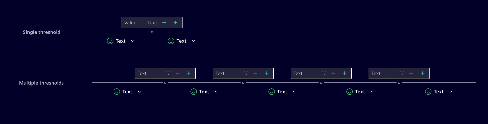
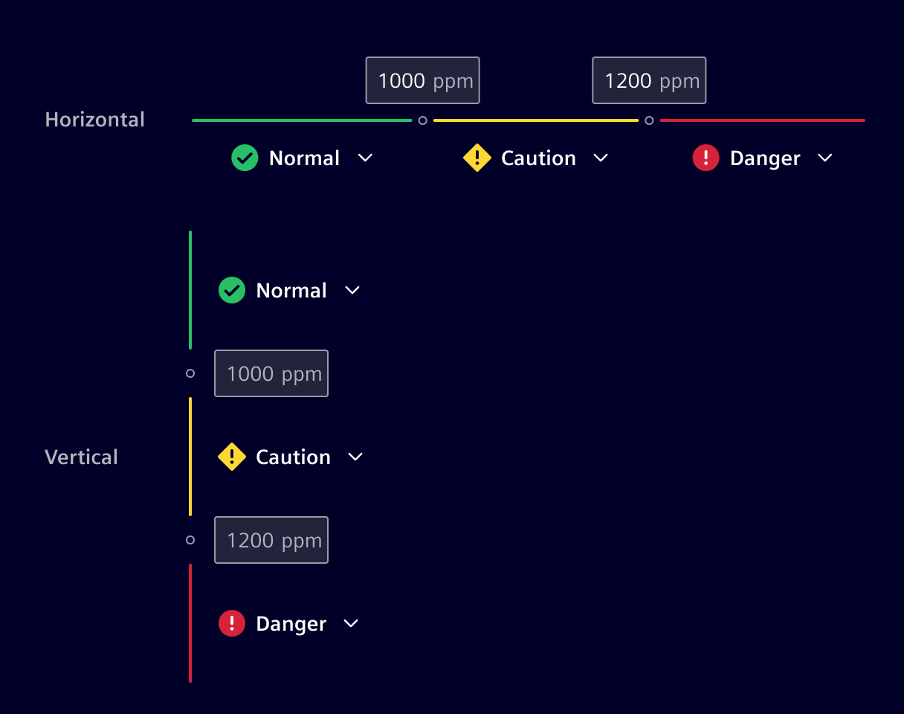
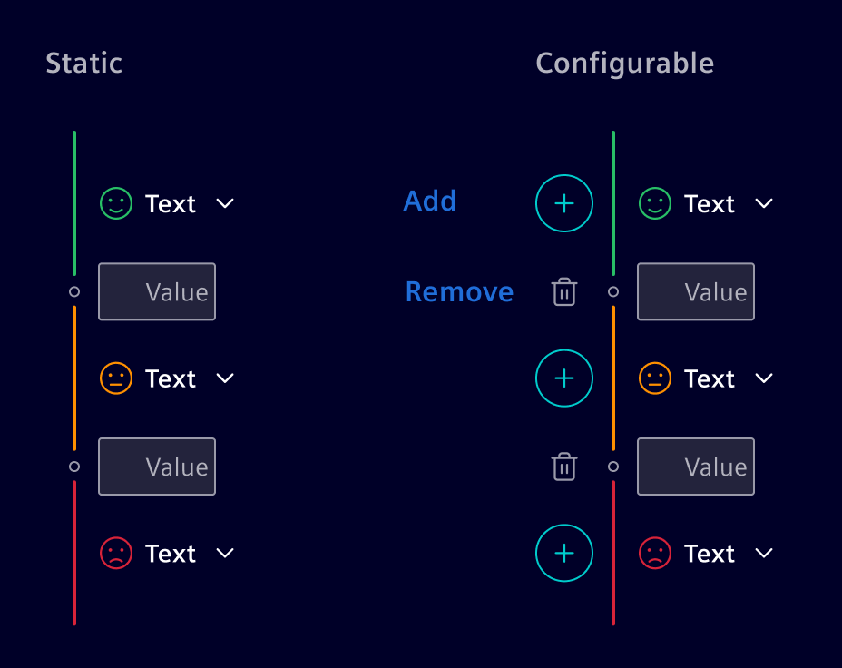
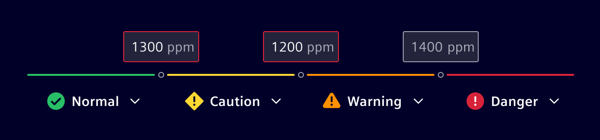

# Threshold

The **Threshold** component compares an input signal to specific threshold
values and produces an output based on whether the input signal is above or
below the threshold.

The threshold editor enables the user to create and edit thresholds and their
conditions.

## Usage ---



A threshold editor component is typically used in situations where a user needs
to set a specific threshold value or range for a particular parameter or setting.
This can be useful in a variety of contexts, such as setting comfort-levels, air
quality-levels and more.

The component is highly flexible and can be customized to specific project needs
in terms of:

- Number of thresholds (*1..n*)
- Unit of threshold values
- Condition levels
- Adding and deleting thresholds
- Layout: Vertical, horizontal

## Design ---

### Elements



1. **Threshold value:** Allows users to input a numeric value. The unit
   (optional) is configurable to a specific to need and has to be the same for
   all threshold values. See the [*Number Input*](../forms-inputs/number-input.md)
   component to for its interaction states.
2. **Connector:** Visually links the different steps together. It can assume
   different colors according to the selected condition.
3. **Condition:** Allows users to select a condition. See the [*Select*](../forms-inputs/select.md)
   component for further details.

### Number of Thresholds

The number of thresholds is defined by the use-case but limited by the available
space based on viewport and orientation. There should be at least a single
threshold and ideally not more than 6.



### Layout

The project can choose between a horizontal or vertical layout. The vertical
orientation adapts better to small screen sizes and higher number of thresholds.



### Modes

Depending on the use-case, the threshold component can be used in two different
modes:

- **Static:** Predefined number of thresholds, where the user can only adapt
  the threshold values and the conditions.
- **Configurable:** In addition to the static mode, the user can also add and
  remove thresholds.



### Validation

Threshold values have to be in an ascending and logical order. If the threshold
values are not entered in a ascending order by the user, then he will get a
feedback.



## Code ---

### Usage

```ts
import { SiThresholdComponent } from '@siemens/element-ng/threshold';

@Component({
  imports: [SiThresholdComponent, ...]
})
```

<si-docs-component example="si-threshold/si-threshold"></si-docs-component>

<si-docs-api component="SiThresholdComponent"></si-docs-api>

<si-docs-types></si-docs-types>
