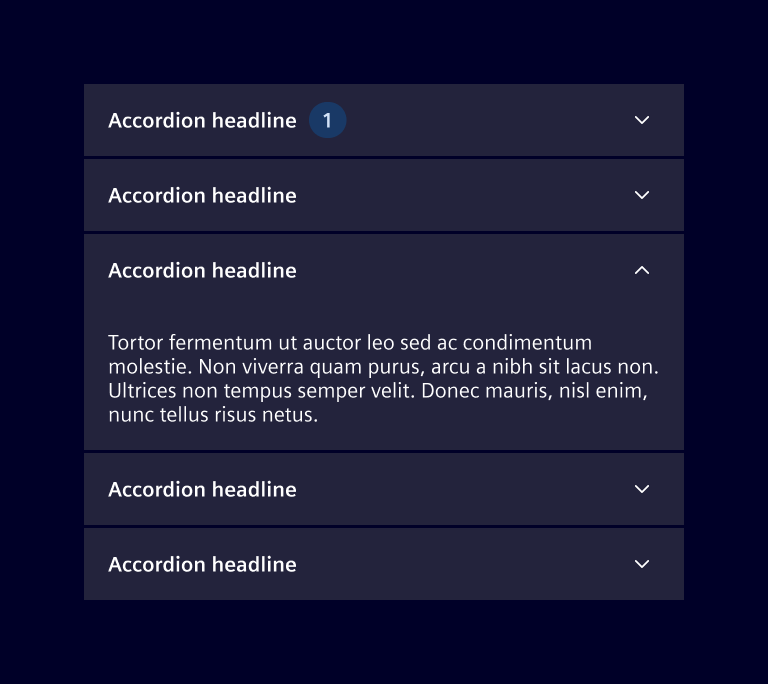
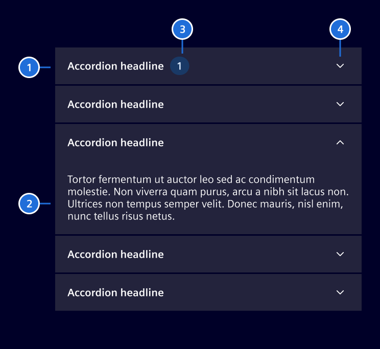
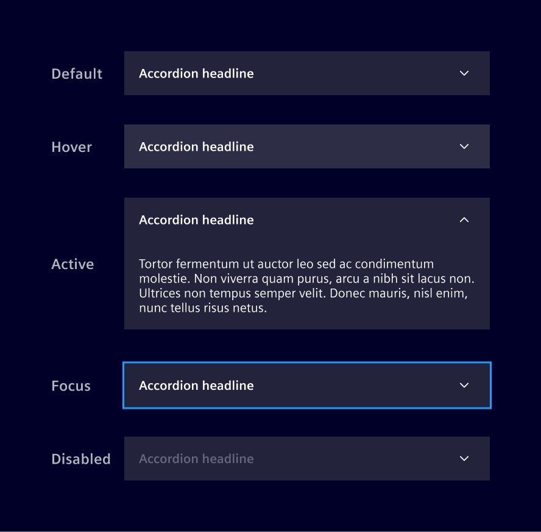
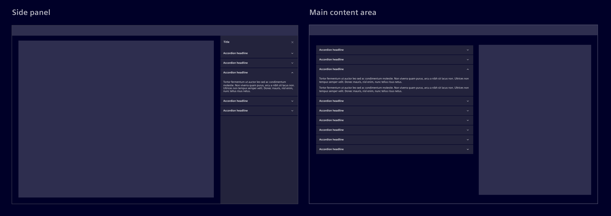
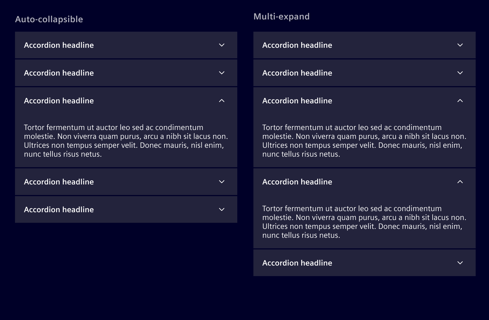

# Accordion

The **accordion** component allows users to expand and collapse content sections in a vertically stacked layout.
Each section is represented by a header that users can select to reveal or hide the corresponding content.

## Usage ---

Accordions are often used to display large amounts of related information in a
condensed, organized manner. By collapsing and expanding sections, users can
focus on the selected content.

The title in the header gives a preview of the content, allowing to find the looked
after information quickly and efficiently. For sections containing lists or data,
a [badge](../status-notifications/badges.md) can offer a quick summary, such as the
total number of items.



### When to use

- When users need to focus on **key information** without viewing all content at once.
- To **group related information** clearly and in a way that's easy to navigate, improving content understanding.
- When **space is limited**, allowing users to hide irrelevant content, especially in [side panel](side-panel.md) or on mobile screens.
- Use it for content that is **not immediately necessary** but still useful for users to access when they need it.

### Best practices for accordions

- Don't use it when users need most or all of the content on the page to accomplish their task.
- Keep the number of sections manageable to avoid clutter.
- Consider expanding important sections by default.
- Avoid using them for primary navigation or essential information.

## Design ---

### Elements



 > 1. Header, 2. Content, 3. Badge (optional), 4. Expand/collapse indicator

### States



### Placement

Accordions can be used in either the [side panel](side-panel.md) or within
the main content area.



### Collapsible panels variants

According to the use case, the accordion sections can be **auto-collapsible** or
**multi-expand**.

- **Auto-collapsible** accordions allow only one section to be open at a time.
- **Multi-expand** accordions allow multiple sections to remain open simultaneously.

As a general rule, it's best to allow users to open multiple sections simultaneously,
enabling them to view and compare different sections at once. Use the auto-collapsible
accordion if the information in each section is independent and users are unlikely to
need simultaneous access.



### Scrolling behavior

When the content length exceeds the viewport, the entire accordion should scroll
vertically. Avoid scrolling within individual sections.

## Code ---

### Usage

`si-accordion` can be imported using the module

```ts
import { SiAccordionModule } from '@siemens/element-ng/accordion';

@NgModule({
  imports: [SiAccordionModule, ...]
})
```

or as a standalone component

```ts
import { SiAccordionComponent, SiCollapsiblePanelComponent } from '@siemens/element-ng/accordion';

@Component({
  imports: [
    SiAccordionComponent,
    SiCollapsiblePanelComponent,
    ...
  ]
})
```

The basic element is `<si-collapsible-panel>` which consists of a heading and
collapsible content. Use as many as required. The panels can be used with or
without the accordion effect provided by `<si-accordion>`, see the two examples:

### Collapsible Panels

In this example, collapsible panels are used without an accordion allowing
multiple panels staying open at the same time.

<si-docs-component example="si-accordion/si-collapsible-panel" height="305"></si-docs-component>

In the next example, we combine the panels with icons and additional header CSS classes.

<si-docs-component example="si-accordion/si-collapsible-panel-icons" height="405"></si-docs-component>

#### Custom heading

The collapsible panel supports customizing the heading via content projection by applying the
`si-panel-heading` directive to an HTML element as shown in the example below:

```html
<si-collapsible-panel contentCssClasses="p-6">
  <span si-panel-heading>Heading via <mark>content projection</mark></span>
  The panel content
</si-collapsible-panel>
```

<si-docs-api component="SiCollapsiblePanelComponent"></si-docs-api>

### Full Accordion

The collapsible panels are wrapped with `<si-accordion>` to make sure only
one panel is open at a time:

<si-docs-component example="si-accordion/si-accordion" height="305"></si-docs-component>

<si-docs-api component="SiAccordionComponent"></si-docs-api>

<si-docs-types></si-docs-types>
