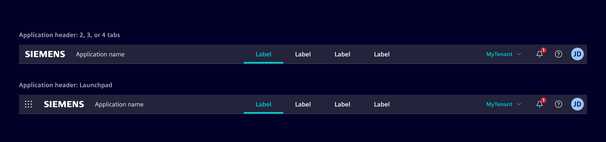
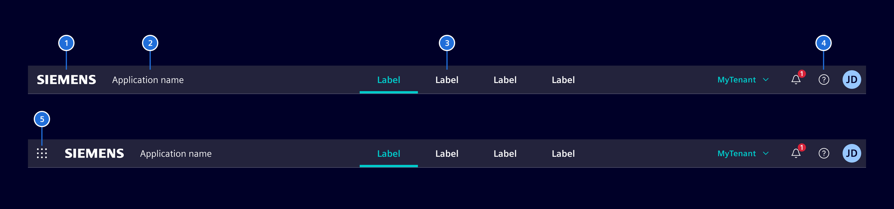
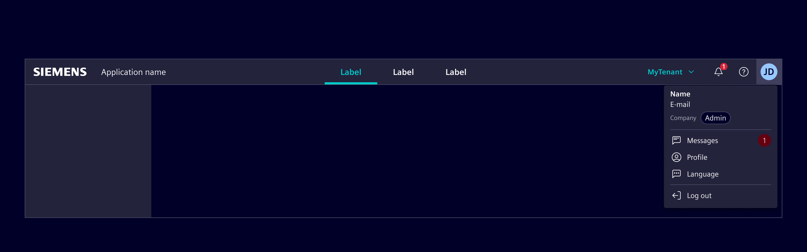
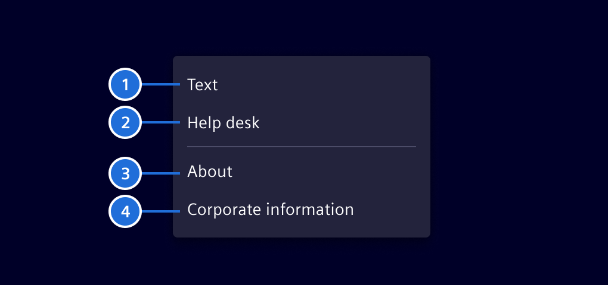
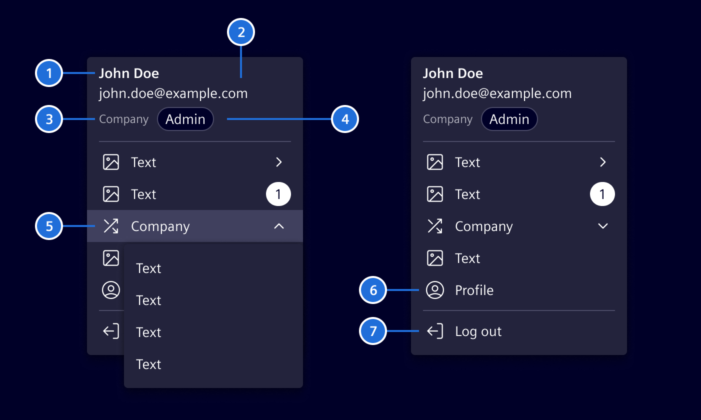
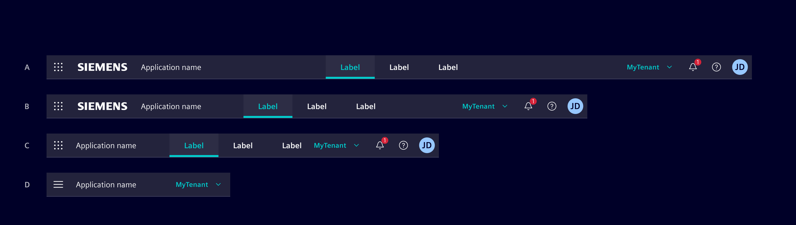

# Application header

The **Application header** organizes an application's structure and content, making it easy to find information and achieve tasks.
It communicates relationships, context, and actions a user can take within an application.

## Usage ---



There are variations of the *Application header*: Standard version and [with Launchpad](launchpad.md) support.

### When to use

If you have up to four primary navigation items

## Design ---

### Elements

The *Application header* consists of the following elements:



> (1) Brand-logo,  (2) Application name, (3) Primary navigation items (up to four), (4) Tool bar, (5) Launchpad selector

!!! info "Launchpad"
    The application header supports a launchpad that can be opened via (5) launchpad selector.
    It allows a user to switch between different application contexts.
    See the [launchpad documentation](launchpad.md) for more information.

### Toolbar

The toolbar contains all the additional navigation and indication elements, which gives the user access to general information like: settings, user profile, about pages, help etc.



#### Help Menu

The help menu is **mandatory** for all applications, because it has legal relevant aspects.
The help menu is located left of the user avatar and uses `element-help` as icon.

The user menu is based on the [menu container](../buttons-menus/menu.md).



1. Help *(optional)*
2. Additional information for providing help to the user *(optional)*
3. Link to the *About* page *(mandatory)*
4. Link to the *Corporate Information* page *(mandatory)*

**Note:**

- The help menu should provide a fast overview about related content.
- Other legal links should be part of the about page.

#### User Menu (optional)

The user menu is mandatory for all applications, which are providing content to
a signed in user. This menu is not needed for pages without user management.

The user menu is based on the [menu container](../buttons-menus/menu.md).



1. User name (readable)
2. Technical username (typically the email address)
3. Company *(deprecated)*
4. Role
5. Company Switcher *(deprecated)*
6. Profile / user-specific settings
7. Sign out

### Responsive behavior



(A) The *Application header* spans over the whole screen width.

On smaller screens it behaves according to the following rule set:

- (B) Decrease of whitespace between Brand-area, Primary navigation items and tool-bar to a defined minimum, no abbreviations of labels.
- (C) Brand logo will be skipped, further decrease whitespace to a minimum.
- (D) Switch to mobile view, here the active tab name will be displayed or if not present, then the application name.

## Code ---

Element provides a template driven approach to create an application header.
This enables applications to customize the header according to their needs.

The header has three main sections which can be placed inside the `si-application-header`.

```html
<si-application-header>
  <si-header-brand></si-header-brand>
  <si-header-navigation></si-header-navigation>
  <si-header-actions></si-header-actions>
</si-application-header>
```

!!! info "Launchpad"
    The application header also supports a launchpad.
    See the [launchpad documentation](launchpad.md) for more information.

### Header brand

The brand section contains brand related content, most likely the logo and the application name.

```html
<si-application-header>
  <si-header-brand>
    <a siHeaderLogo routerLink="/" class="d-none d-md-flex"></a>
    <span class="application-name">My application</span>
  </si-header-brand>
  ...
</si-application-header>
```

Instead of the Siemens logo, you can also use a custom logo like the Siemens healthineers logo.

```html
<si-application-header>
  <si-header-brand>
    <a routerLink="/" class="navbar-brand px-6 focus-inside">
      
    </a>
    ...
  </si-header-brand>
  ...
</si-application-header>
```

### Header navigation

The navigation section contains the primary navigation items.

```html
<si-application-header>
  ...
  <si-header-navigation>
    <a si-header-navigation-item routerLink="/m1" routerLinkActive="active">Module 1</a>
    <a si-header-navigation-item routerLink="/m2" routerLinkActive="active">Module 2</a>
  </si-header-navigation>
  ...
</si-application-header>
```

Header navigation items can have header-dropdowns containing subitems.

```html
<si-application-header>
  ...
  <si-header-navigation>
    <button 
      si-header-navigation-item
      [siHeaderDropdownTriggerFor]="dropdown"
      routerLinkActive="active"
    >
      Module 1
      <ng-template #dropdown>
        <si-header-dropdown>
          <a si-header-dropdown-item routerLink="/m1/1" routerLinkActive="active">Module 1.1</a>
          <a si-header-dropdown-item routerLink="/m1/2" routerLinkActive="active">Module 1.2</a>
        </si-header-dropdown>
      </ng-template>
    </button>
  </si-header-navigation>
  ...
</si-application-header>
```

It is important that the dropdown is placed inside the `si-header-navigation-item`.
This is required by the `routerLinkActive` directive as it only detects content or view children.

### Header actions

The actions section contains additional actions like the user menu and the help menu.
Actions are typically buttons that open a header-dropdown.

```html
<si-application-header>
  ...
  <si-header-actions>
    <button 
      si-header-action-item
      icon="element-help"
      [siHeaderDropdownTriggerFor]="help">Help</button>
  </si-header-actions>
</si-application-header>

<ng-template #help>
  <si-header-dropdown>
    <a si-header-dropdown-item routerLink="/about">About</a>
    <a si-header-dropdown-item routerLink="/corporate-information">Corporate Information</a>
  </si-header-dropdown>
</ng-template>
```

Header action menus should be placed outside the `si-application-header` to keep the actual header definition clean.

#### Account menu

The application header provides a special action item for the user account menu showing
the initials or the profile picture.
The code below demonstrates how to use custom content next to standard dropdown items.
Adopt this in your application to create an account menu similar to the one in the
deprecated `si-primary-navbar`.

```html
<si-application-header>
  ...
  <si-header-actions>
    <button
      si-header-account-item
      type="button"
      name="Lars Vegas"
      [siHeaderDropdownTriggerFor]="account"
    >
    </button>
  </si-header-actions>

  <ng-template #account>
    <si-header-dropdown>
      <div class="mx-5">
        <div class="si-title-2">Lars Vegas</div>
        <div>lars.vegas&#64;siemens.com</div>
        <div class="d-flex align-items-center text-secondary mt-2">
          Siemens AG
          <span class="badge bg-default">Admin</span>
        </div>
      </div>
      <div class="dropdown-divider"></div>
      <button
        si-header-dropdown-item
        icon="element-language"
        type="button"
        [siHeaderDropdownTriggerFor]="..."
      >
        Language
      </button>
      ...
    </si-header-dropdown>
  </ng-template>
```

#### Selection menu (Tenant switch)

The application header provides another special item for selecting a global state, like a tenant.
Only use this once per application.

```html
<si-application-header>
  ...
  <si-header-actions>
    <button
      si-header-selection-item
      type="button"
      [siHeaderDropdownTriggerFor]="..."
    >{{currentTenant}}</button>
  </si-header-actions>
</si-application-header>
```

The application is responsible for managing the state and the selection dialog.
For simple use cases, an application can use the `si-header-dropdown` component to show available options.

If a more complex selection dialog is required, an application can use the `(click)` event to show a custom dialog.
The open state of the `si-selection-item` can be controlled by the `[open]` input.
Use this input only, if you are not using the `siHeaderDropdownTriggerFor` directive.

### Custom content

`si-header-brand`, `si-header-navigation`, `si-header-actions` and `si-header-dropdown` can contain custom content.
Use this to add extra content like user details or a tenant switch.

When adding custom content, ensure that the necessary styling is applied.
Add the `header-item` class to get the basic styling for header items.
If the item is interactive (like a button), add the `focus-inside` class to prevent the overflow of the focus ring.
If the item has a dropdown attached, include the dropdown caret.

A very basic custom item could look like this:

```html
<button class="header-item focus-inside" [siHeaderDropdownTriggerFor]="dropdown">
  Custom content
  <span class="element-down-2 dropdown-caret"></span>
</button>
```

### Layout and responsive behavior

The header is designed to be responsive and to adapt to different screen sizes.
It supports two modes: `expanded` and `collapsed` (`mobile`).
The header switches the mode automatically based on screen size.
By default, it will switch to `collapsed` on the `sm` breakpoint (576px).
Use the `expandBreakpoint` input to change the breakpoint.

In the expanded mode, the header will split the available space evenly between the brand, navigation, and actions sections.
If not enough space is available, the header will resize the different parts.
It will not automatically switch to the collapsed, so developers must ensure that the content
fits the available space.

In the `collapsed` mode the header will only show the brand and action section.
The navigation section is collapsed into a hamburger menu.

To customize the visible actions in the collapsed mode, use the `si-header-collapsible-actions` component.
It will collapse its actions into a menu.

```html
<si-application-header>
  ...
  <si-header-actions>
    ...
    <si-header-collapsible-actions>
      <button si-header-action-item icon="element-help">Help</button>
    </si-header-collapsible-actions>
    ...
  </si-header-actions>
</si-application-header>
```

There should only be one `si-header-collapsible-actions` component per header.

To customize other content within the header like the logo, use utility classes.
If an item should only be visible for screens larger or equal `md`, apply
`d-none` to hide it and `d-md-flex` to show it on `md` and larger.

```html
<si-application-header>
  <si-header-brand>
    <a siHeaderLogo routerLink="/" class="d-none d-md-flex"></a>
    ...
  </si-header-brand>
  ...
</si-application-header>
```

You can use those classes as well to change the order of items in the collapsed mode.
Do this by duplicating the item and hiding it either in expanded or collapsed.

In the following example, the FAQ button should be shown before the `Help` button in expanded mode.
But in the collapsed mode, it should be shown inside the collapsible actions.
Therefor, the FAQ button is duplicated and each version has the required bootstrap utilities applied.

```html
<si-application-header>
  ...
  <si-header-actions>
    <!-- FAQ button to be shown in expanded mode. -->
    <!-- "d-none" is hiding it generally, "d-sm-flex" is overriding this to show the button on screens larger or equal "sm" -->
    <button si-header-action-item icon="element-faq" class="d-none d-sm-flex">FAQ</button>
    <button si-header-action-item icon="element-help">Help</button>
    <si-header-collapsible-actions>
      <!-- FAQ button to be shown in collapsed mode. -->
      <!-- "d-sm-none" is hiding it on screens larger or equal "sm" -->
      <button si-header-action-item icon="element-faq" class="d-sm-none">FAQ</button>
      <button si-header-action-item icon="element-notification">Notifications</button>
    </si-header-collapsible-actions>
    ...
  </si-header-actions>
</si-application-header>
```

You can also use any other `d-<breakpoint>-<mode>` class.
For changing the order, use same breakpoint as for switching the header mode (default: `sm`).
To show elements always use `d-<breakpoint>-flex`.

### Header dropdowns

As shown in previous examples, the header dropdown is an optional component to add a dropdown menu to header items.
While being visually similar to the `si-menu`, header dropdowns are quite different.
Unlike the `si-menu`, header dropdowns feature a tab-based keyboard interaction which provides
a better user experience for keyboard users in headers / navbars.
The header dropdown seamlessly integrates into the header by managing focus automatically
and adopting to the header's current responsive mode.

A header menu is opened by a `siHeaderDropdownTriggerFor` directive which should be applied to an interactive element.
The dropdown content should be placed inside a `si-header-dropdown` element within a `ng-template`.
It is possible to nest dropdown items and to add custom content like dividers.

```html
<button class="btn btn-primary" [siHeaderDropdownTriggerFor]="dropdown2">Toggle dropdown</button>

<ng-template #dropdown1>
  <si-header-dropdown>
    <button si-header-dropdown-item>Item 1</button>
    <button si-header-dropdown-item [siHeaderDropdownTriggerFor]="dropdown2">Item 2</button>
    <span class="dropdown-divider"></span>
    <button si-header-dropdown-item>Item 3</button>
  </si-header-dropdown>
</ng-template>

<ng-template #dropdown2>
  <button si-header-dropdown-item>Item 2.1</button>
  <button si-header-dropdown-item>Item 2.2</button>
</ng-template>
```

Header dropdowns should only be used in headers. In other areas, use the [SiMenu](../buttons-menus/menu.md) instead.

### Example

<si-docs-component example="si-application-header/si-application-header" height="220"></si-docs-component>

<si-docs-api component="SiApplicationHeaderComponent"></si-docs-api>

<si-docs-api directive="SiHeaderBrandDirective"></si-docs-api>

<si-docs-api component="SiHeaderSiemensLogoComponent"></si-docs-api>

<si-docs-api component="SiHeaderNavigationComponent"></si-docs-api>

<si-docs-api component="SiHeaderNavigationItemComponent"></si-docs-api>

<si-docs-api directive="SiHeaderActionsDirective"></si-docs-api>

<si-docs-api component="SiHeaderActionItemComponent"></si-docs-api>

<si-docs-api component="SiHeaderAccountItemComponent"></si-docs-api>

<si-docs-api component="SiHeaderCollapsibleActionsComponent"></si-docs-api>

<si-docs-api directive="SiHeaderDropdownTriggerDirective"></si-docs-api>

<si-docs-api component="SiHeaderDropdownComponent"></si-docs-api>

<si-docs-api component="SiHeaderDropdownItemComponent"></si-docs-api>

<si-docs-types></si-docs-types>
