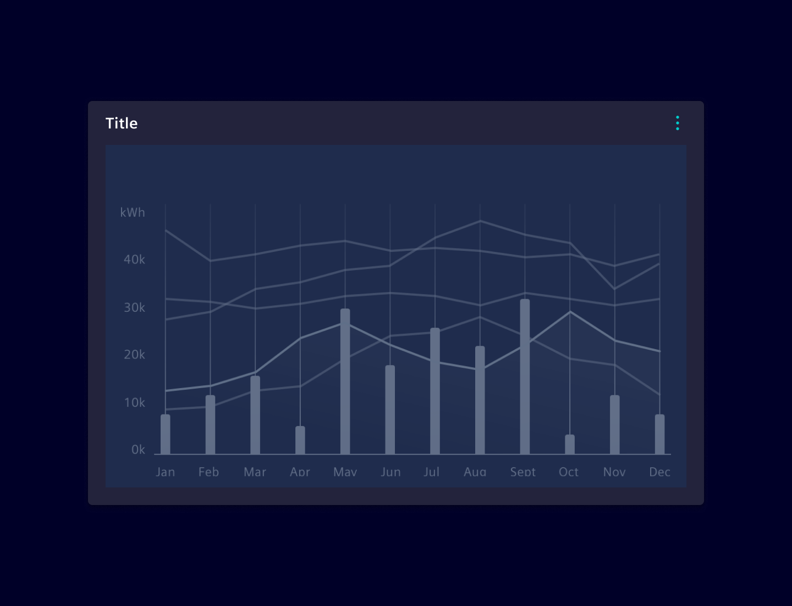
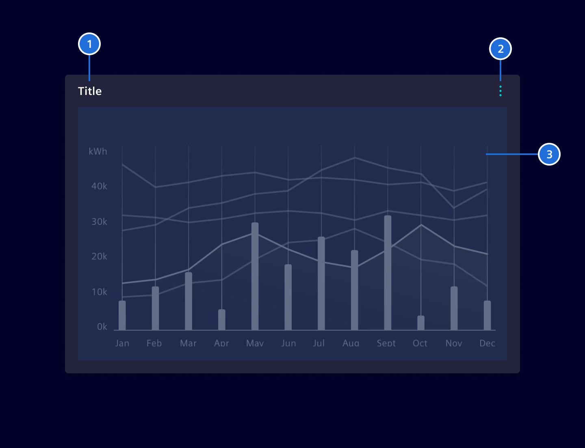
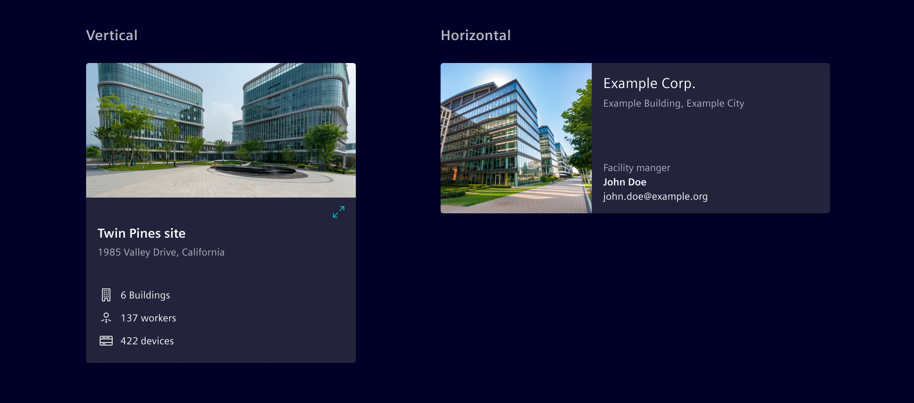
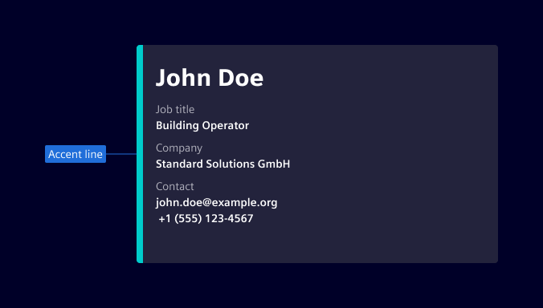
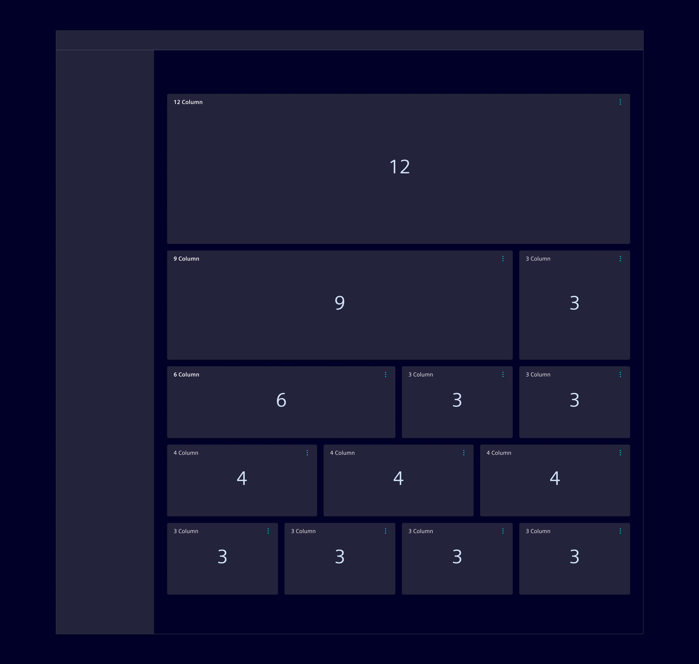
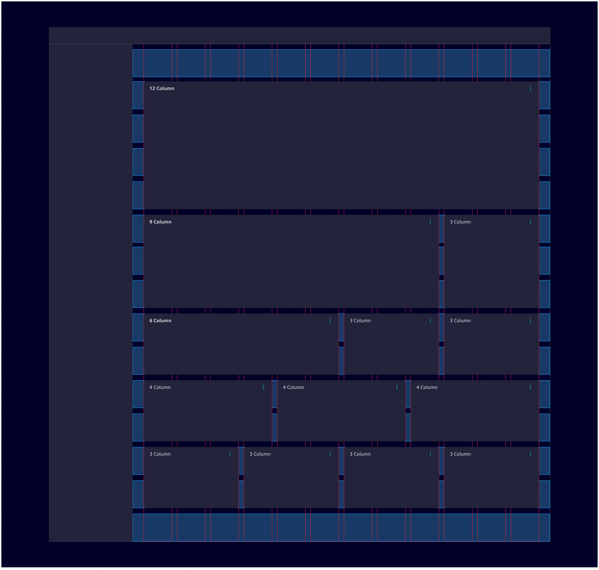

# Cards

A card is a content container to display important and useful information, e.g. trend charts, key data etc.

## Usage ---



### When to use

- To cluster information.

### Best practices

- Only include the most relevant information.
- Set an appropriate size (height and width) of the card to give the content the space needed to convey the information.

## Design ---

### Elements

Every card contains the following elements:

1. Title: The title may either be static, dynamically adapted based on the content or user defined.
By dragging the title bar, a user can move the card to another position.
2. Content action (Optional): A click on the icon opens the content action menu.
3. Content area: Cards may also contain multiple types of content (e.g. a graph and an infobox).



### Content actions (optional)

The content actions component is specified on [this page](../buttons-menus/content-actions.md).

The available options depend on the content, typical ones are:

- Immediately available actions (e.g. expand / reduce)
- Changing the view (e.g. toggle between data table and chart)
- Direct actions (e.g. download, export, share)
- Configuration (access to configuration mode)

### Images

Cards can include an image and be placed either vertically or horizontally.



### Accent line

An accent line can be used to highlight general, non-critical information.
This approach should be reserved for cases where it improves clarity or reinforces the card's purpose.

To prevent overuse and maintain its impact, the accent line should be applied selectively rather than to every card.
Use distinct colors, such as `$element-ui-0`, to emphasize information without implying urgency.



For status indication, refer to the [value widget](../dashboards/value-widget.md).

### Card sizes



To ensure an aligned visual grid and proper aesthetic of dashboards, card sizes follow the underlying 12 column grid of the work area.
The card can span over 3, 4, 6, 9 or 12 columns.



The card's width is defined by a horizontal grid system. The necessary height is primarily driven by the content.
For visual aesthetic and reordering reasons, the number of height-sizes should be kept low and consistent.

### Full-screen view

Cards can be enlarged via the content action menu to get more detailed information. The card then uses the whole working area.
This makes sure that primary navigation, statusbar, notifications or other important information for the users are still accessible.
Dashboard wide settings like e.g. time-range filter shall not be visible. If `Expand` is the only content action, then the expand icon
is directly accessible, otherwise it will be part of the content actions list.

### Responsive behavior

With the bootstrap 12 column grid system in place, cards will first vary their width within certain breakpoints. As the screen size gets smaller and smaller cards will be stacked more and more.

## Code ---

The card component is based on the [Bootstrap cards](https://getbootstrap.com/docs/5.1/components/card/).

For the maximize/restore functionality to work correctly the cards container/working area needs to have `position: relative;`.

### Usage

```ts
import { SiCardComponent } from '@spike-rabbit/element-ng/card';

@Component({
  imports: [SiCardComponent, ...]
})
```

The `si-card` component makes use of the bootstrap card classes. The header
is configurable by input properties (see API). A header icon and the card body are
provided using content projection, with the selectors `headerIcon` and `body`.

When using header icon, make sure to include spacing between the icon and the heading. In
addition, the heading and text within the body should be left aligned. The CSS classes
`card-body` and `card-text` help to set the correct padding within the cards.

Try to avoid content overflows in cards. In case of overflows, make sure the scrollbar
is placed on the edge of the card and padding is set internally.

<si-docs-component example="si-card/si-card" height="300"></si-docs-component>

<si-docs-api component="SiCardComponent"></si-docs-api>

### Card container

Bootstrap provides different container to manage and organize cards. The following takes the different
Bootstrap [card layout](https://getbootstrap.com/docs/5.1/components/card/#card-layout) container samples
and shows them with the Bootstrap card markup and the `si-card` components.

The samples help to ensure compatibility between the element components and Bootstrap design.

#### Card groups

See [Bootstrap documentation](https://getbootstrap.com/docs/5.1/components/card/#card-groups)

<si-docs-component example="si-card/bootstrap-card-group" height="500"></si-docs-component>

#### Grid cards

See [Bootstrap documentation](https://getbootstrap.com/docs/5.1/components/card/#grid-cards)

<si-docs-component example="si-card/bootstrap-card-grid" height="700"></si-docs-component>

<si-docs-types></si-docs-types>
