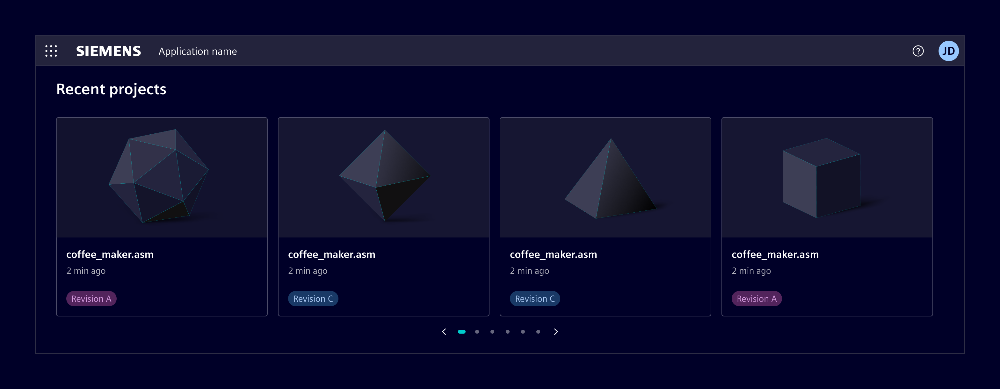
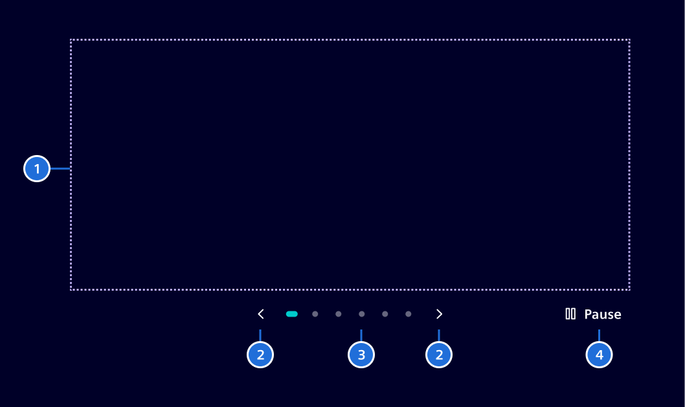
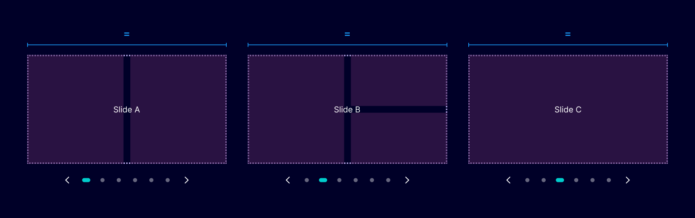
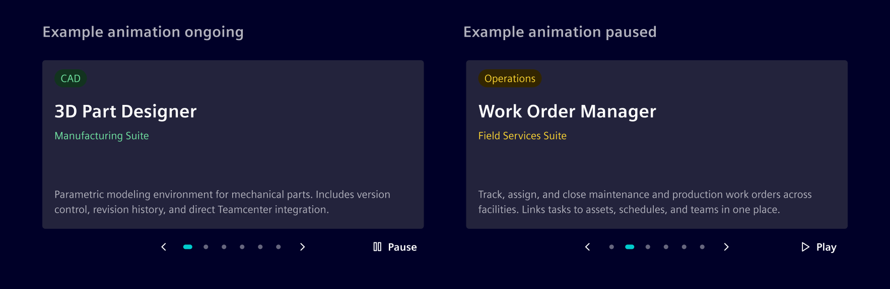

# Carousel

The **carousel** displays a set of related content in a horizontal row,
supporting to cycle through them automatically or manually by the user with navigation controls.

## Usage ---

Use a carousel when users need to browse a small set of related items within limited space,
and each item follows a consistent structure (e.g., same card layout, similar content density).



### When to use

- To surface multiple related items.
- When content can be browsed one page at a time without losing context.
- When space is limited and showing all items at once would overwhelm the layout.
- In unattended display contexts (e.g., monitors, presentation screens) using
  slideshow mode with auto-play.

### Best practices

- Keep slides consistent in height and content structure across pages.
- Always show the auto-play control so users can pause the carousel at any time.
- Avoid mixing slides with very different content types in the same carousel.
- Use the carousel for content that is genuinely browsable, where users benefit from seeing one page at a time.
- The pagination displays a minimum of 2 and a maximum of 7 dots at a time, regardless of the total number of slides.

## Design ---

### Anatomy



> 1. Slides, 2. Navigation controls, 3, Pagination, 4. Pause/play

Except for the slides, **all items are optional**.

### Slide layout

All slides within a carousel share the same width and height,

The carousel always shows one full-width slide.
What goes inside that slot (one card, three cards, a grid, images) can be defined according to the use case.



### Auto-play

When auto-play is enabled, the carousel advances to the next slide after a configurable interval. A play/pause button is shown alongside the navigation controls so
users can pause or resume at any time.

Auto-play works in both carousel and slideshow modes.



### Slideshow mode

**Slideshow mode** expands the carousel to cover the entire viewport, hiding all application content including the app header.
It is typically used for unattended display (monitors, presentation screens) and is commonly paired with auto-play.

## Code ---

The `si-carousel` component uses the `siCarouselItem` directive to mark
each slide. Slides are displayed horizontally with snap-scroll behavior.

### Usage

```ts
import { SiCarouselComponent, SiCarouselItemDirective } from '@spike-rabbit/element-ng/carousel';

@Component({
  imports: [SiCarouselComponent, SiCarouselItemDirective, ...]
})
```

```html
<si-carousel>
  <div siCarouselItem><h2>Slide 1</h2></div>
  <div siCarouselItem><h2>Slide 2</h2></div>
  <div siCarouselItem><h2>Slide 3</h2></div>
</si-carousel>
```

<si-docs-component example="si-carousel/si-carousel"></si-docs-component>

<si-docs-api component="SiCarouselComponent"></si-docs-api>

<si-docs-types></si-docs-types>
