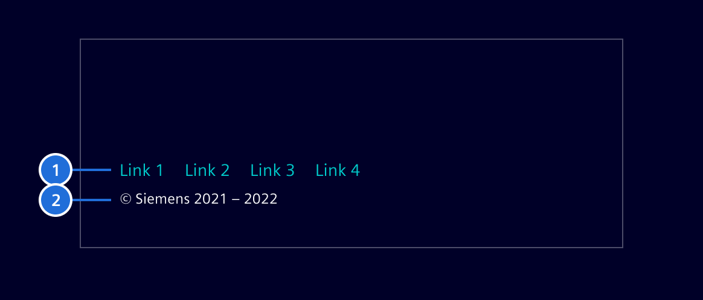
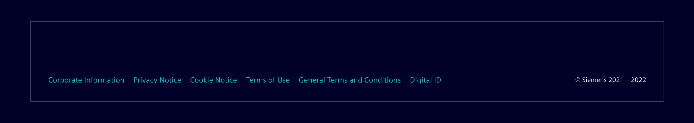
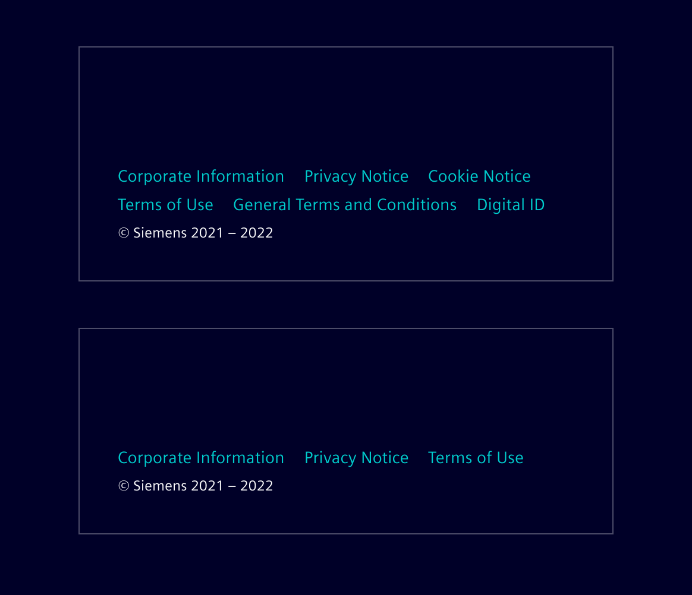

# Footer

The footer provides legal information like copyrights and further links to legal
artifacts to users.

## Usage ---

The footer is a part of an overarching concept for legal guidelines.

### When to use

The footer is mandatory in the following cases:

- On the [Landing Page](../pages/landing-page.md).
- On all other pages, where no [Horizontal Navigation](horizontal-navigation.md)
  is provided, which contains the legal information.

### When not to use

The footer **must not be used** on pages, where a [Horizontal Navigation](horizontal-navigation.md)
is provided, and contains the legal information.

## Design ---

### Elements

The footer contains the `Copyright Notice` and a link list to (legal) artifacts.



 > 1. Link list, 2. Copyright notice

### Wide version

The wide representation of the footer has to be used if the `Copyright Notice`
and the links **do have enough space** on a single line.



### Small version

The small representation of the footer has to be used if the `Copyright Notice`
and the links **do not have enough space** on a single line. The
`Copyright Notice` gets an own line always and a link must not contain a line
break.



## Code ---

The `links` input allows 3 kinds of links.

- `action` perform a given function.
- `href` link to external websites.
- `link` link to an internal route.

The vertical padding of this component can be configured. Just set
`$page-footer-padding` (Default: 13px) to your desired value.

### Usage

```ts
import { SiFooterComponent } from '@siemens/element-ng/footer';

@Component({
  imports: [SiFooterComponent, ...]
})
```

<si-docs-component example="si-footer/si-footer"></si-docs-component>

<si-docs-api component="SiFooterComponent"></si-docs-api>

<si-docs-types></si-docs-types>
