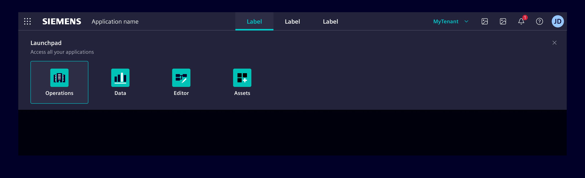
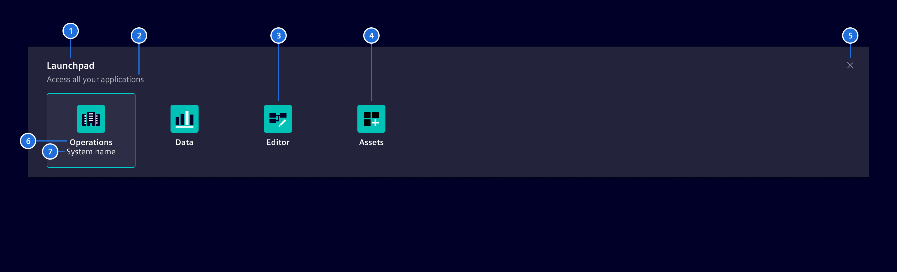
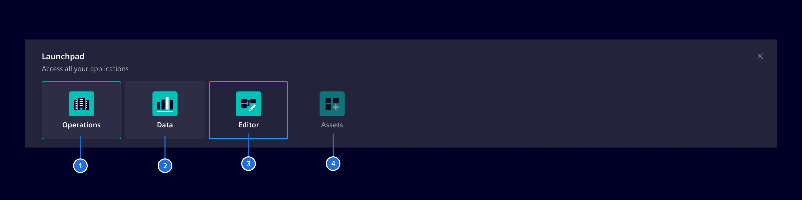
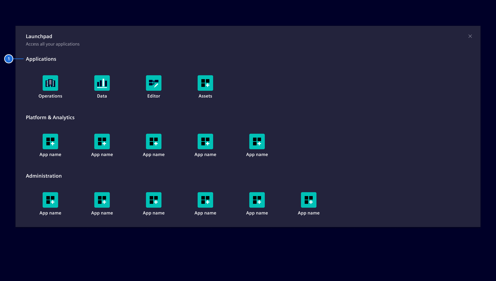
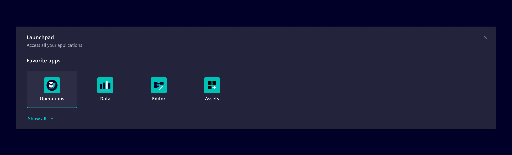
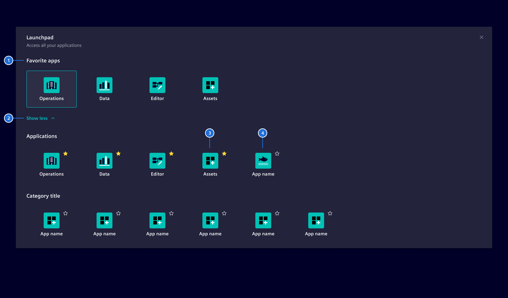
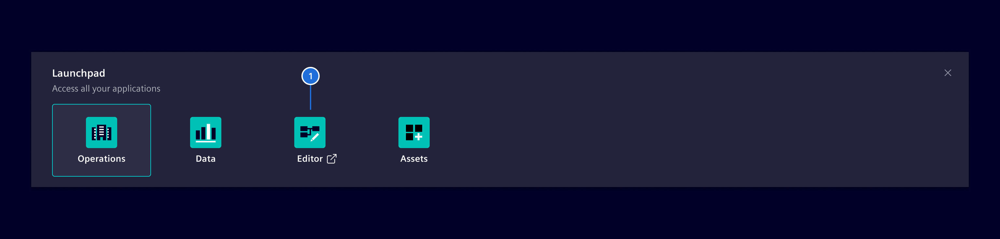

# Launchpad

The launchpad provides a way for the user to easily navigate between applications.

## Usage ---



### When to use

- Use a launchpad to give the user the possibility to launch apps or switch between apps easily within one application.

### Best practices

- If there are a lot of apps, it's recommended for this component to include recently used apps, frequently used apps.
- If the list is a manageable size, include all apps or products available on the system.
- Allow users to manage the applications.
- Only use the launchpad for more than two apps.

## Design ---

### Elements

A launchpad consists of the following elements:



> (1) Title, (2) Sub-title [optional], (3) App with icon, (4) App with logo, (5) Close, (6) App name, (7) System name [optional]

The app is represented by the app logo or alternatively by an icon.

### States



> (1) Current app, (2) Hover state, (3) Focused, (4) Disabled

### Categories (optional)



> (1) Category title

If there is a large number of applications it is possible to organize and group them for a better overview.
Apps should be grouped in a logical and meaningful way.

### Favorites (optional)



For a better overview, the concept of **favorites** allows the user to only show the most important apps at at a glance and to hide less frequent used ones.



> (1) Title, (2) Expand/Collapse-toggle, (3) Favorite app, (4) Standard app

In the expanded view, the user can click on the **star**-icon to mark the app as a favorite one.
The app will then be part of the favorite apps category.
To unstar an app the user simply clicks on the **star**-icon again.

Both concepts of **Categories** and **Favorites** can be mixed if necessary.

### Launch of external app (optional)



> (1) Launch of external app

External apps must be indicated with an additional `element-export` icon and opened in a new browser-tab.
The origin tab remains open to allow a fast and easy return to the previous app.

### Responsive behavior

By decreasing the viewport size the apps within the launchpad will be stacked.

## Code ---

The launchpad (`si-launchpad-factory`) ist part of the [application header](application-header.md).

Wrap it inside a `ng-template` and provide the template to the `si-application-header` component.

```html
<si-application-header [launchpad]="launchpad">
  ...
</si-application-header>

  <ng-template #launchpad>
    <si-launchpad-factory [apps]="myAppsOrCategories" />
  </ng-template>
```

### Example

<si-docs-component example="si-application-header/si-launchpad" height="330"></si-docs-component>

<si-docs-api component="SiLaunchpadFactoryComponent"></si-docs-api>

<si-docs-types></si-docs-types>
