# Main-Detail Container

**Main-Detail** is a layout pattern that shows a list of items and the corresponding
details of the selected item.
It allows users to stay focused on the main content while accessing and editing
related details without loosing context.

## Usage ---

Use this layout when viewing details from an item in a large list or group on the same page is required.

The content in the main container such as list, data table or simple navigation is used to
control the information shown in the details container.

Selecting an item from the main container opens the detail view.
The user can select another item from the main container to switch content of the detail container.

Main-detail layouts are optimized for wider screens, while also incorporating a
responsive behavior to adapt to various screen sizes.

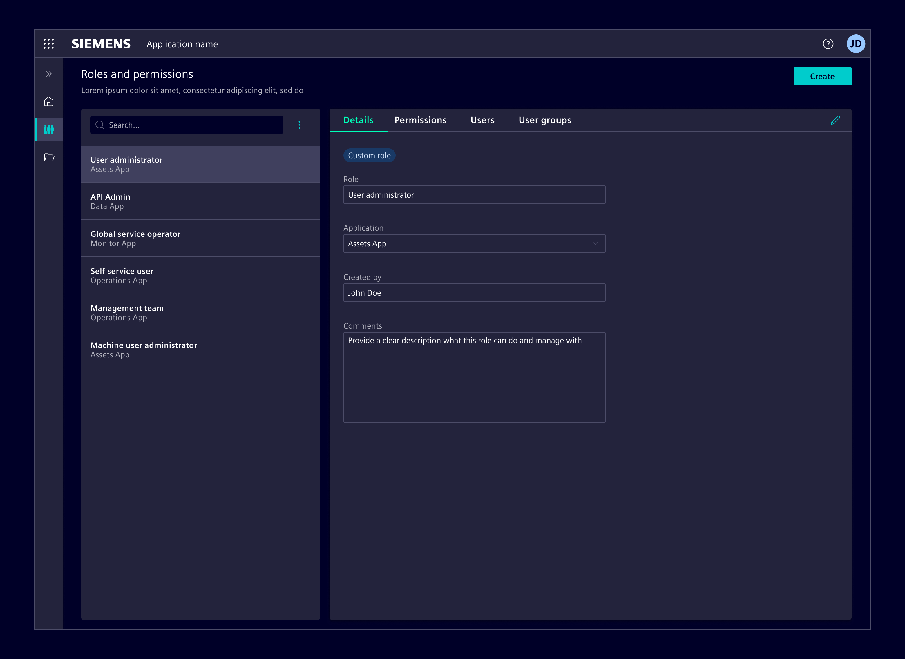

### When to Use

- For navigating through hierarchical data structures, making it easier for users to explore and understand content.
- When there's a need to navigate through large amounts of data or items but only focus on one item at a time.
- In scenarios where users might need to switch quickly between items without losing context.

## Design ---

### Elements

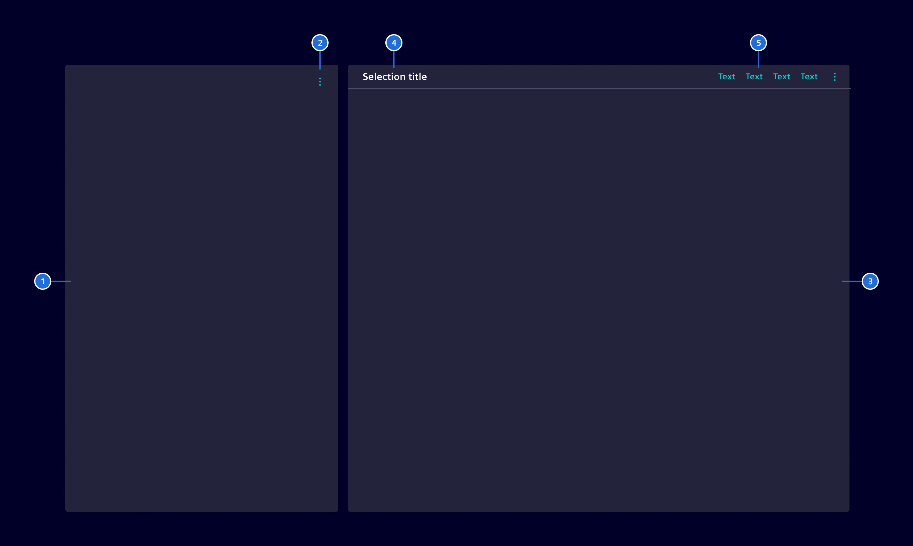

1. **Main container:** Displays content types such as lists, tables or trees.
1. **Main Actions (optional):** These are the functions that a user can perform within the main container.
1. **Detail container:** Displays information from the selected node, such as tables, forms or KPIs.
1. **Detail title (optional):** It provides context about the information displayed, e.g. name of the selected item
1. **Detail actions(optional):** Functions that can be performed within the detail container.

### Resizing the containers

The two sections can be dynamically resizable: when users hover over the dividing area,
the cursor turns into a double-sided arrow, allowing for size adjustments.

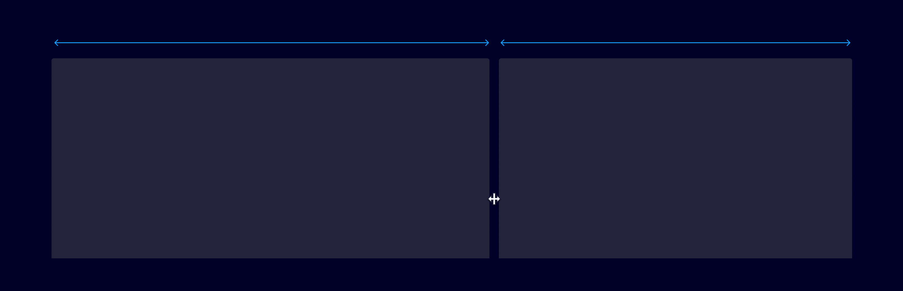

### Edit mode

An 'Edit mode' can be optionally enabled in the detail area, allowing content modifications.
When active, 'Save' and 'Cancel' actions are displayed in a footer.

The main content area is scrollable independently of the footer.
This way, the footer remains visible and accessible even when the content overflows.

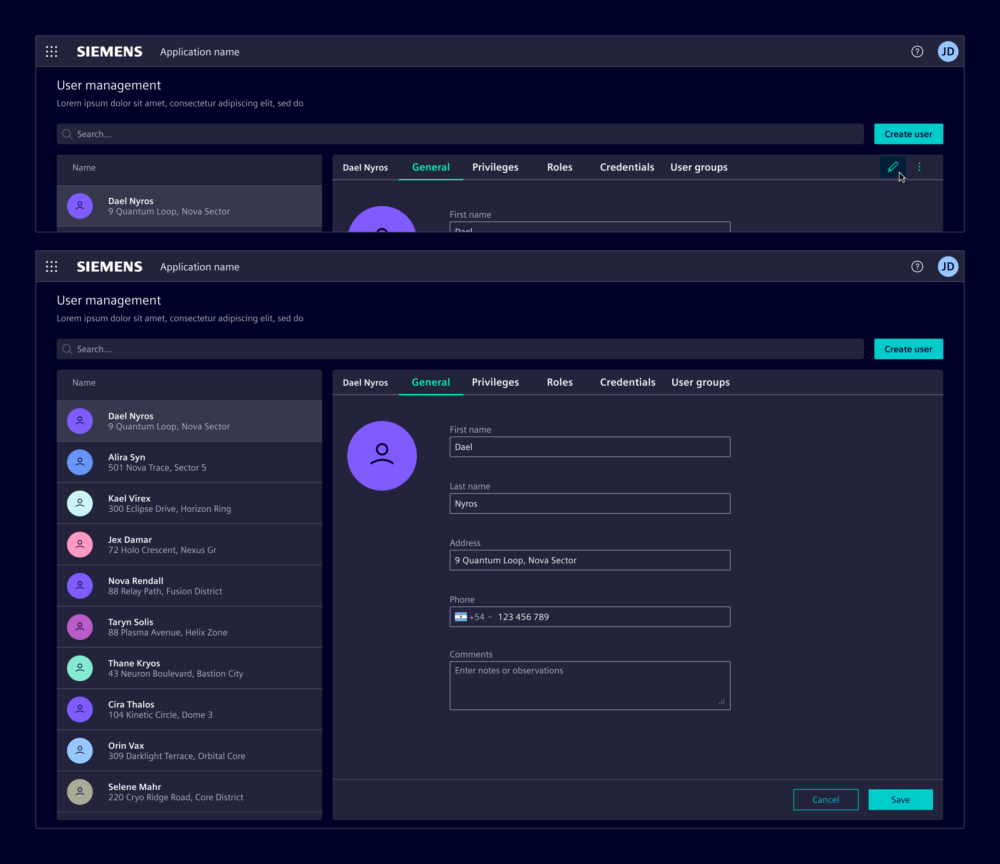

### Search and Actions in Main

These actions are designed to manipulate data in the main container.

They are context-specific, meaning they directly affect the item in the main view.
For example, a bulk action to "Update user permissions" to modify settings
for multiple users at once, or "Adjust settings for multiple zones"
enables uniform changes across different areas in a single step.

Any button type can be used as an action.
However, if more than one action is needed, they should be collapsed over a menu, or reconsidered as global actions.

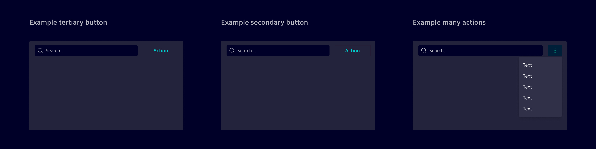

### Filtering in the Main

If filters are needed in the main, a filter button can be placed above the content.
Applied filters can be represented with a filter bar.

If the action next to the search bar is used for another purpose, the filter button can be placed next to the applied filters.

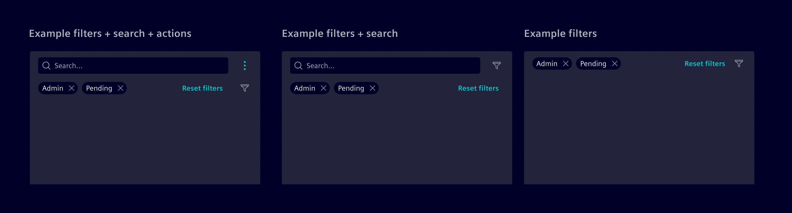

Filters in the main area can overlay the content to show filtering options.
When activated, a panel appears, allowing users to select criteria, and then retracts
to update the displayed content based on the selected filters.

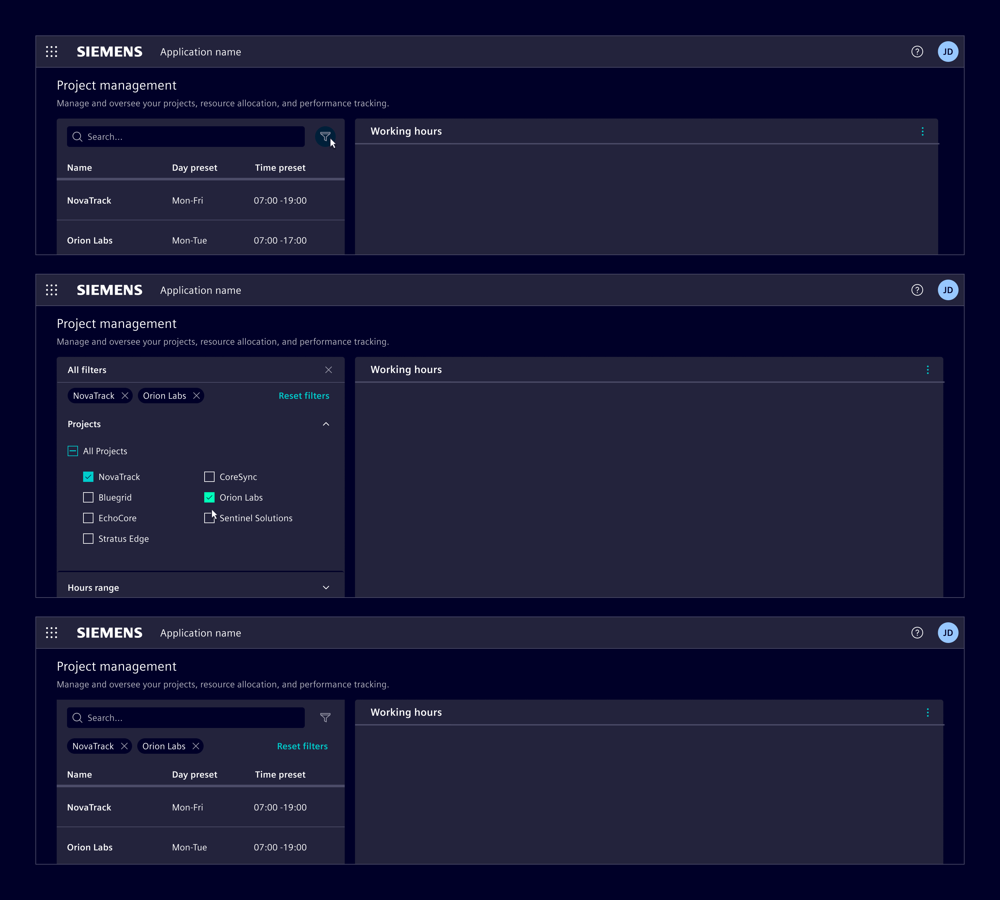

### Global Search and Actions

Unlike the actions that are exclusive to the 'Main' or 'Detail',
global actions transcend specific areas and provide functionality that
is consistently relevant regardless of the user's current focus.
E.g.: A 'Create' button that initiates the process to create a new entry to the main container.

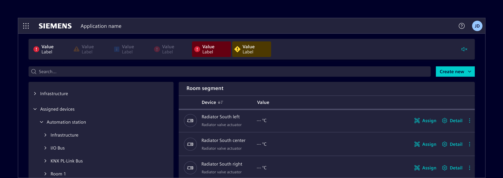

### Bulk actions

When multiple items can be selected, the detail view will display an [*Empty State*](../status-notifications/empty-state.md)
guiding users to either perform an action or clear the selection.

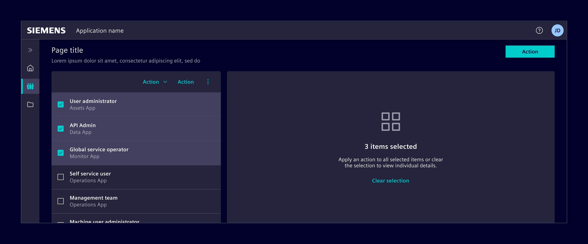

### Initial interaction

Consider the initial interaction: It can either feature a preselected item, displaying its details,
or be user-initiated, where the detail view remains empty until an item is selected or created.

There can also be situations where the main view itself is not populated until the user creates or adds an item.

In instances, where no data is immediately available, use an [*Empty State*](../status-notifications/empty-state.md)
to guide the user.

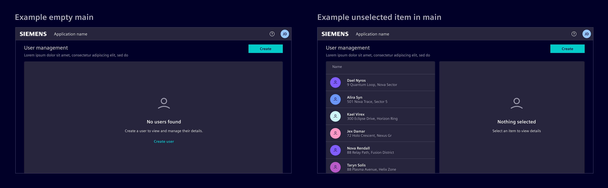

### Responsive behavior

In responsive mode, the Main-Detail splits into two screens: first displaying the main content,
then the details of a selected node with a 'Back' button.

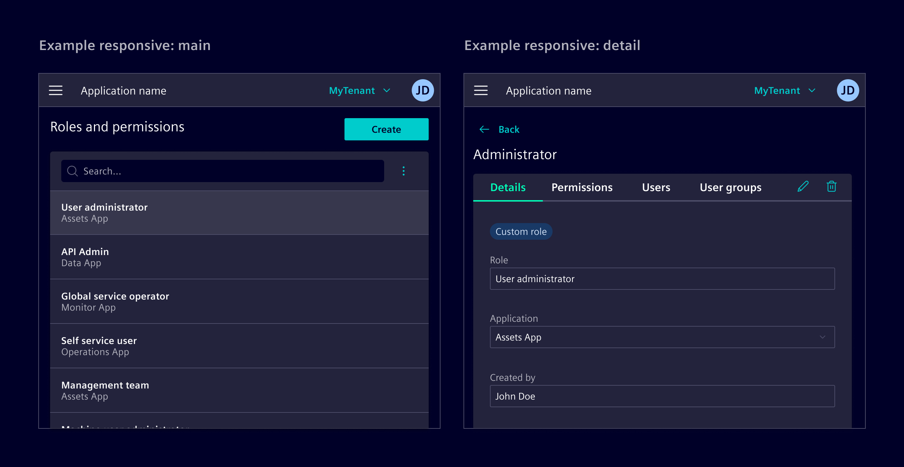

## Code ---

### Usage

```ts
import { SiMainDetailContainerComponent } from '@siemens/element-ng/main-detail-container';

@Component({
  imports: [SiMainDetailContainerComponent, ...]
})
```

The `<si-main-detail-container>` represents the layout container used to organize the different elements.
The `slot` attribute on the child elements is used to assign them to the correct position in the main-detail layout.

The `slot` attribute accepts one of the following values:

- `mainSearch`: Search field for the main list
- `mainActions`: Content actions for the main list
- `mainData`: List/table to show the main data
- `details`: Details pane
- `detailActions`: Content actions for the details pane

<si-docs-component example="si-main-detail-container/si-main-detail-container" height="500"></si-docs-component>

<si-docs-api component="SiMainDetailContainerComponent"></si-docs-api>

<si-docs-types></si-docs-types>
