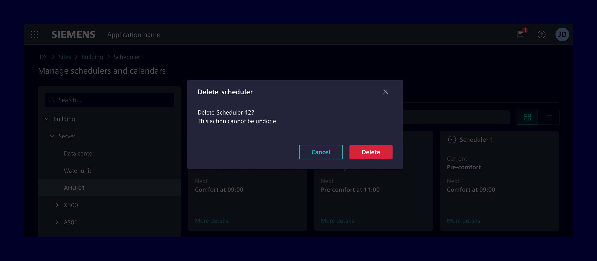
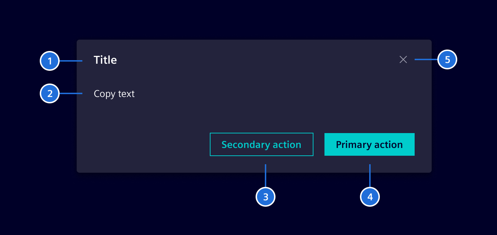
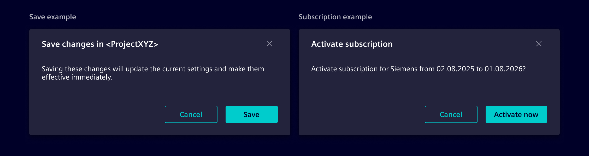
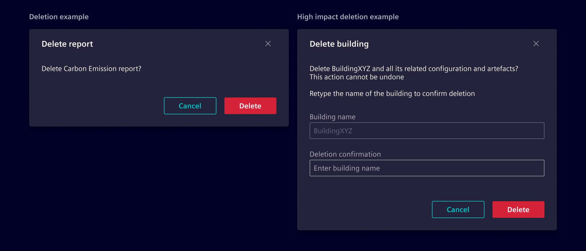

# Modals

Modals are flexible dialog prompts which offer minimal required functionality
and smart defaults. They block the parent window and force users to interact
with the modal itself before allowing to continue the workflow.

## Usage ---



### When to use

- Use modals for guided interactions or showing additional details.
- Use it to interrupt a flow and to catch the user’s full attention.
- Use it to prompt a user to enter information crucial to continuing a process.

### Best Practices

- Use button texts which represent their intended action (e.g. use `Delete`
  instead of `Yes` on a delete confirmation dialog).
- Be mindful **when** to show the modal to avoid interrupting the user flow.
- Modals must always be used in combination with [Backdrop](../../patterns/backdrop.md)
  to provide visual focus on the active modal content.
- Don't use it for complex decision making that requires additional sources of
  information unavailable in the current context.
- Don't use it for nonessential information that is unrelated to the current
  user flow.

## Design ---

### Elements



> 1. Title, 2. Content, 3. Secondary action (optional), 4. Primary action, 5. Cancel

### Common modal types

Modals serve various purposes depending on the scenario. Common examples include:

- **Transactional modals**  
  Used to collect or confirm user inputs, such as completing a form or setting
  preferences.

- **Confirmation modals**  
  Ensure users explicitly approve an action, like saving or submitting data.

  

- **Deletion modals**  
  They are used when the action cannot be undone or the data is hard to recreate.
  For high-impact deletions (e.g., deleting a site with months of work), explicit
  confirmation is required, with safeguards like typing the object’s name or
  enforcing a 4-eyes principle. Low-impact deletions, where data is easy to
  recreate, don’t require a modal.

  

## Code ---

In Element modals are created with the `SiModalService` or alternatively with
the `SiActionDialogService` for predefined modal dialogs.

### Generic modals

To display a modal dialog in any component, you need to follow these steps:

- Import and inject the `SiModalService` in your component.
- Use the `show` method of `SiModalService` to display the modal. This method
  takes either the component or template you want to display in the modal.

```ts
import {viewChild} from "@angular/core";

@Component({
  template: `
    <ng-template #sampleModal>
     <div class="modal-header">
      <h4 class="modal-title">Modal</h4>
      <button
        type="button"
        class="btn btn-circle btn-sm btn-ghost element-cancel"
        aria-label="Close modal"
        (click)="modalRef.hide('cancel')"
      ></button>
    </div>
    <div class="modal-body">
      <span>This is the body.</span>
    </div>
    <div class="modal-footer">
      <span>This is the footer.</span>
      <button type="button" class="btn btn-secondary" (click)="modalRef.hide('close')">Close</button>
    </div>
  </ng-template>     
  `
})
export class SampleComponent {
  private modalService = inject(SiModalService);
  private modal = viewChild.required<TemplateRef<void>>('sampleModal');
  private modalRef?: SiModalRef;


  openModal(): void {
    this.modalRef = this.modalService.show(template, { /* Options go here. */});
  }
}
```

<si-docs-component example="si-modals/si-modal-service" height="450"></si-docs-component>

### Predefined modal dialogs

This section describes the general usage of the element modals.

<si-docs-component example="si-modals/si-modal-dialogs" height="450"></si-docs-component>

#### Action dialogs

Element provides the service `SiActionDialogService`.
The service provides a method to display the modal dialogs for each dialog type.
They offer mandatory and optional parameters to configure the dialogs and
return an `Observable` with the user's result.

##### Alert Dialog

Use the alert dialog to request the attention of the user to a certain
event, which is so severe, that the normal use of the application is
interrupted and the user needs to confirm to this alert. The result
is just `confirm`, which indicates that the users took notice of
the dialog.

##### Confirmation Dialog

Use the confirmation dialog to request a yes-no or agree-disagree confirm-decline
answer from the user. Default button labels are yes and no. Closing the dialog
with the close button returns a decline.

##### Delete Confirmation Dialog

Use the delete confirmation dialog to request user confirmation before
deleting any object.

##### Edit-Discard Dialog

Use the edit-discard dialog when leaving or canceling a data form
that was modified. User results are `Save`, `Discard`, or `Cancel`.

- `Save`: User still wants to save the changes. Save them and navigate away.
- `Discard`: Discard the changes and navigate away.
- `Cancel`: User is unsure and cancel leaving the form. Close the dialog and let
  the user further edit the form.

#### Column selection dialog

Use the `SiColumnSelectionDialogService` if you need a dialog to configure the
column setup of a table.

<si-docs-api injectable="SiModalService"></si-docs-api>

<si-docs-api injectable="SiActionDialogService"></si-docs-api>

<si-docs-api injectable="SiColumnSelectionDialogService"></si-docs-api>

<si-docs-types></si-docs-types>
