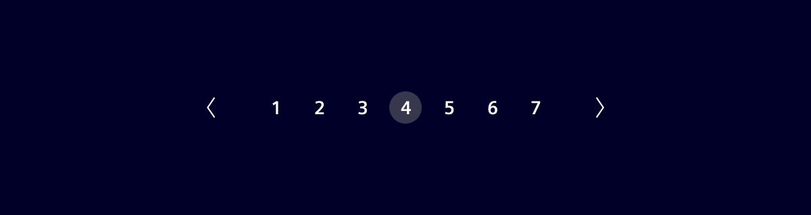
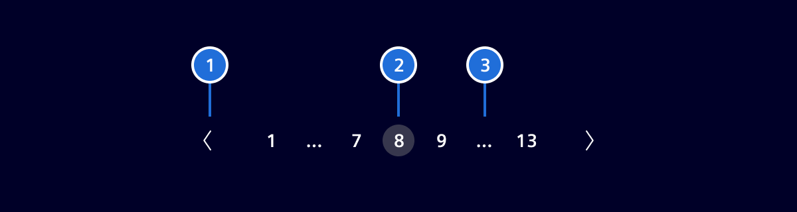
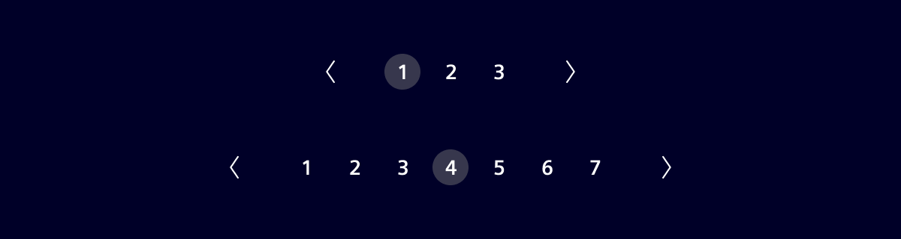
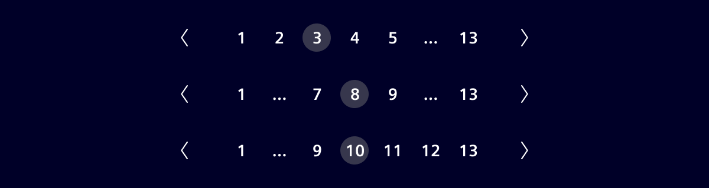
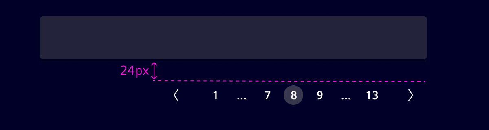

# Pagination

Pagination is used for splitting up content or data into several pages, with a control for navigating to the next or previous page.

## Usage ---



### When to use

- When there are more than 25 items displayed in one view.
  Pagination should not be shown if only one page is available.

### Alternative

Consider using a “Load more” pattern as an alternative to classical pagination.
This approach offers users more control by allowing them to load additional results only when they choose to.
Instead of navigating between pages, users click a “Load more” button at the end of the current list.

## Design ---

### Elements



> 1. Navigation arrows, 2. Current page,  3. "More" indicator

### Number of pages

A maximum of 7 pages or items can be displayed.



When the total number of pages exceeds 7, then the remaining pages will be truncated. The navigation arrows should always be displayed.



### Placement of pagination component

Pagination should be placed at the bottom right of the table.


## Code ---

**Pagination** - provide pagination links for your site or app with the
multi-page pagination component, or the simpler pager alternative.

### Usage

```ts
import { SiPaginationComponent } from '@spike-rabbit/element-ng/pagination';

@Component({
  imports: [SiPaginationComponent, ...]
})
```

<si-docs-component example="si-pagination/si-pagination"></si-docs-component>

<si-docs-api component="SiPaginationComponent"></si-docs-api>

<si-docs-types></si-docs-types>
