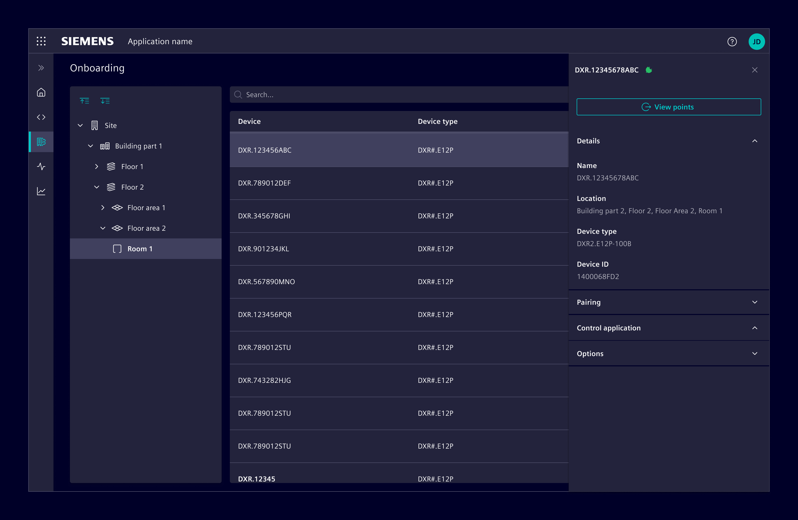
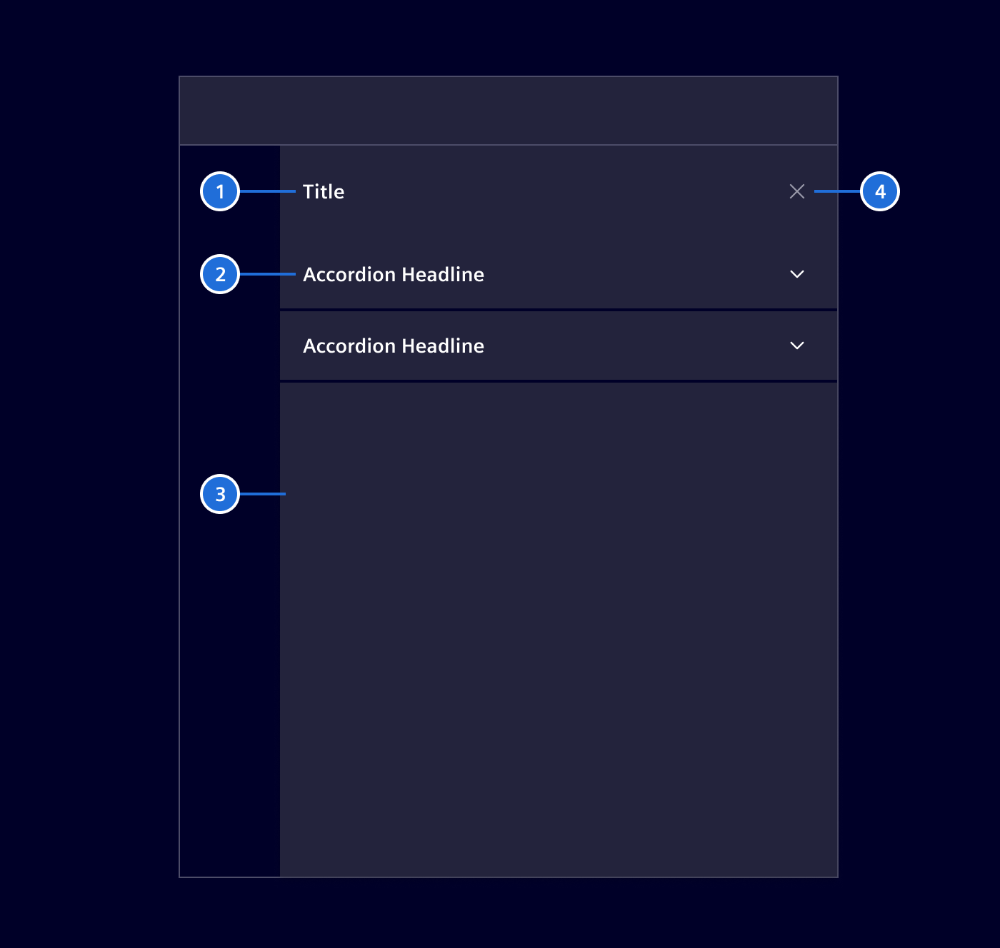
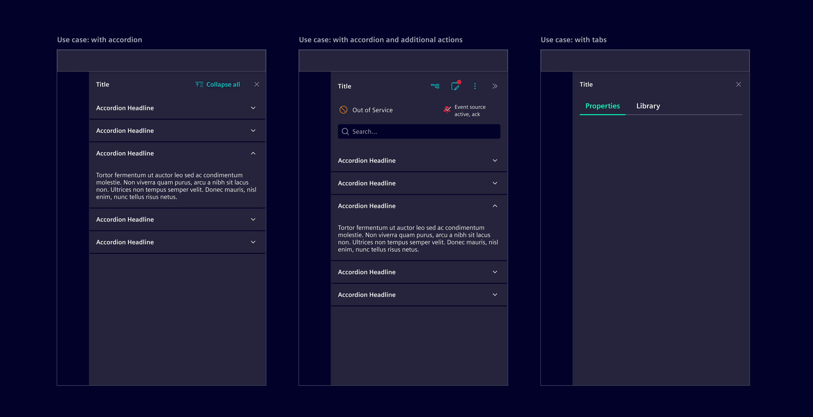
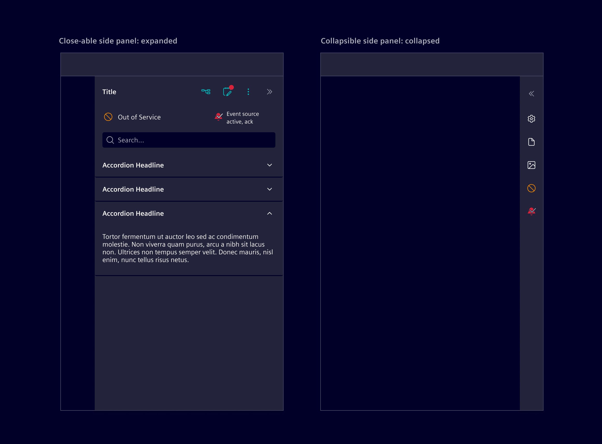
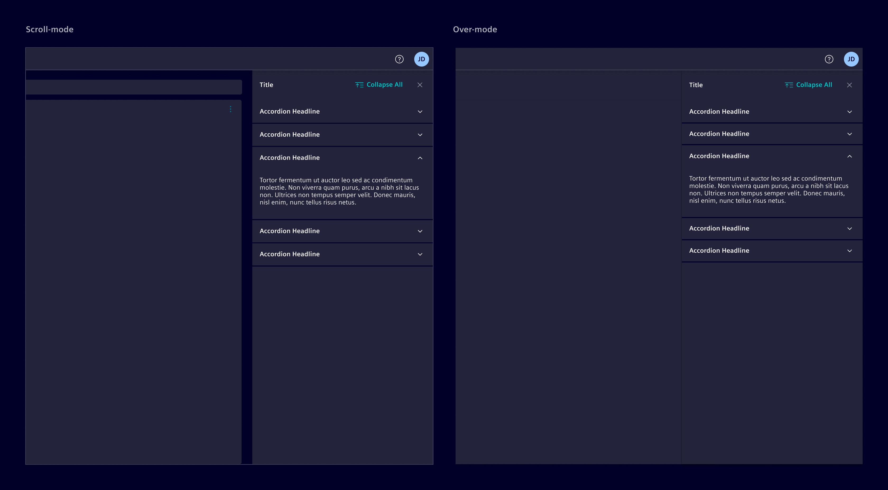
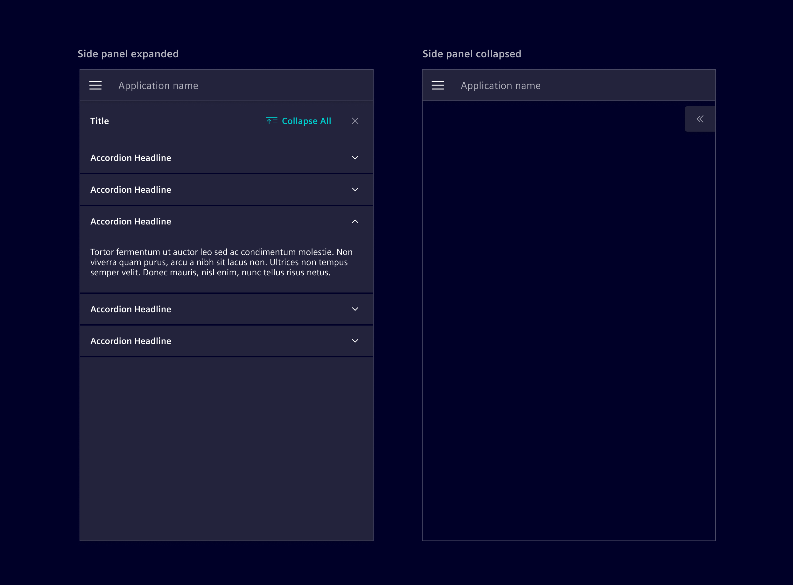
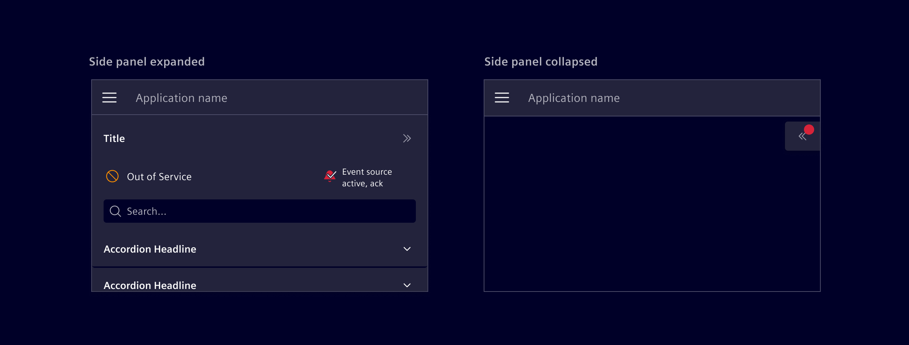

# Side panel

The **side panel** is a responsive layout container that pushes-in from the
right side of an application (for left-to-right/LTR orientation).

## Usage ---

The side panel is used to display additional content or functionality that is
related to the main content of a page.



The panel takes the full application height and a fixed width. There are two
pre-defined widths to choose from, either *regular* (`390px`) or *wide*
(`500px`).

### When to use

- Use it to show detail information of a selected item/object from the main
  working area (e.g. of a list).
- Use it for navigation items such as links or menus.
- Use it for filter options to enable users to refine their search results.
- Use it for settings and preferences to allow users to customize their
  experience.
- Use it for help and support information.
- Use it for notifications to alert users about important updates, events or
  more.

### Best practices for side panel

- Don't use it for permanent information. The content should be changing based
  on the context.
- The content should be scrollable if it exceeds the height of the application
  window.

## Design ---



1. **Title:** A descriptive title for the panel based on its content.
1. **Section header (optional):** Use it for breaking the panel into multiple
   distinct sections.
1. **Content body:** A container that allows to implement any kind of different
   content.
1. **Exit icon:** Button used to hide or collapse the side panel.

### Content

The side panel can contain any content based on the use case.
It is common to use it with [accordions](../layout-navigation/accordion.md)
and [tabs](../layout-navigation/tabs.md)
to section information without overwhelming users.

A special variation of the side panel allows for icons to represent the status
of the selection, remaining visible even in the collapsed state.
This is commonly used to represent data point states including event states, but
is not restricted to these cases.



### Modes

The side panel can be either *closeable* (the panel is completely hidden) or
*collapsible* (still visible with summary information) according to the
application/project use-case.

- Use a *closeable* side panel if the content has no direct relation to the
  items within the main content area. Closeable side panels are typically opened
  by selecting an entry within the horizontal navigation.
- Use a *collapsible* side panel if the content changes based on the selection
  made within the main content area.



A side panel can be configured to use either *over-mode* or *scroll-mode*.
In *over-mode*, the panel overlaps the main content area, while in
*scroll-mode*, the panel pushes the main content area away.



### Collapsible floating button

This is a variation of the collapsed state, specifically designed for smaller screens.



The floating button is restricted to the following configurations:

- The side panel by itself
- The side panel + [application header](../layout-navigation/application-header.md)

It should never be used in combination with the responsive behavior of the [vertical navigation](../layout-navigation/vertical-navigation.md).

If data point states are available (out of service, event active, etc),
a notification tag can be enabled to signal to the user that something requires attention.



## Code ---

Use it together with `<si-accordion>` and `<si-collapsible-panel>` as shown in the example. If
the accordion behavior of having only one open panel is not desired, simply use
`<si-collapsible-panel>` without wrapping them in an `<si-accordion>`.

### Usage

Within a module

```ts
import { SiAccordionModule, SiSidePanelModule } from '@siemens/element-ng/side-panel';

@NgModule({
  imports: [SiAccordionModule, SiSidePanelModule, ...]
})
```

or as a standalone component

```ts
import { SiSidePanelComponent, SiSidePanelContentComponent } from '@siemens/element-ng/side-panel';
import { SiAccordionComponent, SiCollapsiblePanelComponent } from '@siemens/element-ng/accordion';

@Component({
  imports: [
    SiSidePanelComponent,
    SiSidePanelContentComponent
    SiAccordionComponent,
    SiCollapsiblePanelComponent,
  ]
})
```

All content that should be shown in the side panel needs to be wrapped in a
`<si-side-panel-content>`.

The standard way to provide content for the side panel is by placing the
`<si-side-panel-content>` element directly inside the `<si-side-panel>`:

<si-docs-component example="si-side-panel/si-side-panel" height="500"></si-docs-component>

### Flexible content injection via cdkPortal and SiSidePanelService

A more flexible way is to use the `cdkPortal` directive from the
[Angular CDK Portal](https://material.angular.io/cdk/portal/overview) combined with the
`SiSidePanelService` which allows to control the content of the side panel from anywhere
within the application:

<si-docs-component example="si-side-panel/si-side-panel-portal" height="500"></si-docs-component>

### Collapsible side panel with various options

The side panel supports a mode where it collapses into a vertical bar instead
of getting completely hidden. This mode can be enabled by setting `[collapsible]="true"`
as demonstrated in the example below. There are also many other options that can
be enabled on the `<si-side-panel-content>` like showing a search box, content
actions, or status indicators.

<si-docs-component example="si-side-panel/si-side-panel-collapsible" height="500"></si-docs-component>

<si-docs-api component="SiSidePanelComponent"></si-docs-api>

<si-docs-api component="SiSidePanelContentComponent"></si-docs-api>

<si-docs-types></si-docs-types>
