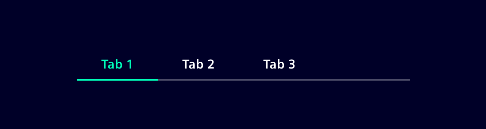
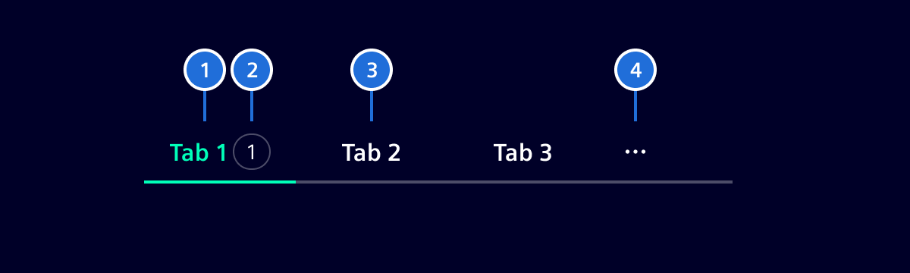
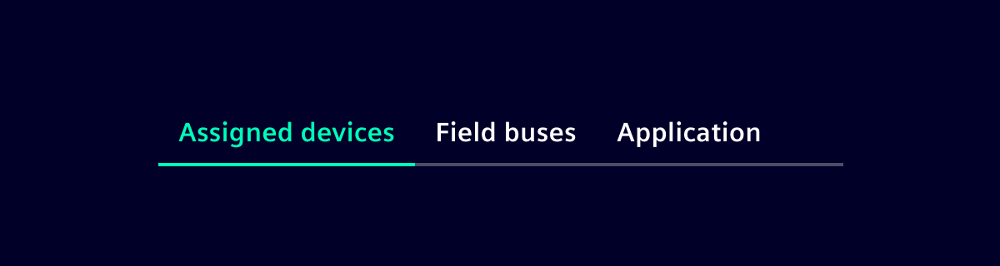
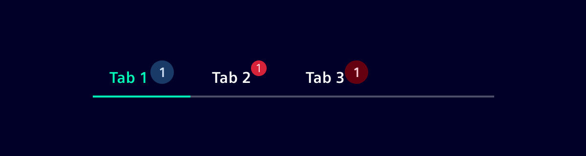
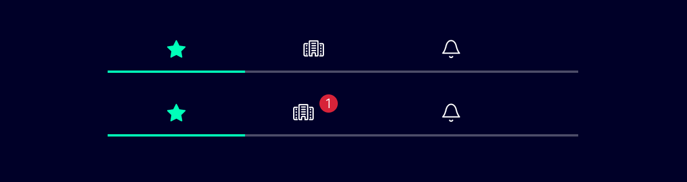
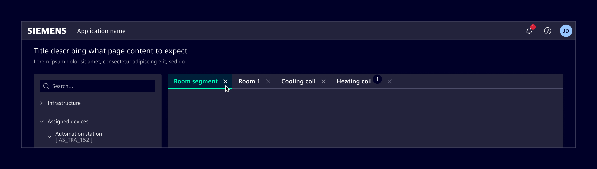
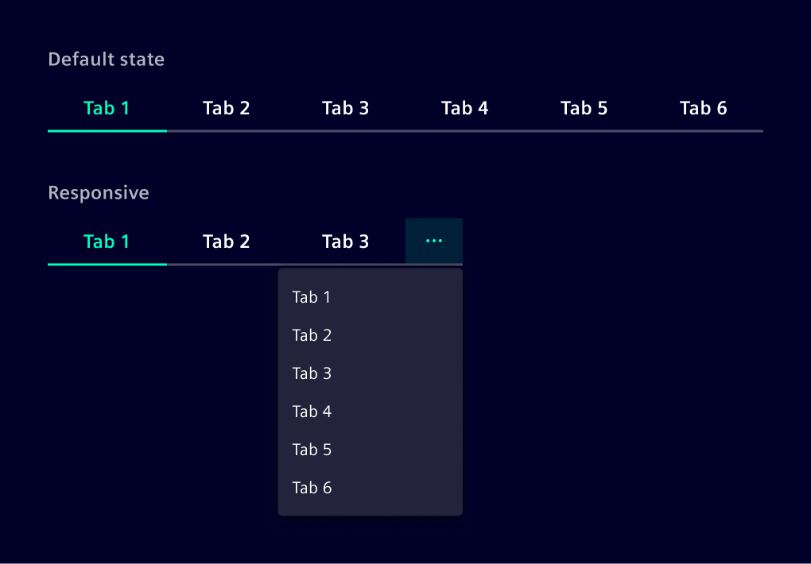

# Tabs

Tabs are used to separate information into logical sections in the context of a single page and to quickly navigate between them.

With Element v48, the tabs have been completely re-implemented including breaking changes in the API.
The old tabs have been renamed to `*-legacy` and are available via legacy entrypoint
`@spike-rabbit/element-ng/tabs-legacy`. For more details, see the BREAKING CHANGES notes for
Element v48.0.0 in the [changelog](../../CHANGELOG.md).

## Usage ---



### When to use

- Use tabs to group content that belongs to the same category.
- Use tabs when there is a large amount of content that can be separated.
- Use tabs to make the content accessible without navigating across pages or compromising on space.
- Different tab-panes should be logically related but mutually exclusive. A content element should only be in one tab at a time.

### Best practices

- Don't mix different content types within the same tab structure.
- Avoid nested tabs (2 levels of tabs stacked on top of each other) since they add visual complexity, and are harder to navigate.

## Design ---

### Elements



> 1. Active tab, 2. Badge (optional), 3. Default tab, 4. Overflow menu

### Tab label



- The label describes the content contained within it.
- Labels are concise and use no more than two words.
- Tab labels should be written in title case and all words should be proper nouns.
- The label will not be truncated and uses the space it needs.
- The minimum width of a tab is `124px`.

### Number of tabs

In most scenarios, you should use no more than six tabs. This ensures an uncluttered UI and reduces cognitive load for users.
If more than six tabs are needed, consider other navigation patterns.

### Order

The order of all tabs should be consistent across all pages. Tabs with related content should be grouped adjacent to each other. The most important tab should be the first.

### Badge



A small badge (dot) can be displayed in tabs to indicate when new information is available. The badge can also contain a number to display the amount of notifications.

### Icon tabs



If there is not enough space to display meaningful labels, a tab version with icons can be used.

> **Note:** This version only works with meaningful icons!

### Closable tabs



This variation allows users to open multiple tabs for multitasking or comparing information side by side, and subsequently close them as needed. They can be used in combination with badges.

> **Note:** Closable tabs cannot be used in combination with icons.

### Responsive behavior

When there isn’t enough space to display all the tabs, the ones that no longer fit collapse into a menu.
This menu contains all the tabs in the same order, ensuring consistent navigation while optimizing space.



## Code ---

### Usage

```ts
import { SiTabComponent, SiTabsetComponent } from '@spike-rabbit/element-ng/tabs';

@Component({
  imports: [
    SiTabComponent,
    SiTabsetComponent,
    ...
  ]
})
```

### Tabs

<si-docs-component example="si-tabs/si-tabs"></si-docs-component>

### Tabs - Routing

<si-docs-component example="si-tabs/si-tabs-routing"></si-docs-component>

### Tabs - Icons

<si-docs-component example="si-tabs/si-tabs-icons"></si-docs-component>

### External Tab Content

Use `SiTabPortalComponent` to render tab content in a different part of the DOM outside of the `si-tabset`.
This is useful for split layouts such as [list-details](../layout-navigation/list-details.md). In these layouts, the tabs are in a header area and the content is in a separate body area.

Pass the `SiTabsetComponent` reference to the `tabset` input on `SiTabPortalComponent`.

```html
<si-tabset #tabset>
  <si-tab heading="Overview" [active]="true"> Overview </si-tab>
  <si-tab heading="History"> History </si-tab>
</si-tabset>

<!-- Rendered elsewhere in the DOM -->
<si-tab-portal [tabset]="tabset" />
```

### Toolbars

Tabs can be combined with toolbar actions (e.g. icon buttons) positioned inline in the tab bar. This pattern requires:

1. A **wrapper container** with the classes `.nav-tabs .d-flex .align-items-center` — this ensures the tabs and toolbar buttons are rendered on the same row, vertically aligned.
2. The `si-tabset` must have `.flex-fill .overflow-hidden` — `.flex-fill` allows the tabset to take all available space (pushing toolbar buttons to the end), and `.overflow-hidden` ensures the responsive overflow menu works correctly within the flex layout.
3. `SiTabPortalComponent` to render tab content separately from the tab header — this ensures toolbar buttons come before the tab content in the DOM/tab order for accessible keyboard navigation.

```html
<!-- Wrapper container -->
<div class="nav-tabs d-flex align-items-center">
  <si-tabset #tabset class="flex-fill overflow-hidden">
    <si-tab heading="Write" [active]="true"> ... </si-tab>
    <si-tab heading="Preview"> ... </si-tab>
  </si-tabset>
  <!-- Toolbar actions placed after the tabset -->
  <si-menu-bar>
    <si-menu-item icon="element-link" aria-label="Link" siTooltip="Link" />
    <si-menu-item icon="element-settings" aria-label="Settings" siTooltip="Settings" />
  </si-menu-bar>
</div>
<!-- Tab content rendered separately for correct tab order -->
<si-tab-portal [tabset]="tabset" />
```

<si-docs-component example="si-tabs/si-tabs-toolbar"></si-docs-component>

<si-docs-api component="SiTabsetComponent"></si-docs-api>

<si-docs-api component="SiTabComponent"></si-docs-api>

<si-docs-api component="SiTabLinkComponent"></si-docs-api>

<si-docs-types></si-docs-types>

## Code (legacy) ---

Element implements tabset and tab components that provide the correct styling and responsive behavior.
It supports the usage combined with the Angular router (preferred way) or alternatively as plain components.

> **Note:** This is the legacy tabs implementation. For new projects, use the [improved tabs component](#code).

### Tabs with Angular Router

When using the tabs with the Angular router, each tab is just an anchor with a `routerLink`.
Make sure to nest the `<router-outlet />` inside the `si-tabset-legacy` component as the tabset applies some accessibility attributes.
No need to apply `routerLinkActive`, this is done automatically.

```html
<si-tabset-legacy>
  <a si-tab-legacy heading="Tab 1" routerLink="./tab-1"></a>
  <a si-tab-legacy heading="Tab 2" routerLink="./tab-2"></a>

  <router-outlet />
</si-tabset-legacy>
```

```ts
import { Component } from '@angular/core';
import { RouterLink } from '@angular/router';
import { SiTabsetLegacyComponent, SiTabLegacyComponent } from '@spike-rabbit/element-ng/tabs-legacy';

@Component({
  templateUrl: './my-component.html',
  imports: [SiTabsetLegacyComponent, SiTabLegacyComponent, RouterLink]
})
export class MyComponent {}
```

A corresponding route definition looks like this:

```ts
import { Route } from '@angular/router';

export const routes: Routes = [
  { path: '', redirectTo: 'tab-1', pathMatch: 'full' }, // Select the first tab by default
  { path: 'tab-1', component: Tab1Component },
  { path: 'tab-2', component: Tab2Component }
];
```

### Tabs with plain components

In general, using the tabs with the Angular router is preferred as the state is stored in the URL.
So deep-linking and bookmarking is supported.
In some cases, this might not be needed, e.g. when using the tabs to group simple information on a page.

In this case, you can use the `si-tabset` component with `si-tab` components as children.

```html
<si-tabset-legacy>
  <si-tab-legacy heading="Tab 1">Tab 1 content</si-tab-legacy>
  <si-tab-legacy heading="Tab 2" [active]="true">Tab 2 content</si-tab-legacy>
</si-tabset-legacy>
```

```ts
import { Component } from '@angular/core';
import { RouterLink } from '@angular/router';
import { SiTabsetLegacyComponent, SiTabLegacyComponent } from '@spike-rabbit/element-ng/tabs-legacy';

@Component({
  templateUrl: './my-component.html',
  imports: [SiTabsetLegacyComponent, SiTabLegacyComponent]
})
export class MyComponent {}
```

By default, no tab is active until the user clicks one.
You can set the `active` property to `true` on one of the tabs to make it active by default.
Ensure that only one tab has the `active` property set to `true`.
Otherwise, the behavior is undefined.

### Closable tabs

Both tab variants can be used as a closable tab.
A tab that can be closed must be explicitly marked as closable by setting the `closable` property to `true`.

```html
<si-tabset-legacy>
  @if(showTab1) {
  <a
    si-tab-legacy
    heading="Tab 1"
    routerLink="./tab-1"
    closable
    (closeTriggered)="removeTab1()"
  ></a>
  }
</si-tabset-legacy>
```

```ts
import { Component } from '@angular/core';
import { RouterLink } from '@angular/router';
import { SiTabsetLegacyComponent, SiTabLegacyComponent } from '@spike-rabbit/element-ng/tabs-legacy';

@Component({
  templateUrl: './my-component.html',
  imports: [SiTabsetLegacyComponent, SiTabLegacyComponent, RouterLink]
})
export class MyComponent {
  showTab1 = true;

  removeTab1() {
    this.showTab1 = false;
  }
}
```

The tabset does not automatically remove a closed tab.
When `closeTriggered` is emitted, you need to handle the removal of the tab in your component logic.

<si-docs-component example="si-tabs/si-tabs-legacy"></si-docs-component>

<si-docs-api component="SiTabsetLegacyComponent"></si-docs-api>

<si-docs-api component="SiTabLegacyComponent"></si-docs-api>
