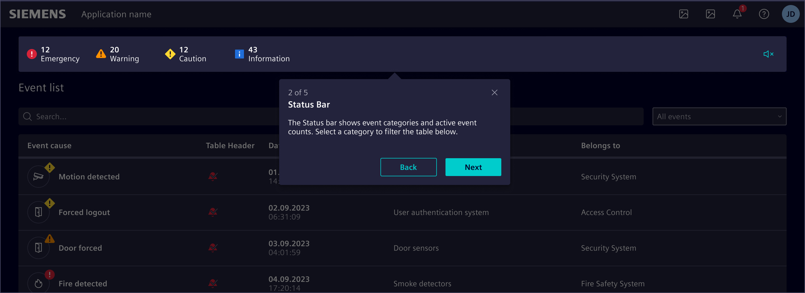
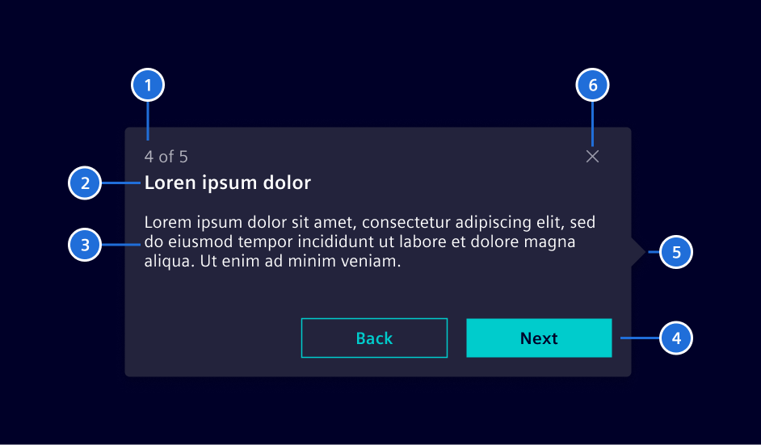
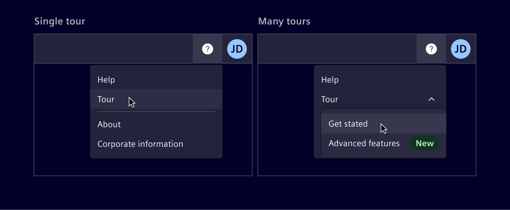
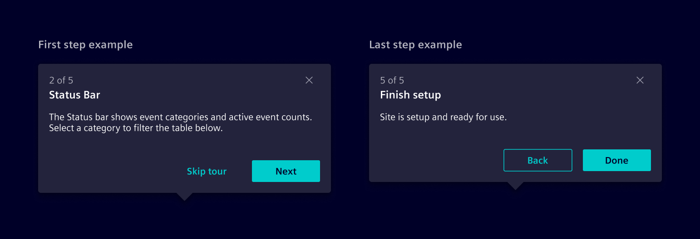

# Tour

**Tour** provides a guided walkthrough of an application's key features and functions,
helping users understand and navigate the interface effectively.

## Usage ---

Use the **tour** to guide users through a series of steps or features within an application,
offering contextual information and instructions to enhance the user experience.



### When to use

- To introduce new users to the application and its primary features.
- To guide users through a new workflow.
- To highlight significant updates or changes in the interface.
- To provide in-app training or onboarding for users.

### Best practices

- Keep tours between 3 and 15 steps.
- Each step should have a clear and concise description.
- Focus on how the feature or function can benefit the user.
- Organize the tour steps in a logical sequence that mirrors the user’s workflow.
- Avoid overwhelming users with too much information at once.

## Design ---

### Elements



> 1. Step number, 2. Title, 3. Description, 4. Actions, 5. Arrow (optional), 6. Close button

Tours can be automatically launched for new users during their first login to guide them through the UI.
Automatic tours are best for first-time use only.

Users can access guided tours anytime from the
Help menu in the [horizontal navigation](../layout-navigation/horizontal-navigation.md).

If more than one tour is offered, they can be organized within the Help menu into categories such
as "Getting started", "Advanced features" or "New features" for easy navigation.



### Tour beginning and end

The first step gives a brief overview of what to expect from the tour, with the option to skip it.
The last step concludes the tour, summarizing key points and optionally offering additional resources.



### Placement

The tour popover is automatically positioned above, below, to the left, or to the
right of an element based on its screen position.
The arrow can be placed along any edge to ensure optimal positioning.

## Code ---

### Usage

```ts
import { SiTourService } from '@siemens/element-ng/tour';

@NgModule({
  imports: [SiTourService, ...]
})
```

<si-docs-component example="si-tour/si-tour" height="300"></si-docs-component>

<si-docs-api injectable="SiTourService"></si-docs-api>

<si-docs-types></si-docs-types>
