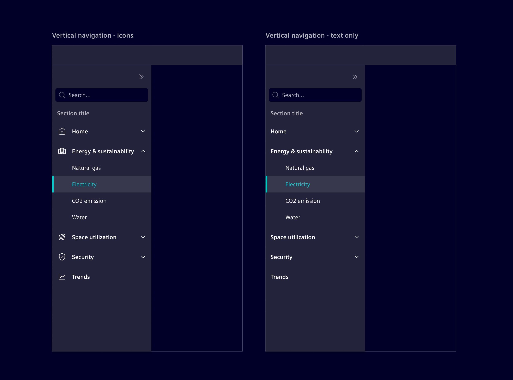
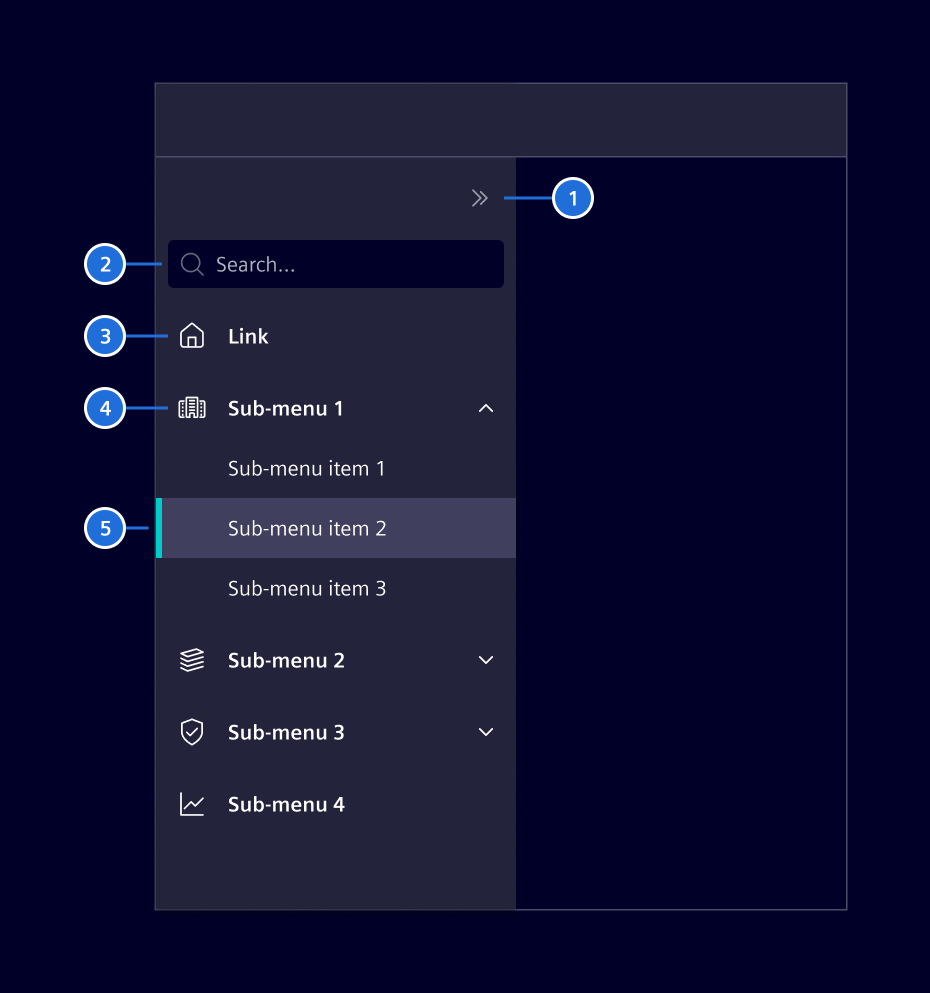
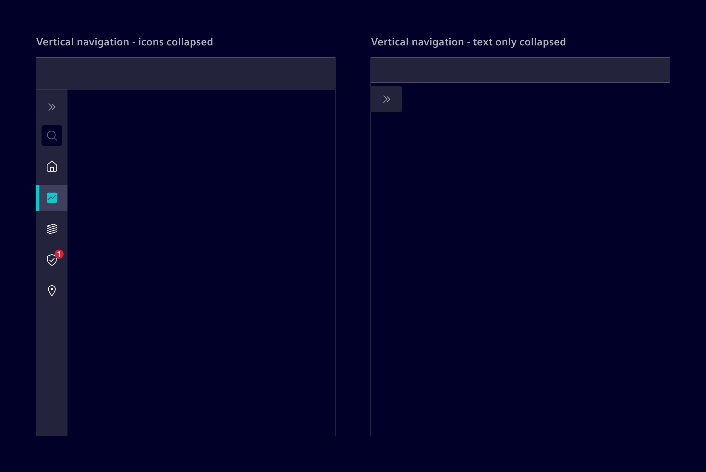
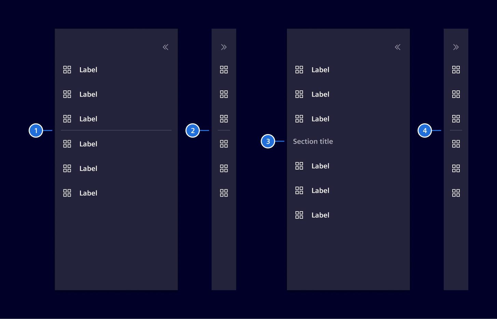
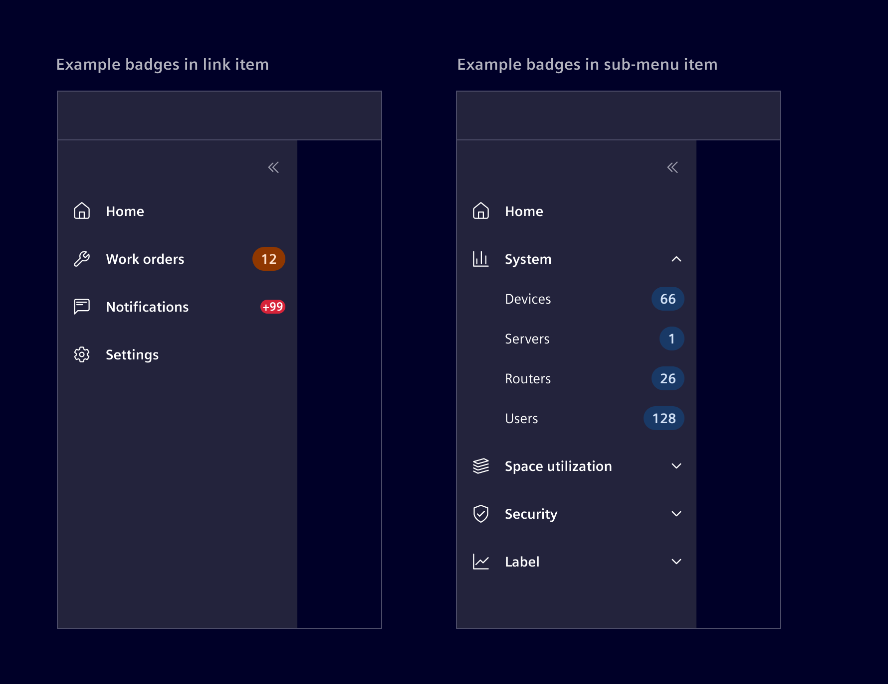

# Vertical navigation

<!-- markdownlint-disable MD033 -->

**Vertical navigation** is a hierarchical global navigation that displays navigation options from top to bottom on the side of a screen.

## Usage ---

The vertical navigation is positioned below the [application header](../layout-navigation/application-header.md)
and aligned to the left in the content area (for LTR languages).

There are two variants: one with icons and labels, and another with text labels only.
Both variants can be collapsed to free up additional screen space.



### When to use

- When the application requires a persistent side menu for organizing navigation elements in a clear, accessible manner.

### Best practices

- Only use icons if they clearly convey the intended meaning.
- Limit navigation to two tiers. For deeper content organization, consider using tabs, accordions or another navigation pattern.

## Design ---

### Elements

The vertical navigation can be configured with optional links, sub menus, and search, with only Expand/Collapse control being required.



### Labels

Labels have to be short and concise with a maximum of two words.
The label will be truncated at the end with 3 `...`, if there is no sufficient space.

### Expand / Collapse

The vertical navigation with icons supports the possibility to be expanded or collapsed to provide additional screen real estate.



> 1. Divider expanded, 2. Divider collapsed, 3. Section title expanded, 4. Section title collapsed

### Item organization

Vertical navigation items can be organized into sections to enhance clarity and navigation flow.
There are two methods:

- **Dividers:** Use it to separate items without labels. Is best for intuitive relationships where categories are unnecessary.
- **Section titles:** Apply section titles to label and categorize groups. Use for distinct categories requiring clear hierarchy.



Use either method individually or combine them, but avoid overuse, as it can make the navigation feel cluttered.

> 1. Divider expanded, 2. Divider collapsed, 3. Section title expanded, 4. Section title collapsed

### Badges (optional)

Items can also include [badges](../status-notifications/badges.md) to provide users with quick, at-a-glance information,
such as notifications or counts. For sub menus, badges should only be used on child elements.



### Responsive behavior

The vertical navigation expands over the full height of the screen.
It comes with a fixed width of 240px (expanded) or 48px when collapsed.
If the height is not enough to show all the navigation menus, then a scrollbar will be available.

## Code ---

### Usage

```ts
import { SiNavbarVerticalComponent } from '@spike-rabbit/element-ng/vertical-navbar';

@Component({
  imports: [
    SiNavbarVerticalComponent, ...
  ]
})
```

### Vertical navigation - icons & labels

To get a vertical navigation with icons, make sure to set icons for the top level items. No
further configuration is necessary as `[textOnly]="false"` is the default value.

<si-docs-component example="si-navbar-vertical/si-navbar-vertical" height="400"></si-docs-component>

### Vertical navigation - text labels only

To get a vertical navigation without icons, i.e. labels only set `[textOnly]="true"`.

<si-docs-component example="si-navbar-vertical/si-navbar-vertical-text" height="400"></si-docs-component>

<si-docs-api component="SiNavbarVerticalComponent"></si-docs-api>

<si-docs-types></si-docs-types>
