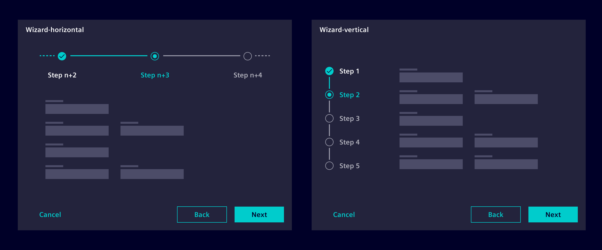
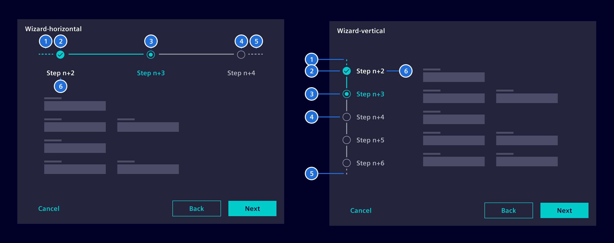
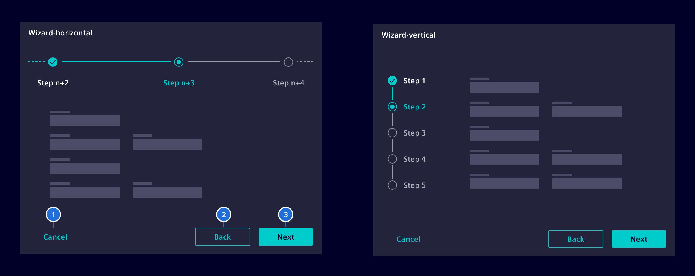
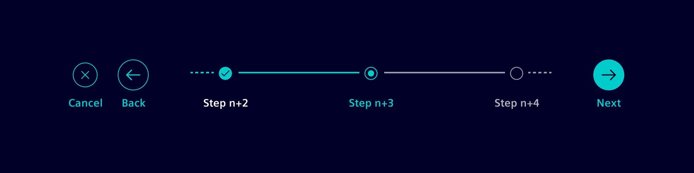
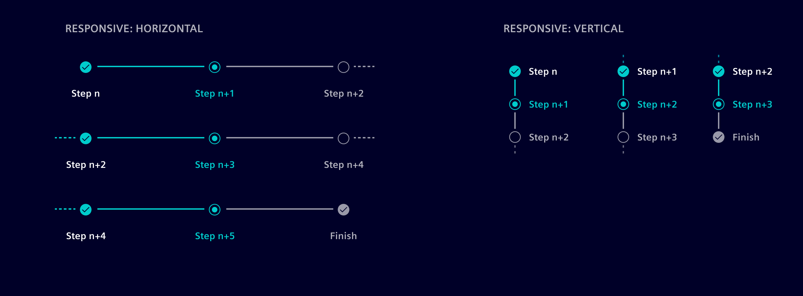
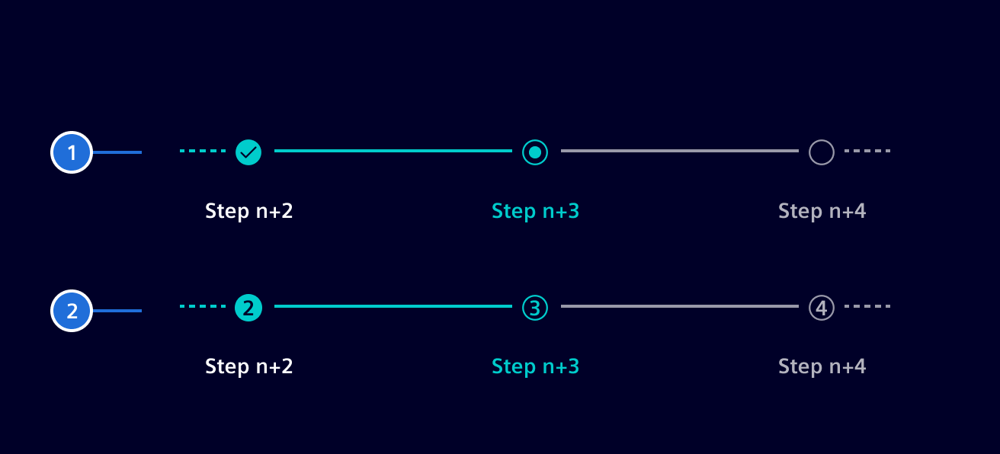

# Wizard

A wizard is a **step-by-step** process that allows users to input information in
**a predefined** order and in which **subsequent steps may depend on**
**information entered in previous ones**.

## Usage ---

Wizards can be used to simplify complex processes performed infrequently or by
novice users. By showing less information at a time, they allow users to focus
better on the content relevant to each step and decrease the chance of errors.

The Wizard component comes in a horizontal and vertical representation. Vertical
wizards stack steps on top of each other, while horizontal ones place them side
by side.



Use a horizontal wizard if:

- A small number of steps are used.
- When the wizard should remain accessible on mobile devices.
- When individual steps have longer title.

Use a vertical wizard if:

- A large number of steps are used.
- Enough vertical space is available for a side-by-side representation.

### When to use

- When the task requires multiple steps.
- When complex data input is needed.
- When users need guidance to complete the process.
- When steps vary based on previous decisions.
- When users lack domain knowledge.
- When the user must complete steps in a specific sequence.

### Best Practices for Wizards

- Minimize steps and keep the purpose clear.
- Show where the user is in the process.
- Don't disable or hide the `Back` button.
- Use a horizontal layout for fewer steps or mobile accessibility
- Provide a summary of choices.

## Design ---

### Elements



> 1. Indication "*more steps*", 2. Step completed, 3. Current step, 4. Future
  step, 5. Indication "*more steps*", 6. Label

The vertical variant can also include an optional divider to visually separate
steps and content for better clarity. Select the layout that aligns with the
process's complexity, content length, and spatial requirements.


### Wizard Button Placement

For both the horizontal and the vertical wizard, we recommend to place the
buttons below the wizard content.



> 1. Cancel button (optional), 2. Back button,  3. Next button

#### Alternative Button Placement for Horizontal Wizard

To ensure a stable position for the controls when the wizard content consumes a
significant amount of vertical space, buttons can be positioned alongside the
horizontal wizard.



### Responsive Behavior

Steps may collapse or hide when space is limited and reappear as more space
becomes available. For a vertical wizard, if the screen space becomes too
constrained, consider switching to a horizontal layout after a defined
breakpoint to preserve clarity.



### Alternative Step Representation

Step numbers are useful when users are less familiar with a process and need
clear guidance on where they are in a sequence. They establish a clear visual
hierarchy, making it evident which step comes before or after the current one,
and provide a clear linear progression.

**Note:** Consistency is crucial. If you use the step number representation in
one part of your application or website, try to use it for all other cases as
well to maintain a cohesive user experience.



> 1. Standard representation 2. Step number representation

## Code ---

Shows multiple steps and allows users to click through using back, next, and
save buttons.

Add a `WizardStep` to the template for each subtemplate. Define an optional
`title` property and an optional `isValid` property. Buttons will only be
enabled if `isValid` is true.

The button texts can be configured by optionally setting the `nextText`,
`backText`, and `saveText` properties.

Outputs are available for the `save`, `next`, and `back` events.

### Usage

`si-wizard` can be imported using the module

```ts
import { SiWizardModule } from '@siemens/element-ng/wizard';

@NgModule({
  imports: [SiWizardModule, ...]
})
```

or as a standalone component:

```ts
import { SiWizardComponent, SiWizardStepComponent } from '@siemens/element-ng/wizard';

@Component({
  imports: [
    SiWizardComponent,
    SiWizardStepComponent,
    ...
  ]
})
```

### Wizard - Standard

<si-docs-component example="si-wizard/si-wizard" height="270"></si-docs-component>

### Wizard - Vertical

The vertical wizard layout has an option to show a divider between the steps and
the content. It can be enabled by setting the attribute `showVerticalDivider` to
`true`. This option can be used in cases where the vertical wizard appears
visually disconnected or "floating" within the interface, typically in
full-screen layouts.

<si-docs-component example="si-wizard/si-wizard-vertical" height="290"></si-docs-component>

### Wizard - Responsive

This example has the same settings as the basic example above. It just contains
more steps to show the responsiveness the wizard provides. It shrinks and grows
with it's given width.

You may resize your screen to see the effect.

<si-docs-component example="si-wizard/si-wizard-dynamical" height="340"></si-docs-component>

### Wizard - Failed

For setting the icon status to failed, add the `failed` attribute and set it to
`true`.

If the attribute is not set, the default value will be `false` and the step will
behave like the basic example above.

<si-docs-component example="si-wizard/si-wizard-failed" height="270"></si-docs-component>

### Wizard - Input Validation

This example demonstrates the use of `isNextNavigable` attribute to uncouple
enabling/disabling of the `next` button and navigation to next step. This is
useful for triggering form validation by `next` button click.

<si-docs-component example="si-wizard/si-wizard-input-validation" height="270"></si-docs-component>

### Show Completion Page

Add the `enableCompletionPage` attribute and set it to `true` to show a
completion page after the wizard is finished.

If the attribute is not set, the wizard will use the default value `false`.

By default, the display duration of the completion page is `3000 ms`. To change
them, the `completionPageVisibleTime` attribute must be added and a time in ms
must be specified.

The `completionAction` callback will perform a specified function, after the
wizard was worked through.

<si-docs-component example="si-wizard/si-wizard-show-completion-page" height="270"></si-docs-component>

### Cancel Button

Add the `hasCancel` attribute and set it to `true`. With the output `cancel`
you can define what happen if the user presses the cancel button.

<si-docs-component example="si-wizard/si-wizard-cancel-button" height="270"></si-docs-component>

### Number representation

The number representation for wizard steps can be enabled by setting the
`showStepNumbers` input to `true`.

<si-docs-component example="si-wizard/si-wizard-numbered-steps" height="340"></si-docs-component>

<si-docs-api component="SiWizardComponent"></si-docs-api>

<si-docs-api component="SiWizardStepComponent"></si-docs-api>

<si-docs-types></si-docs-types>
