# Table and datatable

Data tables efficiently organize and display large volumes of data
in a structured grid format, making it easy for users to scan, compare, and analyze information.

## Usage ---

Use a table to organize information in columns and rows.

Tables are ideal for text-based content, data, and sections where
information needs to be easily and quickly comprehended in an organized manner.

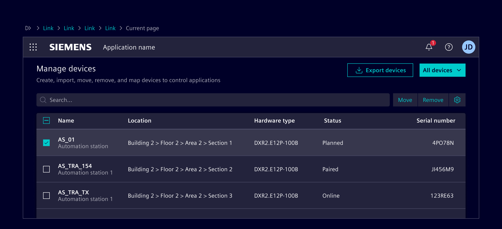

### When to use

- To view or process a large amount of information at once.
- To make it easy to compare data points between rows or columns.
- When data is easy to understand in a flat hierarchy.

## Best practices

- Order rows intuitively.
- Minimize the number of columns.
- Keep column headers short. Use concise labels for clarity.
- Shorten data to make scanning easier.
- Left-align text and right-align numeric values. Don’t use center alignment.
- Use hyphen (-) to represent empty values.
- Use [empty state](../status-notifications/empty-state.md) to represent an empty table.
- Don't use expandable rows with more than 1 levels.
- When possible, avoid repeating the title in every cell of a given column.
- Use [skeleton](../progress-indication/skeleton.md) to represent the loading state.

## Design ---

### Elements

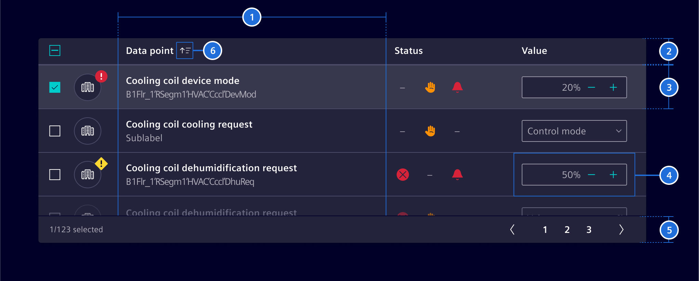

> 1. Columns, 2. Header, 3. Row, 4. Cell, 5. Footer (optional), 6. Sort button (optional)

### Row states

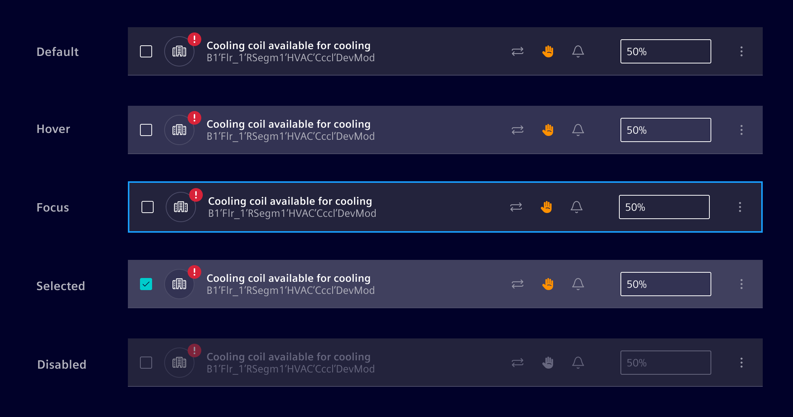

### Row density

The data table is available in different row sizes: default, small, extra-small.

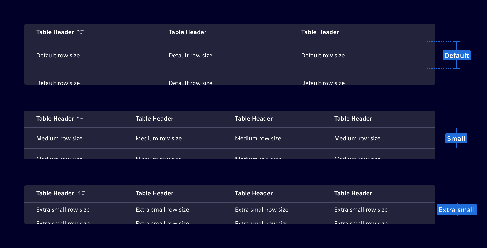

### Read only tables

Use it for displaying information only, with no user interaction needed.
For most cases, **read-only rows should not have a hover effect**, but it could
be enabled if the application has only read-only, very data-dense tables.

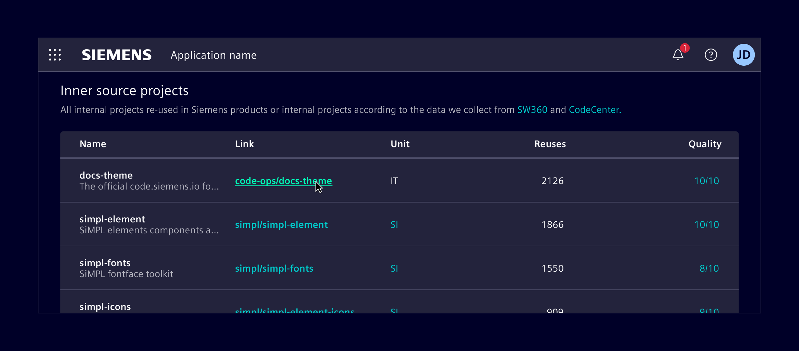

### Selectable tables

They allow users to select individual rows.
Selection methods can be implicit or explicit.

**Implicit selection** allows users to select a row by simply interacting with it.
Use it for simpler, more intuitive interactions, such as viewing details in a
[side panel](../layout-navigation/side-panel.md) or navigating to a new screen.

**Explicit selection** uses checkboxes or radio buttons.
Use it for more complex choices that need clear user acknowledgment or for batch actions in the case of multi-selection.

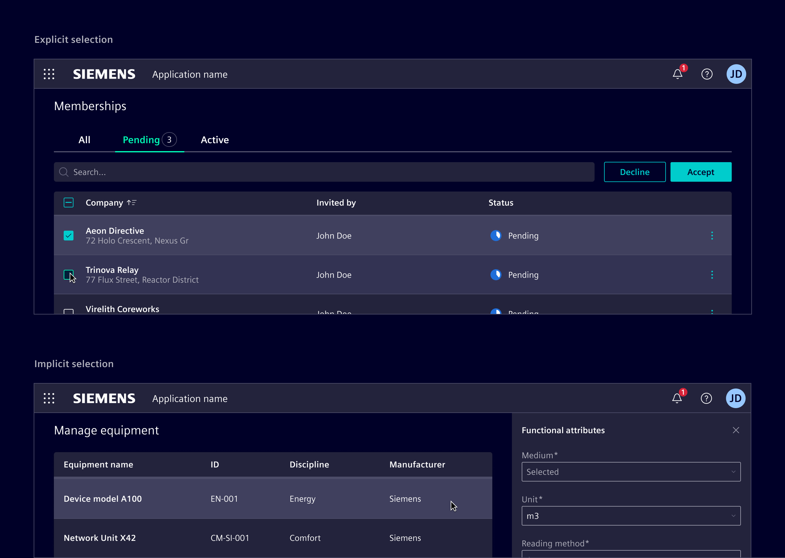

### Placement

Tables should be positioned directly in the main content area.
Avoid layering tables within non-functional container elements.

When tables are placed inside other containers, such as [modals](../layout-navigation/modals.md)
and [side panel](../layout-navigation/side-panel.md), no elevation should be applied.
Additionally, in these contexts, avoid using tables with more than two or three columns to prevent overcrowding.
Consider using [list group](../lists-tables-trees/list-group.md) instead.

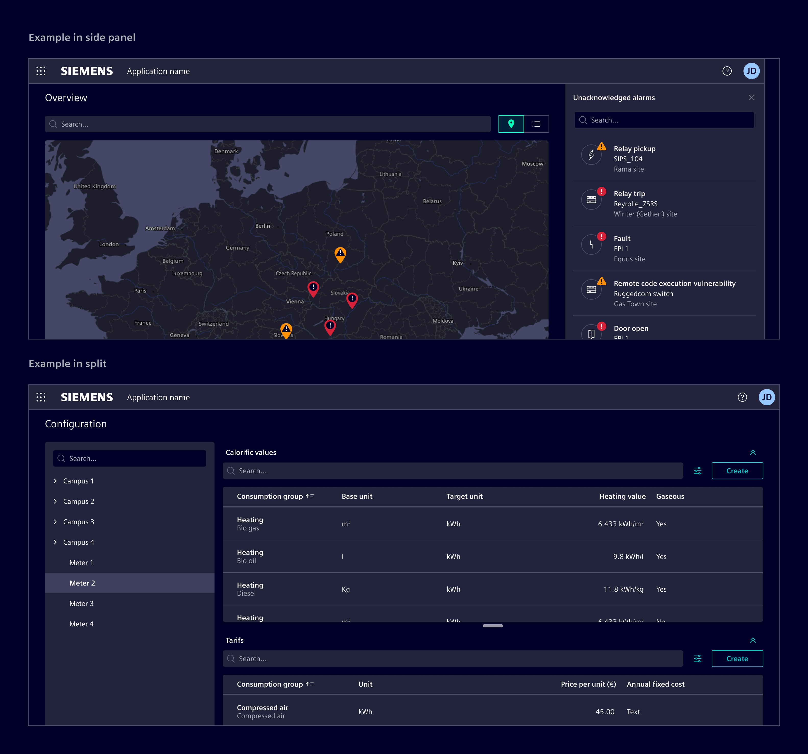

### Search and actions placement

Place the search field directly above the data table, aligned to the left (RTL).
It can stretch the entire table width or be smaller for short search terms.

Position table actions to the right of the search field.
When possible, limit to 3-4 actions, collapsing less frequent ones in a menu.

### Inline actions

Inline actions are specific functions performed on a table row.
Display up to two actions. If more actions are needed, consider collapsing them into a menu.

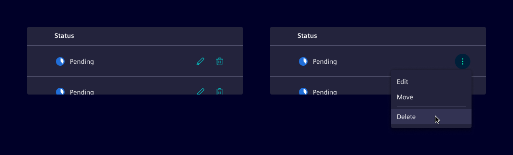

### Edit table content

Consider the following methods for editing row content.
Choose and adapt the method based on the use case and requirements.

- [side panel](../layout-navigation/side-panel.md): Use it for row editing without losing context.
- [modal dialog](../layout-navigation/modals.md): Use it to focus user attention on editing tasks or require complex input forms.
- Inline editing: Use it for quick, in-place edits directly within table cells.
- Full page: Redirect to a dedicated page for editing providing a full-screen, focused space for complex edits.
  Use it for highly detailed edits.

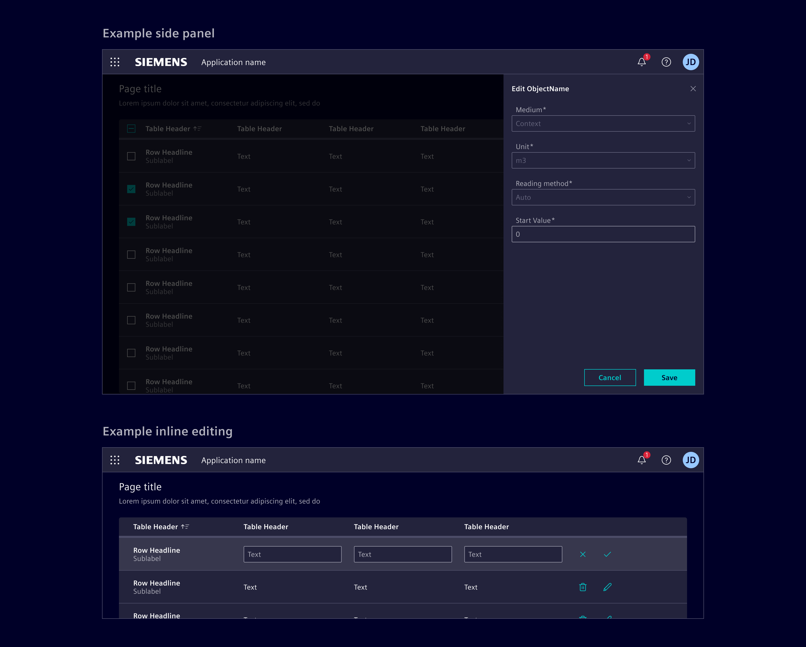

### Column management

Enable users to choose what data is included in the table with the
[column selection dialog](../layout-navigation/modals.md).
This functionality allows users to hide and reorder columns based on their use case.

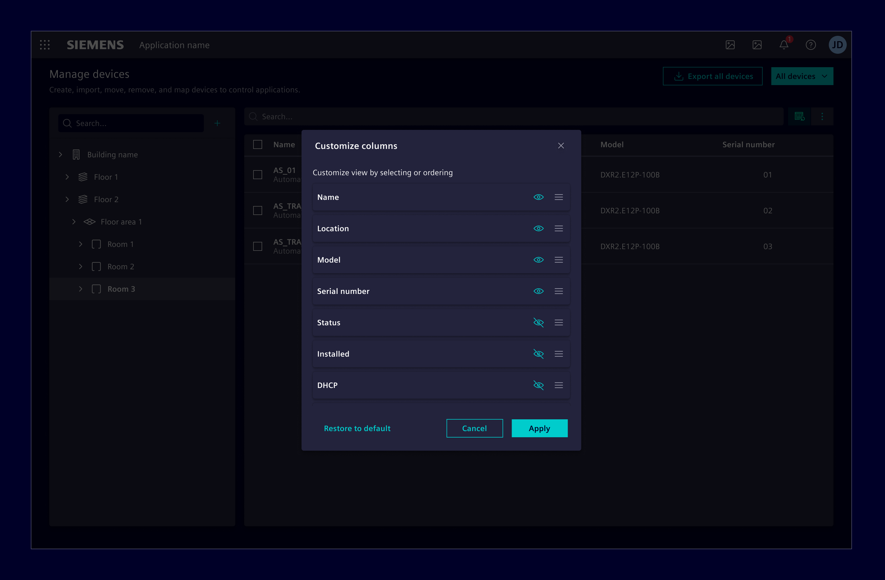

### Footer

Use a footer to display total number of items in the data table, or to display the
number of items that are currently visible based on any applied filters.

If needed, it can be combined with [pagination](../layout-navigation/pagination.md).

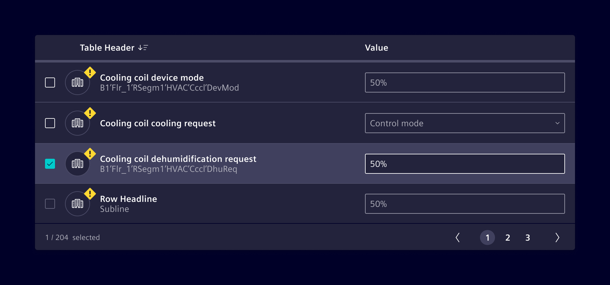

### Responsive behavior

Ensure tables are accessible on all screen sizes by prioritizing essential
information and hiding less critical data on smaller screens.
Consider the following strategies and adapt according to the use case:

- **Expandable rows:** Collapses less critical columns under an expandable row.

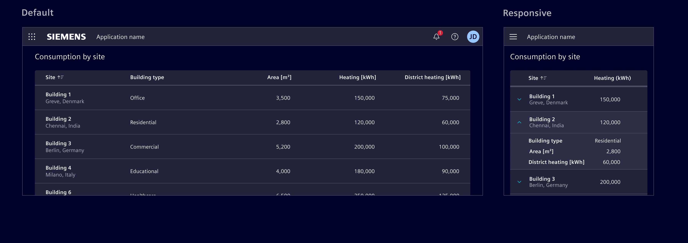

- **Reflow:** Displays data horizontally until a minimum size, then stack row content vertically.

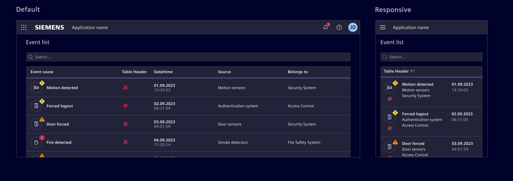

- **Transform:** Changes the content layout by transforming each row into individual cards.

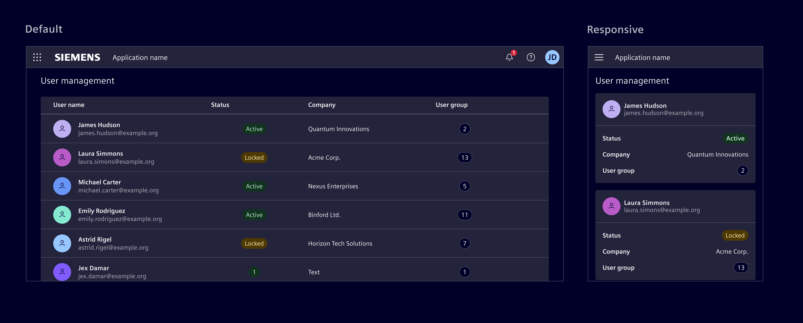

- **Move:** Enable horizontal scrolling to accommodate more columns, allowing users to access all data.
  However, be mindful about this approach as it can make it difficult to view and compare data.

## Code ---

Element provides two different approaches for the implementation of tables and data grids:

1. **Bootstrap Table** based on the standard HTML `table` for small tables showing mostly static data
2. **Datatable** (`<ngx-datatable>`) for large data sets while supporting various user interactions

There are various advantages and disadvantages to each approach depending on context and requirements.
Please check the capabilities and limitations of each approach and make sure to consider both
architectural as well as UX requirements in your decision.

Following some constraints and limitations when using the Bootstrap table approach:

- Header title is not "sticky" to stay on top when using vertical scroll bars
- Column width cannot be manually resized by the user
- No pagination support
- No inherent support for DOM and/or data virtualization as supported by ngx-datatable
- Performance issues with higher number of rows (>500), but this also depends on DOM complexity and hardware specs

> **Note:** The ngx-datatable implements change detection based on immutable table data.
> E.g. when only the content of a particular cell has changed, this change is not detected by the ngx change detection.
> See also the [remark in the ngx-datatable documentation](https://siemens-com.gitbook.io/ngx-datatable/readme/cd).

### Usage

`ngx-datatable` is an Angular component for presenting large and complex data.
The table is designed to be flexible and light. It doesn't make any
assumptions about the data or how you filter, sort or page it.
Check out the [full documentation](https://siemens-com.gitbook.io/ngx-datatable/),
[demos](http://siemens.github.io/ngx-datatable/) and the [demo code](https://github.com/siemens/ngx-datatable/blob/master/src/app)
for more information!

<!-- markdownlint-disable MD044-->
??? info "Required Packages"
    - [@siemens/ngx-datatable](https://www.npmjs.com/package/@siemens/ngx-datatable)

```ts
import { NgxDatatableModule } from '@siemens/ngx-datatable';
import { SI_DATATABLE_CONFIG, SiDatatableModule, provideSiDatatableConfig } from '@siemens/element-ng/datatable';

// standalone apps
export const APP_CONFIG: ApplicationConfig = {
  providers: [
    ...
    provideSiDatatableConfig()
    // For smaller row heights:
    // provideSiDatatableConfig({rowHeight: SI_DATATABLE_CONFIG.rowHeightSmall})
  ]
};

// module based apps
@NgModule({
  imports: [
    NgxDatatableModule.forRoot(SI_DATATABLE_CONFIG),
    // For smaller row heights:
    // NgxDatatableModule.forRoot({ ...SI_DATATABLE_CONFIG, rowHeight: SI_DATATABLE_CONFIG.rowHeightSmall }),
    SiDatatableModule,
    // ...
  ]
})
```

#### Style configuration

No additional configuration is necessary as everything is already provided in the Element theme.

### Keyboard interaction

To have the correct keyboard interaction, use the `siDatatableInteraction` directive.

### Right align columns

There is a small but powerful trick how to right align columns with `ngx-datatable`. Notice how the `Age` column is
right aligned in the example below. In the TypeScript code you can see that the table columns support two properties
called `headerClass` and `cellClass` that can be used to apply a CSS class to the column header as well as the column's
body cells:

```ts
{
  headerClass: 'justify-content-end', // right align column header
  cellClass: 'text-align-right-cell' // right align body cell
}
```

For the `headerClass` you can use the existing Bootstrap utility class `justify-content-end` to right align the column header.
For the `cellClass` you have to define your own custom class `text-align-right-cell` and add the following SCSS code
in your stylesheet:

```scss
::ng-deep {
  // center align datatable cell
  .text-align-right-cell .datatable-body-cell-label {
    flex: 1;
    text-align: end;
  }
}
```

<si-docs-component example="datatable/datatable-footer" height="750"></si-docs-component>

### Client-side paging, sorting and selection options

- Use `class="table-element"` on `<ngx-datatable>`.
- Use the [pagination](../layout-navigation/pagination.md) component as custom
footer template with `ngx-datatable-footer` and map inputs and outputs.

<si-docs-component example="datatable/datatable" height="750"></si-docs-component>

### Server-side paging

Datatable component configured for server-side paging and lazy loading.

<si-docs-component example="datatable/datatable-paging" height="600"></si-docs-component>

### Vertical scroll

This example shows a table that grows to the maximum available height, using the
`layout-fixed-height` class (see also [Content Layouts](../../fundamentals/layouts/content.md)).
The property `scrollbarV` is used to enable vertical scrolling within the table.
Enabling `scrollbarVDynamic` removes the scrollbar width from the row width
only when actually needed.

<si-docs-component example="datatable/datatable-vertical-scrolling" height="450"></si-docs-component>

### Infinite scroll

Datatable component configured for server-side virtual paging. The data is loaded
in pages from the server.

<si-docs-component example="datatable/datatable-paging-virtual" height="450"></si-docs-component>

### Empty state

Use the `<si-empty-state></si-empty-state>` for an empty table.

<si-docs-component example="datatable/datatable-empty-custom" height="250"></si-docs-component>

### Selection

Datatable with a selection. Use the `datatableInteractionAutoSelect` input of the `siDatatableInteraction`
directive to have it automatically select on keyboard navigation.

<si-docs-component example="datatable/datatable-selection" height="600"></si-docs-component>

### Filter and sort

<si-docs-component base="datatable" height="300">
  <si-docs-tab example="datatable-filter-sort-server" heading="Server side"></si-docs-tab>
  <si-docs-tab example="datatable-filter" heading="Client side"></si-docs-tab>
</si-docs-component>

### Responsive

<si-docs-component example="datatable/datatable-responsive" height="600">
</si-docs-component>

### Fix height

<si-docs-component example="datatable/datatable-fixed-height" height="600">
</si-docs-component>

### Sticky columns with horizontal scroll

<si-docs-component example="datatable/datatable-sticky-columns" height="600">
</si-docs-component>

### Resizing

Datatables do have a fixed, automatically updated size, assumed during their
initial rendering and refreshed during screen-size changes. However, they are
not automatically refreshed in case their parent container changes size. It is
the responsibility of a consuming application to invoke a recalculation if such
an event occurs. Such a recalculation can be initiated by using the
`recalculate()` function, exposed by the component.

```ts
// ...

@ViewChild(DatatableComponent) table?: DatatableComponent;

// ...

resizeTable() {
  setTimeout(() => this.table?.recalculate());
}
```

> **Note:** For the component to obtain the correct size information, the
> recalculation has to happen after the actual resizing event. To ensure that,
> the `setTimeout()` has to be used.

The recalculation can either be triggered whenever changes on the DOM are made
(e.g. when panels are collapsed/expanded) or by using Element's `siResizeObserver`
directive. If you use `siResizeObserver` directive ensure that you have imported
`SiResizeObserverDirective` in your standalone component or module.

```html
<ngx-datatable
  (siResizeObserver)="resizeTable()"
  ...
></ngx-datatable>
```

### Bootstrap Table

For simple HTML tables the general [Bootstrap Tables](https://getbootstrap.com/docs/5.1/content/tables/)
documentation applies. Add the CSS class `table-hover` for row hover effect. The theme comes with the
following styling for `table`:

<si-docs-component example="datatable/bootstrap" height="600"></si-docs-component>

<si-docs-api component="DatatableComponent" hideImplicitlyPublic="true"></si-docs-api>

#### Methods

<si-docs-type name="DatatableComponent.recalculate"></si-docs-type>

<si-docs-api directive="SiDatatableInteractionDirective"></si-docs-api>

<si-docs-types></si-docs-types>
