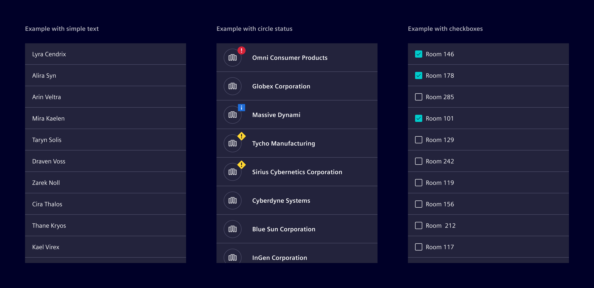

# List group

**List groups** are responsive components for organizing and displaying a series of content.

## Usage ---

Optimized for single-column layouts, it provides a simple and flexible way to display data.
It follows the same styling as the [data table](../lists-tables-trees/datatable.md) but with a
more lightweight implementation for basic data needs.

The List Group is flexible and can contain various types of content, such as [badges](../status-notifications/badges.md),
[circle status](../status-notifications/circle-status.md), [checkboxes](../forms-inputs/checkbox.md) or other interactive elements.

### When to use

- When displaying straightforward, single-column data.
- For lists where the data doesn't require complex structures, such as headers or multiple columns.
- When a simpler alternative to a table is needed for performance or ease of use.

## Best practices

- Keep list items concise and clear.
- Ensure the lists are readable and functional on all screen sizes.
- Place it in [cards](../layout-navigation/cards.md), [modals](../layout-navigation/modals.md), [side panel](../layout-navigation/side-panel.md) or other any other layout container.

## Code ---

### References

- [List group](https://getbootstrap.com/docs/5.1/components/list-group/#links-and-buttons)

### List group item heights

We added the CSS classes `.list-group-md` and `.list-group-lg` to align the height of the
contained `list-group-item` elements with the supported heights of the [Datatable](datatable.md),

- CSS class `.list-group-md` set a minimum height of `48px`.
- CSS class `.list-group-lg` set a minimum height of `64px`.

### Example

<si-docs-component example="list-group/list-group" height="400"></si-docs-component>
