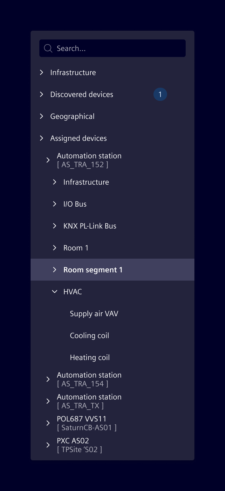
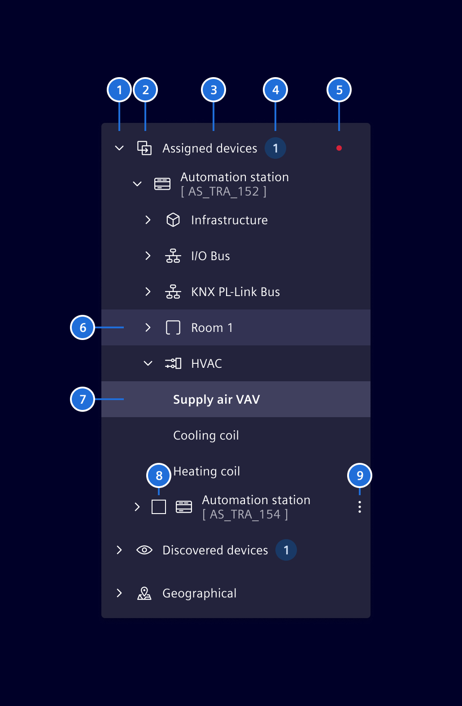
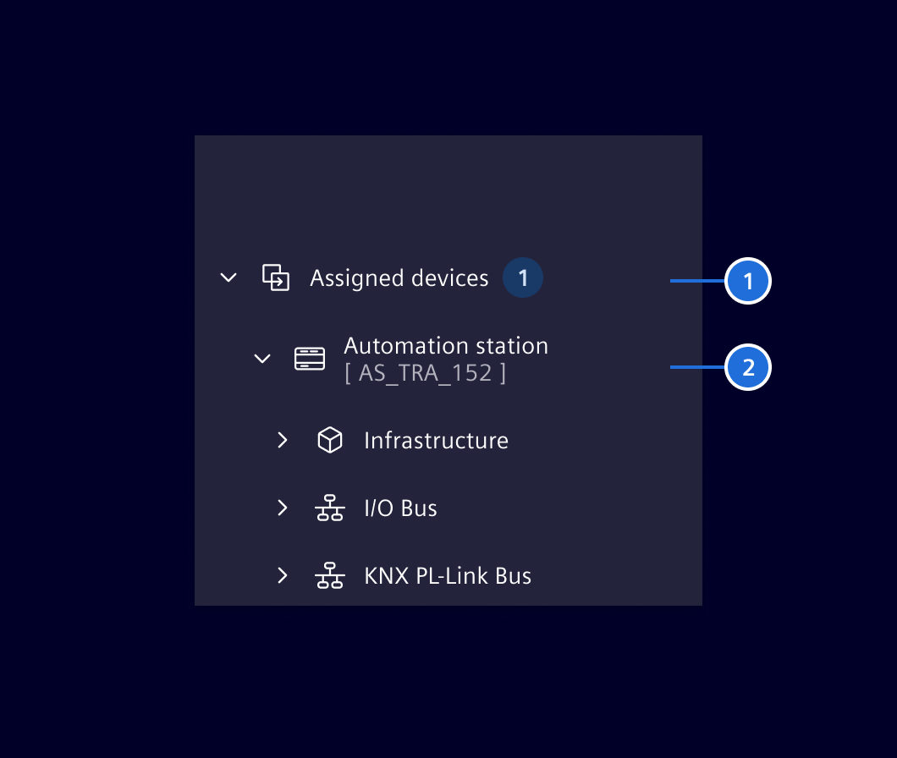
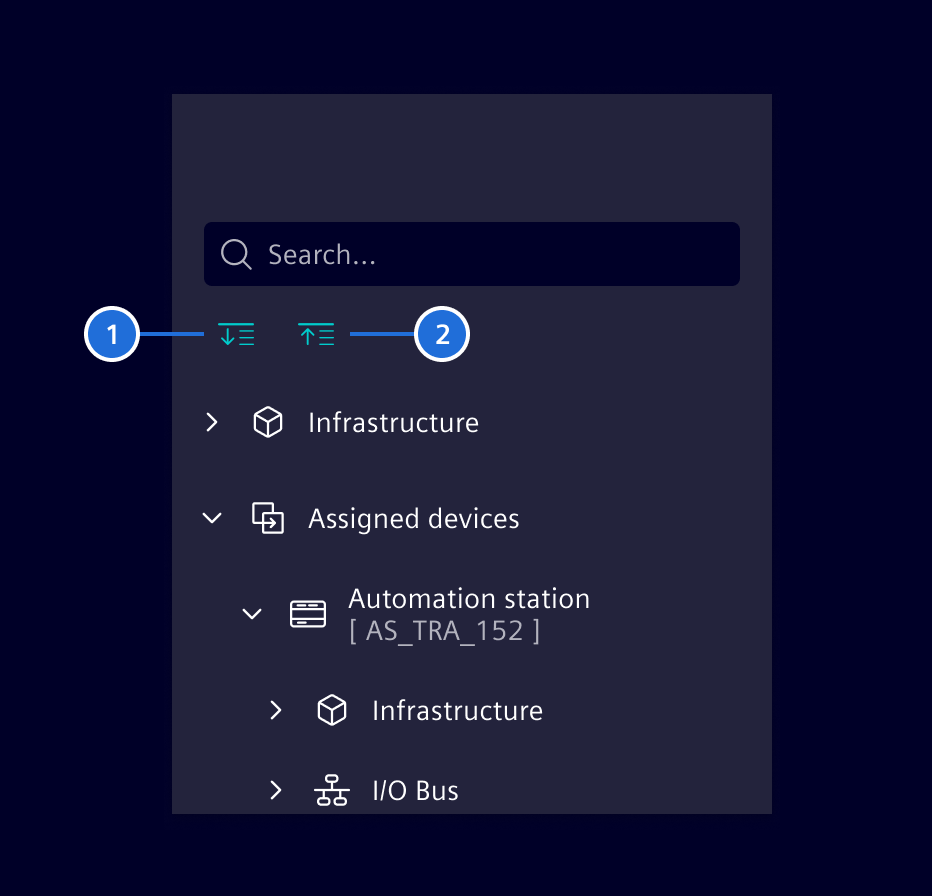
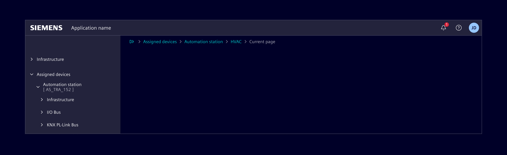
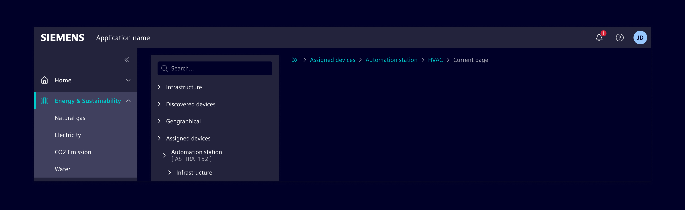
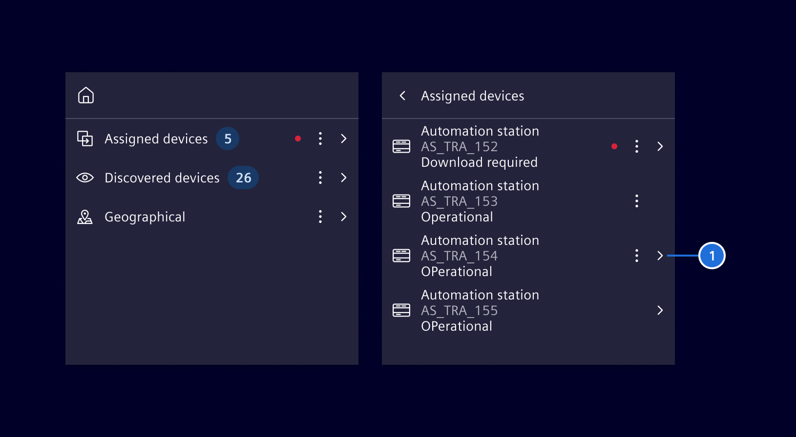

# Tree View

The tree component is used to display hierarchical data and supports a wide range of
configurable options and features.

## Usage ---



### When to use

- Data in hierarchical form can be represented in a tree structure. Examples
  include directory, organization and location structures.
- Apply a tree view to large data sets that can be categorized into two or more
  levels.

### Does and Don'ts

- Use nodes with icons only if you have meaningful icons available.
- Don't mix **nodes with icons** and nodes with **just a label** within the same
  hierarchy.

### Best practices

- A tree view should not have more than four sub-levels (not including the root
  node).
- The most commonly accessed objects should appear in the first two levels.
- Use a natural hierarchical structure that is familiar to most users. Balance
  discoverability with a predictable user model that minimizes confusion.
- A tree view should be supported by a breadcrumb within the content area.

## Design ---

### Elements

A tree view consists of the following elements:



1. Expand/collapse icon
2. Node icon *(optional)*
3. Label
4. Badge *(optional)*
5. Indicator *(optional)*
6. Node: Hover state
7. Node: Selected state
8. Checkbox and/or option box per node *(optional)*
9. Options menu (e.g. additional commands) *(optional)*

### Item representation

The standard tree view component supports 2 different node representations:



1. Node with main-label
2. Node with main-label and sub-label

### Features

The tree view component has the following features:

- Showing multiple trees in a list.
- Showing the trees in a flat mode with navigation/breadcrumb on top.
- Children of parent nodes are lazy loaded upon request (in case they are not
  yet available in the model).
- Menu support via command pattern; the commands can be set via input
  properties.
- Multi selection and focus support.
- Checkbox and/or option box per node.
- Virtualization support: Input properties allow to set the page size and the
  number of pages to be virtualized. Current limitation is roughly half a
  million of tree items. This is due to some *strange* behavior with flex
  containers.
- Grouped list support.
- Support of templating, if templates are present.
- Support of expand and collapse of all child elements.

### Expand / collapse all

The tree view component supports expanding and collapsing of all child elements:



1. Expand all
2. Collapse all

### Position of tree view

If the tree view is the main navigation of a page, then it's placed to the left.



If the tree view is part of a page then it will be represented as a card.

> **Note:** This pattern is still work in progress and might therefore be
> subject to change.



### Responsive behavior

The tree view has a default width `300px` to give enough space for the labels.
If the height is not enough to show all the navigation items, a scrollbar will
be available.

### Menu labels

Menu labels have to be short and concise with a maximum of two words. They share
the same space with all items, like labels, icons, badges, etc. The label will
be truncated at the end with 3 `...`, if there is no sufficient space.

### Variant

Showing the tree in flat mode with back-navigation on top:



In flat mode, a node also offers a third node representation format with (1)
**item with main-label, sub-label and value**.

## Code ---

### Usage

Within a module

```ts
import { SiTreeViewModule } from '@siemens/element-ng/tree-view';

@NgModule({
  imports: [SiTreeViewModule, ...]
})
```

or as a standalone component

```ts
import {
  SiTreeViewComponent,
  SiTreeViewItemComponent,
  SiTreeViewItemDirective,
  SiTreeViewItemTemplateDirective
} from '@siemens/element-ng/tree-view';

@Component({
  imports: [
    SiTreeViewComponent,
    SiTreeViewItemComponent,
    SiTreeViewItemDirective,
    SiTreeViewItemTemplateDirective
  ]
})
```

The `items` property is the most important property of the `si-tree-view` component.
It is used to provide an array of `TreeItem` objects to be displayed.

Note that all properties of the `TreeItem` interface are optional. This allows you to
directly feed a JSON structure (e.g. from an API) to the tree view.

<si-docs-type name="TreeItem"></si-docs-type>

<si-docs-component example="si-tree-view/si-tree-view" height="300"></si-docs-component>

### Expand/Collapse

Expand and collapsing of all nodes can be enabled via the `expandCollapseAll` property.

<si-docs-component example="si-tree-view/si-tree-view-expand-collapse" height="300"></si-docs-component>

### Dynamic Context Menu

The context menu can be dynamically constructed using the `MenuItemsProvider`.

<si-docs-component example="si-tree-view/si-tree-view-menu-builder" height="300"></si-docs-component>

### Custom Templates

The tree also supports custom templates for tree items. The `TreeItem` object model
supports the property `templateName` to apply a custom template.

As you can see in the example below, you can create a ng-template structured as follows
where the `templateName` of the model has to match the `siTreeViewItemTemplate` value:

```html
<ng-template let-item siTreeViewItemTemplate="yourTemplateName">
  <!-- your template -->
</ng-template>
```

The following example demonstrates the use of two templates to render the root and child nodes
differently.

<si-docs-component example="si-tree-view/si-tree-view-template" height="300"></si-docs-component>

### Adding, removing, updating tree items

Due to the way change detection works, mutations on the tree item structure
assigned to the `items` property might not be detected by the tree view. Thus,
the UI will not reflect the changes in the model.

Depending on the use case, there are different ways to trigger the change
detection mechanism of the tree view:

- Create and assign a new reference, e.g. `this.items = [...this.items];`
- Call `refresh()` function on the tree component
- Use `addChildItems()` function on the tree component

Note: If items should be lazy-loaded when expanding a parent, consider using the
`loadChildren` event which allows to append children while properly handling
change detection.

The following example shows how to use `addChildItems()` to dynamically add tree
items as root elements or as children of an existing tree item:

```typescript
@Component({
  selector: "app-sample",
  template: `
    <button type="button" class="btn btn-primary" (click)="addItemToRoot()">
      Add item to Root
    </button>
    <button type="button" class="btn btn-primary" (click)="addItemToCompany1()">
      Add item to Company1
    </button>
    <si-tree-view class="vh-100" [items]="items"></si-tree-view>
  `,
  imports: [SiTreeViewModule],
  changeDetection: ChangeDetectionStrategy.OnPush,
  standalone: true
})
export class SampleComponent {
  @ViewChild(SiTreeViewComponent, { static: true })
  private treeViewComponent!: SiTreeViewComponent;
  private count = 0;
  protected items: TreeItem[] = [{ label: "Company1" }];

  protected addItemToRoot() {
    this.treeViewComponent.addChildItems([
      { label: `new root item ${++this.count}`, state: "leaf" }
    ]);
  }

  protected addItemToCompany1() {
    this.treeViewComponent.addChildItems(
      [{ label: `new root item ${++this.count}`, state: "leaf" }],
      this.items[0]
    );
  }
}
```

### Playground with various options

<si-docs-component example="si-tree-view/si-tree-view-playground" height="600"></si-docs-component>

<si-docs-api component="SiTreeViewComponent"></si-docs-api>

<si-docs-types></si-docs-types>
