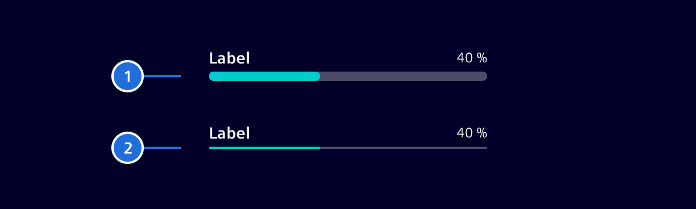

# Progress bar

**Progress bars** notify users that an app needs more time to process a user action,
and if possible tell how much time (approximately) it will take.

## Usage ---

Progress bars inform users about the status of ongoing processes, such as loading an app,
documents or data, submitting a form, saving data and more.

### When to use

Use a progress bar for any action that takes longer than about **one second**.
Anything shorter than that will act distracting to users.

### Best practices

- An application should provide visual feedback for any extended waiting/loading period.
- Progress bars shall be used for non-blocking waiting/loading actions.

## Design ---

A Progress bar consists of the following elements:


> 1. Label (optional), 2. Progress, 3. Track, 4. Value (optional)

Besides the default size, there is also a small variant available.



> 1. Default, 2. Small

## Code ---

### Usage

```ts
import { SiProgressbarComponent } from '@spike-rabbit/element-ng/progressbar';

@Component({
  imports: [SiProgressbarComponent, ...]
})
```

<si-docs-component example="si-progressbar/si-progressbar-dynamic" height="250"></si-docs-component>

<si-docs-api component="SiProgressbarComponent"></si-docs-api>

<si-docs-types></si-docs-types>
